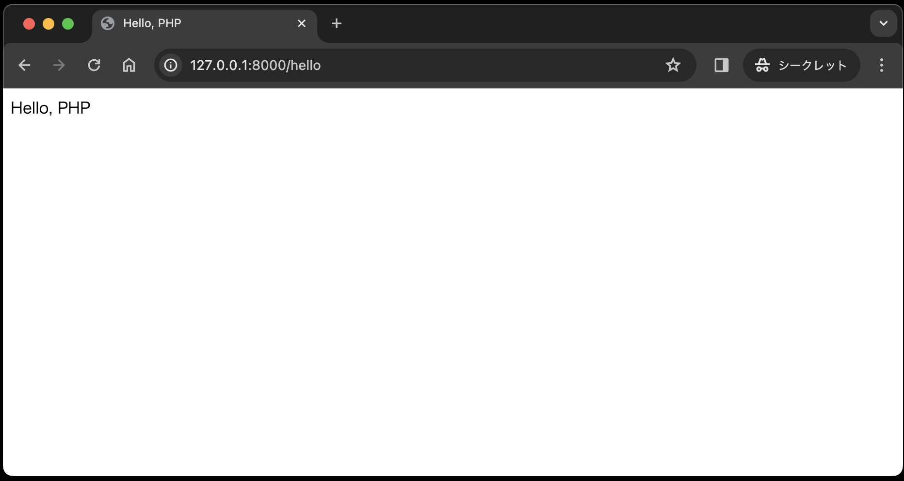

# コントローラ

- [コントローラ](#コントローラ)
  - [コントローラとは](#コントローラとは)
  - [コントローラの実装](#コントローラの実装)
  - [まとめ](#まとめ)

## コントローラとは

ユーザーからのリクエストを受け取り、適切なメソッドを実行します。モデルのデータを取得し、必要なビューを表示する処理を行います。コントローラはモデルとビューの仲介役であり、アプリケーションのロジック<sup>[1](#note1)</sup>を管理します。
<small id="note1">※1 ここでいうロジックとは、データベースからデータを取得する処理や、データを加工する処理、ビューに渡すデータを作成する処理などを指します。</small>

図で表すと、以下の赤枠の部分です。
_controller.jpg)

## コントローラの実装

では、早速コントローラの実装を見ていきましょう。まずは、コントローラのファイルが格納されている app ディレクトリを見てみます。デフォルトでは以下のような構成になっています。

```text
プロジェクトディレクトリ
├── app
│   ├── Console
│   ├── Exceptions
│   ├── Http
│   │   ├── Controllers
│   │   │   └── Controller.php
│   │   -[略]-
│   ├── Models
│   └── Providers
-[略]-
```

今回はこの app/Http/Controllers ディレクトリ内に、HelloController.php というファイルを作成し、その中にコントローラの処理を記述します。ただし、モデルの処理はまだ実装していないため、ビューのみを返す処理を記述します。

1. 下記コマンドに従って、HelloController.phpファイルを作成してくださいい。

    ```text
    php artisan make:controller HelloController
    ```

1. app/Http/Controllers ディレクトリ内に、HelloController.php というファイルが作成されたはずです。その中身は以下のようになっています。

    ```php
    <?php

    namespace App\Http\Controllers;

    use Illuminate\Http\Request;

    class HelloController extends Controller
    {
        //
    }
    ```

1. 以下のように、HelloController.php の「//」の部分を書き換えてください。public function index() { ... } は、HelloControllerクラスの中にあるメソッドです。このメソッドは、URLにアクセスされた際に実行される処理を定義します。今回は、ビューを返す処理を記述しています。

    ```php
    <?php

    namespace App\Http\Controllers;

    use Illuminate\Http\Request;

    class HelloController extends Controller
    {
        public function index()
        {
            return view('hello.index');
        }
    }
    ```

1. このコントローラの処理を呼び出すために、ルーティングの設定を記述します。routes/web.php ファイルを開き、以下のように記述してください。

    ```php
    Route::get('/hello', [\App\Http\Controllers\HelloController::class, 'index']);
    ```

    Route::get は、Laravelの定義済みクラスである Route クラスの静的メソッド get を スコープ解決演算子(::)を使って呼び出しています。get メソッドは、HTTPのGETリクエストに対応するルートを定義します。GETリクエストは、主にサーバーから情報を取得するために使用されます。例えば、ブラウザのアドレスバーにURLを入力してアクセスする場合や、リンクをクリックする場合などです。

    '/hello' は、このルートが反応するURLのパスを指定します。つまり、ウェブアプリケーションのドメインに/helloを追加したURL(例：http://127.0.0.1/hello )に対するリクエストをこのルートが処理します。

    [\App\Http\Controllers\HelloController::class, 'index'] は、リクエストを処理するコントローラとメソッドを指定しています。この部分は配列で構成されており、最初の要素はコントローラクラス（この場合は\App\Http\Controllers\HelloController）、二番目の要素はそのコントローラ内のメソッド名（この場合は'index'）を示しています。

1. ビューを作成します。resources/views ディレクトリ内に、hello ディレクトリを作成します。その中に index.blade.php ファイルを作成してください。なお、ビューの詳細については、次回以降で詳しく解説します。

    ```text
    プロジェクトディレクトリ
    │
    -[略]-
    ├── resources
    │   ├── views
    │   │   ├── hello
    │   │   │   └── index.blade.php
    │   │   └── welcome.blade.php 
    │
    -[略]-  
    ```

    index.blade.php の中身は以下のようになっています。簡単なHTMLの内容ですので説明は省略します。

    ```html
    <!DOCTYPE html>
    <html lang="ja">

    <head>
        <meta charset="UTF-8">
        <title>Hello, PHP</title>
    </head>

    <body>
        Hello, PHP
    </body>

    </html>
    ```

2. では、ブラウザで http://127.0.0.1/hello にアクセスしてみましょう。以下のような画面が表示されれば成功です。

    

## まとめ

本章では、コントローラの役割と実装方法について解説しました。コントローラはユーザーからのリクエストを受け取り、適切なメソッドを実行します。モデルのデータを取得し、必要なビューを表示する処理を行います。コントローラはモデルとビューの仲介役であり、アプリケーションのロジックを管理します。
モデルの処理はまだ実装していないため、ビューのみを返す処理を記述しました。以降の章で、モデルの処理についても解説していきます。
