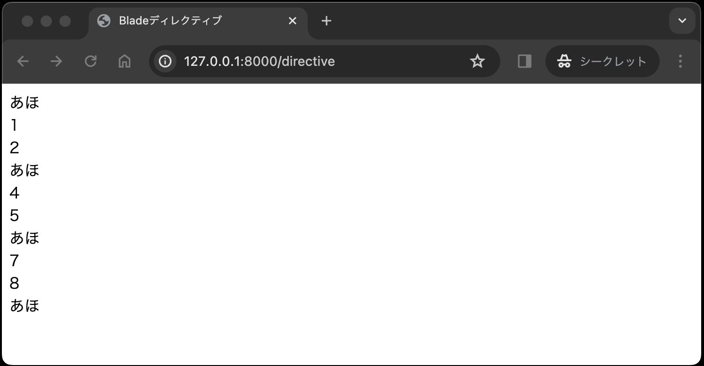

# ビュー

## ビューとは

ユーザーインターフェースの表示を担当します。ユーザーが操作するインターフェースを定義し、モデルから取得したデータを表示する役割を持ちます。HTMLやCSSなどを使ってビューを作成します。

図で表すと、以下の赤枠の部分です。
_view.jpg)

## ビューの実装

ビューの実装については、resources/views ディレクトリにファイルを作成します。ファイルの拡張子は .blade.php となり、この拡張子で作成したファイルのことをBladeと呼びます。

### Blade

LaravelにはBladeというテンプレートエンジンが搭載されています。
Bladeとは、一言で言うならばHTMLにPHPスクリプトを埋め込むための仕組みです。Bladeを使うことで、 HTMLに埋め込まれた<?php ... ?> のようなPHPスクリプトを、より直感的に記述することができます。

### ディレクティブ

Bladeでは、ディレクティブと呼ばれる特別な記法を使うことができます。以下に、Bladeでよく使われるディレクティブをいくつか紹介します。

|ディレクティブ|使い方|説明|
|----|----|----|
|@if| @if(条件)</br>&nbsp;&nbsp;&nbsp;(コード)</br>@elseif(条件)</br>&nbsp;&nbsp;&nbsp;(コード)</br>@else</br>&nbsp;&nbsp;&nbsp;(コード)</br>@endif|if分を挿入可能。</br>@elseif と @else は該当する上限がなければ入れなくて良い。|
|@foreach|@foreach(配列名 as 値)</br>&nbsp;&nbsp;&nbsp;(コード)</br>@endforeach|foreach文を挿入可能。|
|@for|@for(条件)</br>&nbsp;&nbsp;&nbsp;(コード)</br>@endfor|for文を挿入可能。|
|@php|@php</br>&nbsp;&nbsp;&nbsp;(コード)</br>@endphp|PHPコードを挿入可能。|
|@auth|@auth</br>&nbsp;&nbsp;&nbsp;(コード)</br>@endauth|認証済みのユーザーのみに表示するコードを挿入可能。|
|@guest|@guest</br>&nbsp;&nbsp;&nbsp;(コード)</br>@endguest|未認証のユーザーのみに表示するコードを挿入可能。|

実際にディレクティブを使ったBladeを実装してみましょう。resources/views ディレクトリ内に、directive ディレクトリを作成し、その中に index.blade.php ファイルを作成します。<sup>[1](#note1)</sup>以下は、3の倍数の時に「あほ」になるコードです。</br>
<small id="note1">※1 Bladeを作成するコマンドはありません。</small>

```php
<!DOCTYPE html>
<html lang="ja">
<head>
    <meta charset="UTF-8">
    <title>Bladeディレクティブ</title>
</head>
<body>
    @for($i = 0; $i < 10; $i++)
        @if($i % 3 == 0)
            あほ</br>
        @else
            {{ $i }}</br>
        @endif
    @endfor
</body>
</html>
```

「$」始まりの変数を表示したい場合は、「{{ }}」<sup>[2](#note2)</sup> で囲む必要があります。</br><small id="note2">※2 「{{ }}」で囲むと、変数を表示する他に、エスケープ処理も行われます。</small>

このように、ディレクティブを使うことで、より直感的に記述することができます。

### ビューの表示

前章までのおさらいです。上記で作成したビューをブラウザに表示するために、ルーティングを設定します。routes/web.php ファイルに以下のコードを追記します。

```php
Route::get('/directive', [\App\Http\Controllers\DirectiveController::class, 'index']);
```

次に、コントローラーを作成します。app/Http/Controllers ディレクトリに DirectiveController.php ファイルをコマンドで作成します。

1. まずは、プロジェクトのルートディレクトリに移動します。
2. 以下のコマンドを実行し、コントローラーを作成します。

    ```bash
    php artisan make:controller DirectiveController
    ```

3. app/Http/Controllers ディレクトリに DirectiveController.php ファイルが作成されているので、以下のコードを追記します。

    ```php
    <?php

    namespace App\Http\Controllers;

    use Illuminate\Http\Request;

    class DirectiveController extends Controller
    {
        public function index()
        {
            return view('directive.index');
        }
    }
    ```

4. 以下のコマンドを実行し、サーバーを起動します。

   ```bash
    php artisan serve
    ```

5. ブラウザで、http://127.0.0.1/directive にアクセスします。以下のような画面が表示されれば成功です。

    

### レイアウト作成

Bladeには、レイアウトを定義し、それを他のビューに適用する機能があります。ここでいうレイアウトとは、共通の部分を切り出して、共通化することで、コードの重複を減らすことができます。

例えば、多くのページで共通して使われるヘッダーやフッターをレイアウトとして定義し、それを他のビューに適用することができます。

レイアウトを定義するには、resources/views ディレクトリに layouts ディレクトリを作成し、その中に layout.blade.php ファイルを作成します。繰り返しにはなりますが、 Bladeを作成するコマンドはありません。

以下は、レイアウトを定義した layout.blade.php ファイルの例です。新たに@yieldディレクティブと@sectionディレクティブが登場します。

```php
<!DOCTYPE html>
<html lang="ja">
<head>
    <meta charset="UTF-8">
    <title>@yield('title')</title>
</head>
<body>
    <header>
        @yield('header')
    </header>
    @yield('content')
    <footer>
        @yield('footer')
    </footer>
</body>
</html>
```

次に、レイアウトを適用するビューを作成します。resources/views/directive ディレクトリに、section.blade.php ファイルを作成します。

```php
@extends('layouts.layout')

@section('title', 'レイアウトの練習')

@section('header')
    <h1>ヘッダー</h1>
@endsection

@section('content')
    <p>コンテンツ</p>
@endsection

@section('footer')
    <p>フッター</p>
@endsection
```

このように、レイアウトを定義することで、共通の部分を切り出して共通化することができます。
では、ビューを表示してみましょう。routes/web.php ファイルに以下のコードを追記します。

```php
Route::get('/section', [\App\Http\Controllers\DirectiveController::class, 'section']);
```

次に、コントローラーを編集します。app/Http/Controllers/DirectiveController.php ファイルに以下のコードを追記します。

```php
public function section()
{
    return view('directive.section');
}
```

