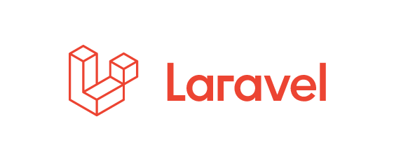

# Laravelオリエンテーション

- [Laravelオリエンテーション](#laravelオリエンテーション)
  - [本授業で使用する言語「Laravel」について](#本授業で使用する言語laravelについて)
  - [フレームワークとそのメリット](#フレームワークとそのメリット)
  - [本授業の狙いと目標](#本授業の狙いと目標)
  - [MVCモデル](#mvcモデル)
    - [モデル（Model）](#モデルmodel)
    - [ビュー（View）](#ビューview)
    - [コントローラ（Controller）](#コントローラcontroller)
    - [ルーティング(Routing)](#ルーティングrouting)
  - [環境について](#環境について)
  - [まとめ](#まとめ)

## 本授業で使用する言語「Laravel」について

本授業では、PHPのフレームワークである「Laravel」を使用してWebアプリケーションを開発します。
Laravelは、PHPのフレームワークの中でも特に人気が高く、多くの開発者に利用されています。

## フレームワークとそのメリット

フレームワークは、ソフトウェア開発を効率化するための基盤や構造を提供するツールセットです。
フレームワークを利用した開発には以下のようなメリットがあります。

1. 開発速度の向上
フレームワークには、前期で学習した「データベース操作」、「フォーム処理」、「認証」などの一般的な機能が予め用意されているため、これらの機能をゼロから作る必要がありません。
これにより開発プロセスが加速されます。

1. 標準化されたコード
フレームワークは一般的に、コーディング規約や開発パターンを提供しています。
これにより、プロジェクト内でのコードの一貫性が保たれ、他の開発者がコードを理解しやすくなります。

1. セキュリティ
多くのフレームワークは、セキュリティ機能を組み込んでおり、XSS(クロスサイトスクリプティング)、CSRF(クロスサイトリクエストフォージェリ)、SQLインジェクションなどの脅威からアプリケーションを守ります。

## 本授業の狙いと目標

- 狙い
  - Laravelを用いたWebアプリケーション開発を通じて、フレームワークを使った開発のメリットを理解する
  - MVCモデルを理解し、アプリケーションの構造化を学ぶ
  - Laravelの基本的な機能を理解し、Webアプリケーション開発の基礎を身につける

- 目標 
  前期授業で作成したWebアプリケーション「ミニショップ」をLaravelを用いて再構築し、上記狙いを具体的に実感する

## MVCモデル

LaravelのMVCモデルは、Webアプリケーション開発を効率化するためのソフトウェアデザインパターンです。
MVCモデルの詳細を説明する前に、基礎言語であるPHPで作成したWebアプリケーションのリクエストからレスポンスまでの流れをおさらいしましょう。

.svg)

これまでに作成したPHPのWebアプリケーションは、このような流れで動作していました。
リクエストを受け取り、処理を行い、レスポンスを返すという流れです。
ただし、良い意味でも悪い意味でも、この流れは非常にシンプルで自由度が高すぎるため、大規模なアプリケーションを開発するには適していません。

そこでMVCモデルが登場します。
MVCモデルは、アプリケーションを3つに分割し、それぞれが特定の役割を担当することで、アプリケーションの開発を効率化します。

### モデル（Model）

---

データとデータベースとのやり取りを担当します。
データモデルは、アプリケーションのデータベーステーブルに対応し、データの取得・保存・更新・削除を行います。

### ビュー（View）

---

ユーザーインターフェースの表示を担当します。
ユーザーが操作するインターフェースを定義し、モデルから取得したデータを表示する役割を持ちます。
HTMLやCSSなどを使ってビューを作成します。
ここでいうインターフェースとは、Webアプリケーションの画面全体を指します。

### コントローラ（Controller）

---

ユーザーからのリクエストを受け取り、適切なメソッドを実行します。
モデルのデータを取得し、必要なビューを表示する処理を行います。
コントローラはモデルとビューの仲介役であり、アプリケーションのロジックを管理します。

これらの流れを先ほどの図に当てはめると、以下のようになります。

.svg)

### ルーティング(Routing)

---

上記の図を見ると、MVC以外に「ルーティング」という言葉が出てきました。
ルーティングとは、リクエストされたURLに対して、どのコントローラのどのメソッドを実行するかを指定する仕組みです。
Laravelでは、routes/web.php ファイルにルーティングの設定を記述します。

※ちなみにルーティングの文脈において、メソッドを指すための言葉として「アクション」という言葉が使用されることもあります。
ですが、本授業では、前期で「メソッド」という言葉を多用しておりますので引き続き「メソッド」という言葉を使用します。

以降の章では、LaravelのMVCモデルを活用して、Webアプリケーションを開発していきます。
その都度、詳細は説明していくので、まずは図でイメージをつかんでおいてください。

## 環境について

本授業では、以下の環境を使用します。

- PHP 8.3.12
- Laravel 11.20.0
- MySQL 8.4.0
- Docker
- VSCode
- Git
- GitHub

## まとめ

本章では、ソフトウェア開発を効率化するPHPのフレームワーク、LaravelとそのMVCモデルについて説明しました。
Laravelは開発速度の向上、コードの標準化、セキュリティ強化を提供し、MVCモデルを通じて役割が分担されたクリアな構造を提供します。
次章以降では、Laravelの基本的な機能を学びながら、Webアプリケーションの開発を進めていきます。
