# CRUD機能を作ろう！(Delete、Update編)

- [CRUD機能を作ろう！(Delete、Update編)](#crud機能を作ろうdeleteupdate編)
  - [事前準備](#事前準備)
  - [はじめに](#はじめに)
  - [CRUDとは](#crudとは)
  - [削除機能をもったカート一覧画面の作成](#削除機能をもったカート一覧画面の作成)
    - [ルーティングの設定](#ルーティングの設定)
    - [ビューの作成(カート一覧画面の作成とリンク修正)](#ビューの作成カート一覧画面の作成とリンク修正)
    - [コントローラを修正(`index`メソッドと`destroy`メソッドの追加)](#コントローラを修正indexメソッドとdestroyメソッドの追加)
    - [動作確認(1回目:削除機能)](#動作確認1回目削除機能)
  - [カートの更新機能を実装](#カートの更新機能を実装)
    - [ルーティングの設定](#ルーティングの設定-1)
    - [ビューの修正(更新ボタンの追加)](#ビューの修正更新ボタンの追加)
    - [コントローラの修正(`update`メソッドの追加)](#コントローラの修正updateメソッドの追加)
  - [動作確認(2回目:更新機能)](#動作確認2回目更新機能)
  - [まとめ](#まとめ)

## 事前準備

前回の[CRUD機能を作ろう！(Create編)](../shop_cart_index/README.md)で使用したコード(`21-first-laravel-GitHubアカウント名`)をそのまま利用してください。

※動作が遅い場合は、[こちらのリンク](https://classroom.github.com/a/O_3YzAHj)から、動作が軽い環境をcloneし、利用ください。(なお、課題同様、Laravelの環境構築が再度必要です。)

## はじめに

- LaravelでCRUD機能を実装する方法を学ぶ
- ルーティングの可読性を実感する

## CRUDとは

CRUDについておさらいしましょう。
Laravelのみならず他の言語でも多用される言葉ですので、ここでしっかりとおさえておいてください。

CRUDとは、データベース操作の基本的な機能の頭文字を取ったものです。
具体的には、以下の4つの操作を指します。

- Create（作成）: SQLのINSERT文に相当←既に実装済み
- Read（読み取り）: SQLのSELECT文に相当←既に実装済み
- Update（更新）: SQLのUPDATE文に相当
- Delete（削除）: SQLのDELETE文に相当

本章では、CRUDのうち、DeleteとUpdateの機能を実装します。

## 削除機能をもったカート一覧画面の作成

まずは、カート内の商品を削除する機能を実装します。

### ルーティングの設定

---

`routes/web.php`に以下のルーティングを追加します。

```php
<?php

use Illuminate\Support\Facades\Route;
use App\Http\Controllers\ItemController;
use App\Http\Controllers\CartController;

// 途中省略

Route::get('cart/create', [CartController::class, 'create'])->name('cart.create');
Route::post('cart', [CartController::class, 'store'])->name('cart.store');
// --- 以下を追加 ---
Route::get('cart', [CartController::class, 'index'])->name('cart.index');
Route::delete('cart/{cart}',[CartController::class, 'destroy'])->name('cart.destroy');
```

**【解説】**

`Route::get('cart', [CartController::class, 'index'])->name('cart.index');`: <br>
カート内の商品を一覧表示するためのルーティングです。
`CartController`の`index`メソッドを呼び出します。

`Route::delete('cart/{cart}',[CartController::class, 'destroy'])->name('cart.destroy');`: <br>
カート内の商品を削除するためのルーティングです。
`CartController`の`destroy`メソッドを呼び出します。
`Route::delete`メソッドを使って、HTTPメソッドが`DELETE`のリクエストを受け付けるように設定しています。

今までのリクエストは`GET`と`POST`だけでしたが、今回は`DELETE`リクエストを使います。
`GET`や`POST`を使っても同様のルーティングを設定できますが、処理の性質によって使い分けます。

### ビューの作成(カート一覧画面の作成とリンク修正)

---

`resources/views/cart/index.blade.php`を作成し、以下のように記述します。



```php
<!DOCTYPE html>
<html lang="ja">
<head>
<meta charset="UTF-8">
<meta name="viewport" content="width=device-width, initial-scale=1.0">
<title>サンプル</title>
</head>
<body>
    <h3>カート一覧</h3>
    @if (session('message'))
        <font color="red">{{ session('message') }}</font>
    @endif
    @if( count($carts) == 0 )
        <p>カート内に商品はありません</p>
    @else
        <table border="1">
        <tr>
            <th>商品番号</th>
            <th>数量</th>
            <th>削除</th>
        </tr>
        @foreach( $carts  as  $cart )
            <tr>
                <td> {{ $cart->ident }} </td>
                <td> {{ $cart->quantity }} </td>
                <td>
                    <form method="POST" action="{{ route('cart.destroy', ['cart' => $cart->ident]) }}">
                        @csrf
                        @method('DELETE')
                        <input type="submit" value="削除">
                    </form>
                </td>
            </tr>
        @endforeach
        </table>
    @endif
    <a href="{{ route('cart.create') }}">カートに追加</a>
</body>
</html>
```

**【解説】**

`<form method="POST" action="{{ route('cart.destroy', ['cart' => $cart->ident]) }}">`: <br>
削除ボタンを押すと、カート内の商品が削除されるように設定しています。
`route`関数の第2引数に`['cart' => $cart->ident]`を指定しています。
これにより、`$cart->ident`の値が`{cart}`に代入されます。

`@method('DELETE')`: <br>
`DELETE`リクエストを使うことを指定しています。
HTTPのリクエストメソッドにおける`DELETE`リクエストは、リソースの削除を行うためのメソッドです。

`GET`リクエストや`POST`リクエストを使う場合は特に指定しなかったのに対し、`DELETE`リクエストを使う場合は明示的に指定する必要があります。
なぜなら、HTMLの`form`の`method`属性には`DELETE`リクエストがサポートされていないためです。
そのため、`@method('DELETE')`を使って、`DELETE`リクエストを使うことを明示的に指定しています。
これにより、ルーティングを見るだけで、削除機能があることがわかります。

次に、カート追加画面からカート一覧画面に遷移するリンクを修正します。

**resources/views/cart/create.blade.php**

```php
<!DOCTYPE html>
<html lang="ja">
<head>
<meta charset="UTF-8">
<meta name="viewport" content="width=device-width, initial-scale=1.0">
<title>サンプル</title>
</head>
<body>
    <h3>カートに追加</h3>
    @if (session('message'))
        <font color="red">{{ session('message') }}</font>
    @endif
    @if ($errors->any())
        @foreach ($errors->all() as $error)
            <font color="red">{{ $error }}</font><br>
        @endforeach
    @endif
    <form action="{{ route('cart.store') }}" method="POST">
    @csrf
    番号:<input type="number" name="ident" min="1" max="15"><br>
    数量:<input type="number" name="quantity" min="1" max="10"><br><br>
    <input type="submit" value="カートに追加">
    </form>
    <!-- 以下を追加 -->
    <a href="{{ route('cart.index') }}">カート一覧へ</a>
    <!-- ここまで -->
</body>
</html>
```



### コントローラを修正(`index`メソッドと`destroy`メソッドの追加)

---

`app/Http/Controllers/CartController.php`を以下のように修正します。

```php
<?php
namespace App\Http\Controllers;

use Illuminate\Http\Request;
use App\Models\Cart;

class CartController extends Controller
{
    
    // 途中省略

    // --- 以下を追加 ---
    public function index()
    {
        $carts = Cart::all();
        return view('cart.index', ['carts' => $carts]);
    }

    public function destroy(Request $request, Cart $cart)
    {
        $cart->delete();
        $request->session()->flash('message', '削除しました');
        return redirect()->route('cart.index');
    }
    // --- ここまで追加 ---
}
```

**【解説】**

`public function destroy(Cart $cart)`: <br>
カート内の商品を削除するためのメソッドです。
Laravelでは、コントローラのメソッドにdestroyと命名する場合、削除処理を行うことが一般的です。

`$cart->delete();`: <br>
`$cart`の`delete`メソッドを使って、レコードを削除しています。
この記述のみで、指定したレコードが削除されます。
ここでいう指定したレコードとは、ルーティングで指定した`{cart}`の値が`$cart`に代入されたレコードです。
つまり、`$cart->delete();`は、`Cart::find($cart->ident)->delete();`と同じ意味になります。
以前もお伝えしましたが、Laravelのこの機能のことをルートモデルバインディングといいます。

`return redirect()->route('cart.index');`: <br>
削除処理が終わったら、カート内の商品一覧画面にリダイレクトします。

以上で、カート内の商品を削除する機能が実装できました。

### 動作確認(1回目:削除機能)

---

以下の手順で動作確認をしてみましょう。

1. `http://localhost:{ポート番号}/cart`でカート一覧画面にアクセスする<br>
    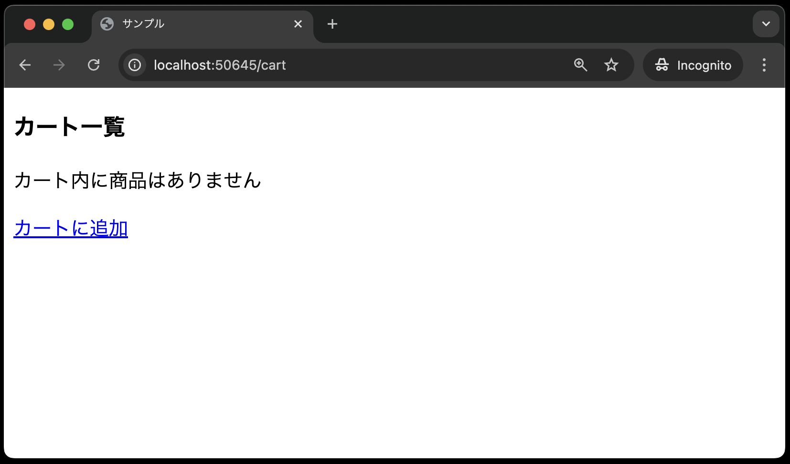
2. カート追加画面にアクセスする<br>
3. 商品番号と数量を入力し、カートに追加する<br>
    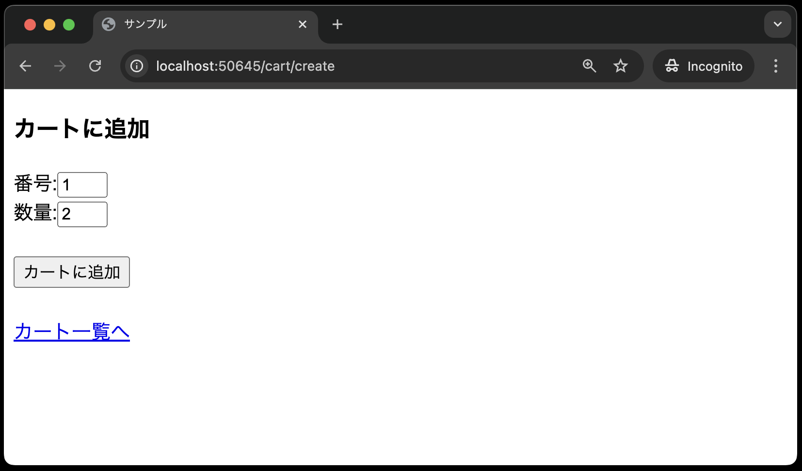
   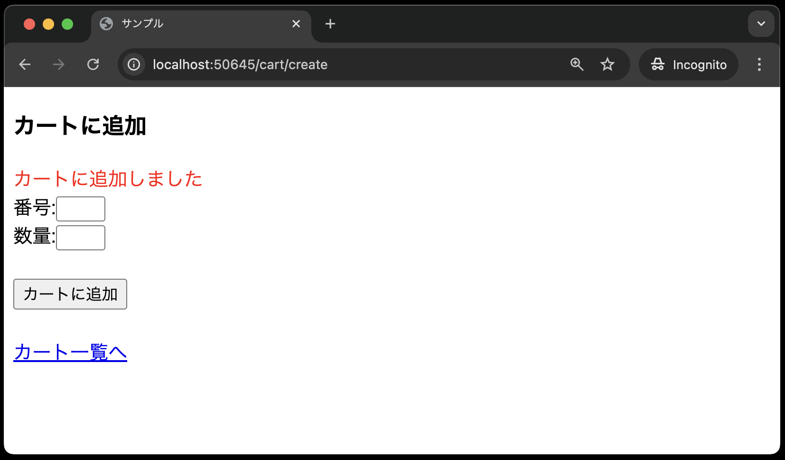
4. カート一覧画面に遷移し、商品が追加されていることを確認する<br>
   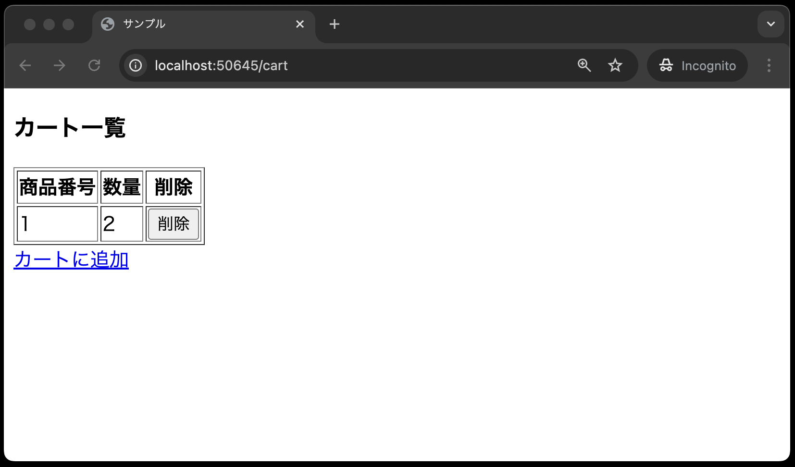
5. 削除ボタンを押し、商品がカート内から削除されていることを確認する<br>
   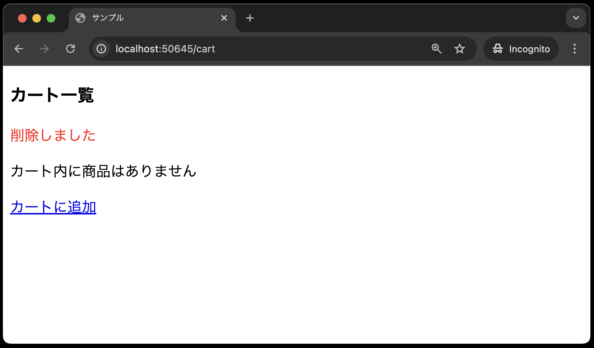

## カートの更新機能を実装

次に、カートの注文数を変更する機能を実装します。

### ルーティングの設定

---

`routes/web.php`に以下のルーティングを追加します。

```php
<?php

use Illuminate\Support\Facades\Route;
use App\Http\Controllers\ItemController;
use App\Http\Controllers\CartController;

// 途中省略

Route::get('cart', [CartController::class, 'index'])->name('cart.index');
Route::delete('cart/{cart}',[CartController::class, 'destroy'])->name('cart.destroy');
// --- 以下を追加 ---
Route::patch('cart/{cart}',[CartController::class, 'update'])->name('cart.update');
```

**【解説】**

`Route::patch('cart/{cart}',[CartController::class, 'update'])->name('cart.update');`: <br>
カートの注文数を変更するためのルーティングです。
`CartController`の`update`メソッドを呼び出します。
`Route::patch`メソッドを使って、HTTPメソッドが`PATCH`リクエストを受け付けるように設定しています。

今回は、カート内の商品の注文数を変更するため、`PATCH`メソッドを使います。
`PATCH`メソッドは、リソースの一部を更新するためのメソッドです。

### ビューの修正(更新ボタンの追加)

---

`resources/views/cart/index.blade.php`を以下のように修正します。


```php
<!DOCTYPE html>
<html lang="ja">
<head>
<meta charset="UTF-8">
<meta name="viewport" content="width=device-width, initial-scale=1.0">
<title>サンプル</title>
</head>
<body>
    <h3>カート一覧</h3>
    @if (session('message'))
        <font color="red">{{ session('message') }}</font>
    @endif
    @if( count($carts) == 0 )
        <p>カート内に商品はありません</p>
    @else
        <table border="1">
        <tr>
            <th>商品番号</th>
            <th>数量</th>
            <th>削除</th>
        </tr>
        @foreach( $carts  as  $cart )
            <tr>
                <td> {{ $cart->ident }} </td>
                <!-- 以前のコードはコメントアウト -->
                <!-- <td> {{ $cart->quantity }} </td> -->
                <!-- 以下を追加 -->
                <td>
                    <form method="POST" action="{{ route('cart.update', ['cart' => $cart->ident]) }}">
                        @csrf
                        @method('PATCH')
                        <input type="number" name="quantity" value="{{ $cart->quantity }}" min="1" max="10">
                        <input type="submit" value="更新">
                    </form>
                </td>
                <!-- ここまで -->
                <td>
                    <form method="POST" action="{{ route('cart.destroy', ['cart' => $cart->ident]) }}">
                        @csrf
                        @method('DELETE')
                        <input type="submit" value="削除">
                    </form>
                </td>
            </tr>
        @endforeach
        </table>
    @endif
    <a href="{{ route('cart.create') }}">カートに追加</a>
</body>
</html>
```

**【解説】**

`<form method="POST" action="{{ route('cart.update', ['cart' => $cart->ident]) }}">`: <br>
注文数を変更するためのフォームです。
`route`関数の第2引数に`['cart' => $cart->ident]`を指定しています。
これにより、`$cart->ident`の値が、ルーティングの`{cart}`に代入されます。

`@method('PATCH')`: <br>
`PATCH`リクエストを使うことを指定しています。
`GET`リクエストや`POST`リクエストを使う場合は特に指定しなかったのに対し、`PATCH`メソッドを使う場合は明示的に指定する必要があります。
なぜなら、ブラウザは`PATCH`リクエストをサポートしていないためです。
そのため、`@method('PATCH')`を使って、`PATCH`リクエストを使うことを明示的に指定しています。
これにより、ルーティングを見るだけで、更新機能があることがわかります。



### コントローラの修正(`update`メソッドの追加)

`app/Http/Controllers/CartController.php`を以下のように修正します。

```php
<?php
namespace App\Http\Controllers;

use Illuminate\Http\Request;
use App\Models\Cart;

class CartController extends Controller
{
    // 途中省略

    public function destroy(Cart $cart)
    {
        $cart->delete();
        return redirect()->route('cart.index');
    }

    // --- 以下を追加 ---
    public function update(Request $request, Cart $cart)
    {
        $validated = $request->validate([
            'quantity' => 'required|integer|min:1|max:10',
        ]);
        $cart->update(['quantity' => $validated['quantity']]);
        $request->session()->flash('message', '更新しました');
        return redirect()->route('cart.index');
    }
    // --- ここまで ---
}
```

**【解説】**

`public function update(Request $request, Cart $cart)`: <br>
カート内の商品の注文数を変更するためのメソッドです。
Laravelでは、コントローラのメソッドにupdateと命名する場合、更新処理を行うことが一般的です。

`$cart->update(['quantity' => $request->quantity]);`: <br>
`$cart`の`update`メソッドを使って、レコードを更新しています。
`$request->quantity`の値で、`$cart`の`quantity`カラムを更新しています。
これにより、指定したレコードの注文数が変更されます。

カート内の商品の注文数を変更する機能が実装できました。

## 動作確認(2回目:更新機能)

以下の手順で動作確認をしてみましょう。

1. `http://localhost:{ポート番号}/cart`でカート一覧画面にアクセスする<br>
   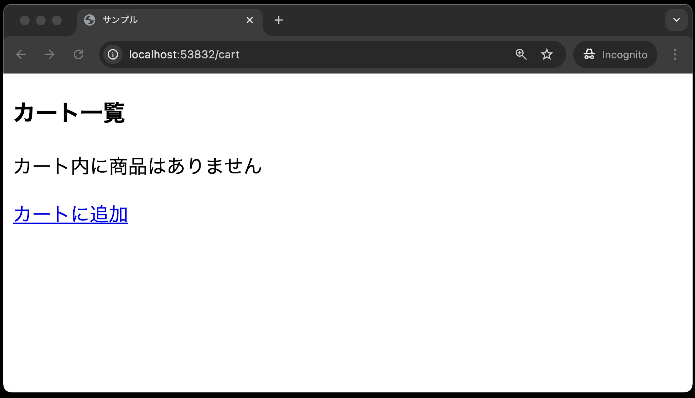
2. カート追加画面にアクセスする<br>
   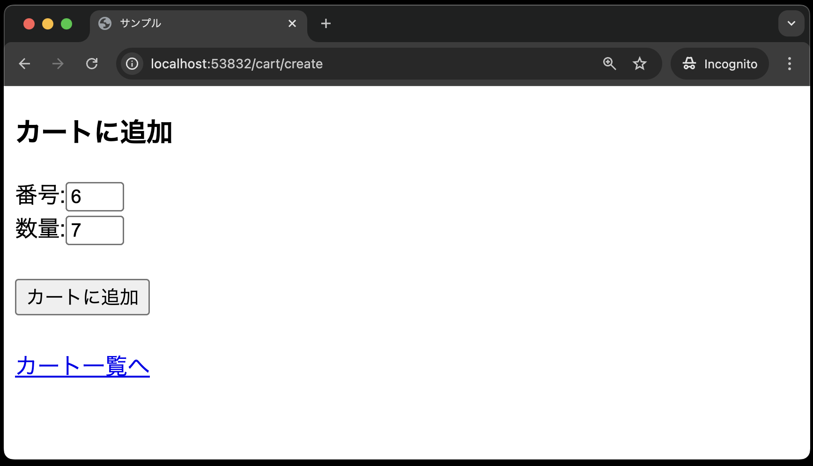
3. 商品番号と数量を入力し、カートに追加する<br>
   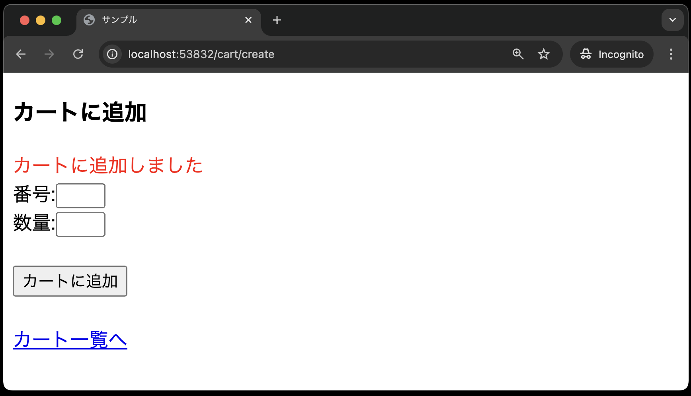
4. カート一覧画面に遷移し、商品が追加されていることを確認する<br>
   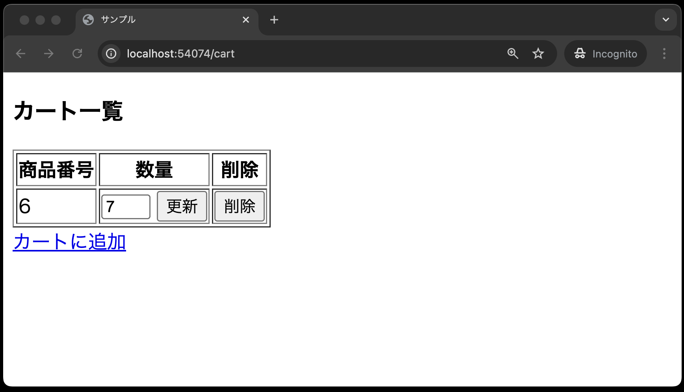
5. 注文数を変更し、更新ボタンを押す<br>
   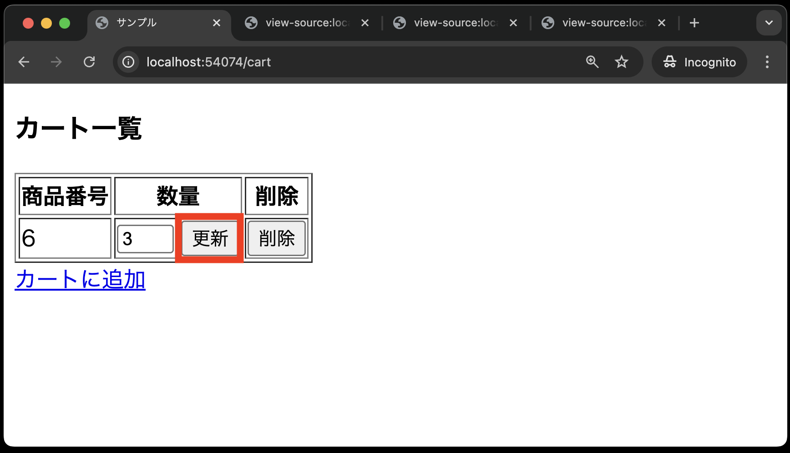
6. カート一覧画面に遷移し、商品の注文数が変更されていることを確認する<br>
   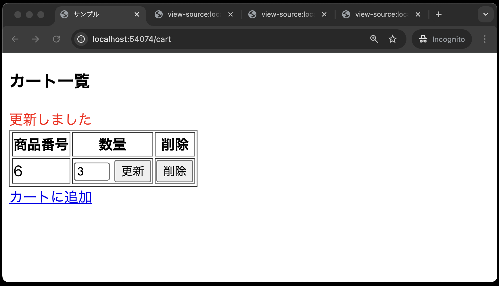
7. phpMyAdminでもデータの整合性を確認できたらOK<br>
   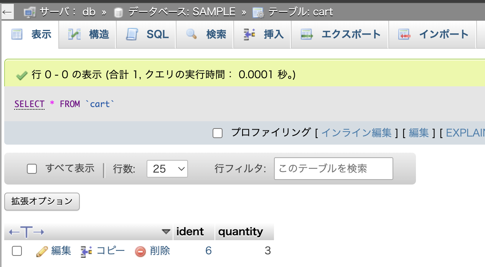

## まとめ

本章までで、Laravelを使って、CRUD機能(Create（作成）、Read（読み取り）、Update（更新）、Delete（削除）)を実装する方法を学びました。

また、できあがったカートについてのルーティングは以下のようになります。

```php
Route::get('cart', [CartController::class, 'index'])->name('cart.index');
Route::get('cart/create', [CartController::class, 'create'])->name('cart.create');
Route::post('cart', [CartController::class, 'store'])->name('cart.store');
Route::delete('cart/{cart}',[CartController::class, 'destroy'])->name('cart.destroy');
Route::patch('cart/{cart}',[CartController::class, 'update'])->name('cart.update');
```

ルーティングを見るだけで、読み取り(`index`)、追加(`create`、`store`)、削除(`delete`)、更新(`update`)の機能があることがわかります。
