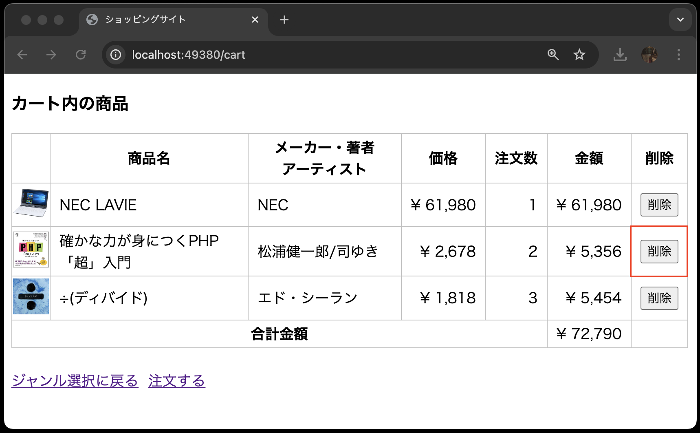
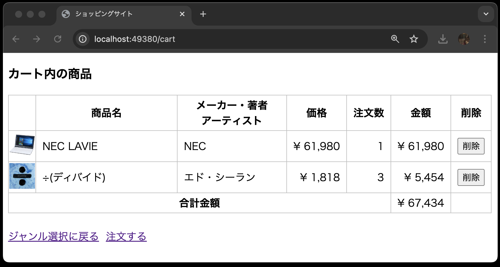
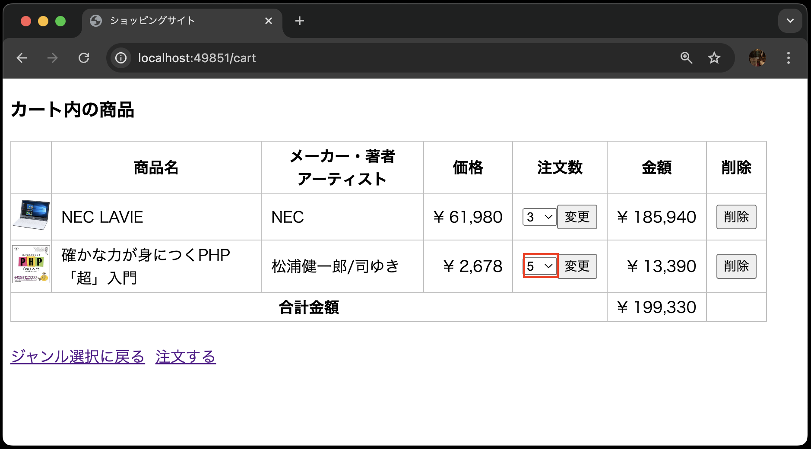
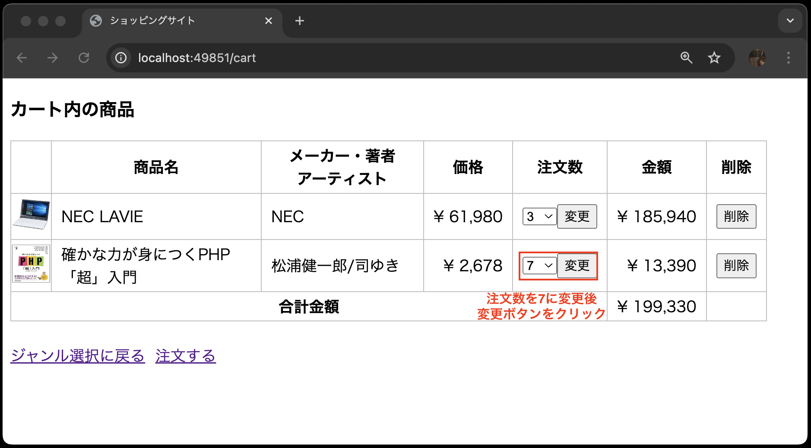
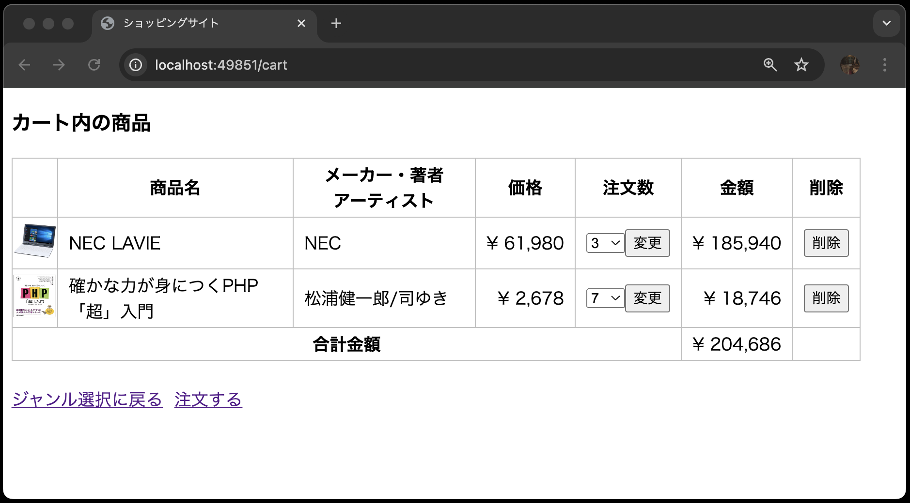

## カートの削除・更新機能

- [カートの削除・更新機能](#カートの削除更新機能)
- [事前準備](#事前準備)
- [はじめに](#はじめに)
- [カートの削除機能を実装](#カートの削除機能を実装)
  - [ルーティングの設定](#ルーティングの設定)
  - [削除ボタンの追加](#削除ボタンの追加)
  - [コントローラに削除機能を実装](#コントローラに削除機能を実装)
- [カートの更新機能を実装](#カートの更新機能を実装)
  - [ルーティングの設定](#ルーティングの設定-1)
  - [更新ボタンの追加](#更新ボタンの追加)
  - [コントローラに更新機能を実装](#コントローラに更新機能を実装)
- [まとめ](#まとめ)

## 事前準備

前回の[カート内の商品画面](../shop_cart_index/README.md)でcloneしたコードをそのまま利用してください。

## はじめに

本章では、Laravelを使って、カートの削除・更新機能を作成します。

## カートの削除機能を実装

まずは、カート内の商品を削除する機能を実装します。

### ルーティングの設定

`routes/web.php`に以下のルーティングを追加します。

```php
<?php

use Illuminate\Support\Facades\Route;
use App\Http\Controllers\ItemController;
use App\Http\Controllers\CartController;

// Route::get('/', function () {
//     return view('welcome');
// });

Route::get('/', function () {
    return view('index');
})->name('index');

//Route::post('item', [ItemController::class, 'index'])->name('item.index');
Route::match(['get', 'post'], 'item/{genre?}', [ItemController::class, 'index'])->name('item.index');
Route::get('item/show/{item}', [ItemController::class, 'show'])->name('item.show');

Route::get('cart', [CartController::class, 'index'])->name('cart.index');
Route::post('cart', [CartController::class, 'store'])->name('cart.store');
// --- 以下を追加 ---
Route::delete('cart/{cart}',[CartController::class, 'destroy'])->name('cart.destroy');
```

**【解説】**

- `Route::delete('cart/{cart}',[CartController::class, 'destroy'])->name('cart.destroy');`: <br>
  カート内の商品を削除するためのルーティングです。
  `CartController`の`destroy`メソッドを呼び出します。
  `Route::delete`メソッドを使って、HTTPメソッドがDELETEのリクエストを受け付けるように設定しています。

  今までのリクエストはGETとPOSTだけでしたが、今回はDELETEメソッドを使います。
  GETやPOSTを使っても同様のルーティングを設定できますが、処理の性質によって使い分けます。

### 削除ボタンの追加

`resources/views/cart/index.blade.php`を以下のように修正します。

```php
<!DOCTYPE html>
<html lang="ja">
<head>
<meta charset="UTF-8">
<meta name="viewport" content="width=device-width, initial-scale=1.0">
<link rel="stylesheet" href="{{ asset('css/minishop.css')}}">
<title>ショッピングサイト</title>
</head>
<body>
    <!-- 以下を追加 -->
    @if( count($carts) == 0 )
        <h3>カート内に商品はありません</h3>
        <a href="{{ route('index') }}">ジャンル選択に戻る</a>
    @else
    <!-- ここまで -->
        <h3>カート内の商品</h3>
        <table>
        <tr>
            <th>&nbsp;</th>
            <th>商品名</th>
            <th>メーカー・著者<br>アーティスト</th>
            <th>価格</th>
            <th>注文数</th>
            <th>金額</th>
            <th>削除</th> // 追加
        </tr>
        @php
            $total = 0;
        @endphp
        @foreach( $carts  as  $cart )
            <tr>
                <td class="td_mini_img">item->image )}}"></td>
                <td class="td_item_name"> {{ $cart->item->name }} </td>
                <td class="td_item_maker"> {{ $cart->item->maker }} </td>
                <td class="td_right">&yen; {{  number_format( $cart->item->price) }} </td>
                <td class="td_right"> {{ $cart->quantity }} </td>
                <td class="td_right">&yen; {{ number_format( $cart->item->price * $cart->quantity) }}</td>
                <!-- 以下を追加 -->
                <td>
                    <form method="POST" action="{{ route('cart.destroy', ['cart' => $cart->ident]) }}">
                        @csrf
                        @method('DELETE')
                        <input type="submit" value="削除">
                    </form>
                </td>
                <!-- ここまで -->
            </tr>
            @php
                $total += $cart->item->price * $cart->quantity;
            @endphp
        @endforeach
        <tr>
            <th colspan="5">合計金額</th><td class="td_right">&yen; {{ number_format($total) }}</td>
            <td>&nbsp;</td> // 追加
        </tr>
        </table>
        <br>
        <-- 注文するリンクはまだ作成していないので、href属性は空にしています -->
        <a href="{{ route('index') }}">ジャンル選択に戻る</a>&nbsp;&nbsp;<a href="">注文する</a>
    @endif
</body>
</html>
```

**【解説】**

`<form method="POST" action="{{ route('cart.destroy', ['cart' => $cart->ident]) }}">`: <br>
  削除ボタンを押すと、カート内の商品が削除されるように設定しています。
  `route`関数の第2引数に`['cart' => $cart->ident]`を指定しています。
  これにより、`$cart->ident`の値が`{cart}`に代入されます。

`@method('DELETE')`: <br>
DELETEメソッドを使うことを指定しています。
GETメソッドやPOSTメソッドを使う場合は特に指定しなかったのに対し、DELETEメソッドを使う場合は明示的に指定する必要があります。
なぜなら、ブラウザはDELETEメソッドをサポートしていないためです。
そのため、`@method('DELETE')`を使って、DELETEメソッドを使うことを明示的に指定しています。
これにより、ルーティングを見るだけで、削除機能があることがわかります。

### コントローラに削除機能を実装

`app/Http/Controllers/CartController.php`を以下のように修正します。

```php
<?php
namespace App\Http\Controllers;

use Illuminate\Http\Request;
use App\Models\Cart;

class CartController extends Controller
{
    public function index()
    {
        $carts = Cart::with('item')->get();
        return view('cart.index', ['carts' => $carts]);
    }

    public function store(Request $request)
    {
        // 既にカートに入っている商品かチェック
        $cart = Cart::find($request->ident);
        if ($cart) {
            $new_quantity = $request->quantity + $cart->quantity;
            if ($new_quantity > 10) {
                $new_quantity = 10;
            }
            $cart->quantity = $new_quantity;
            $cart->update(['quantity' => $new_quantity]);
        } else {
            Cart::create([
                'ident' => $request->ident,
                'quantity' => $request->quantity,
            ]);
        }
        return redirect()->route('cart.index');
    }

    // --- 以下を追加 ---
    public function destroy(Cart $cart)
    {
        $cart->delete();
        return redirect()->route('cart.index');
    }
    // --- ここまで追加 ---
}
```

**【解説】**

`public function destroy(Cart $cart)`: <br>
カート内の商品を削除するためのメソッドです。
Laravelでは、コントローラのメソッドにdestroyと命名する場合、削除処理を行うことが一般的です。

`$cart->delete();`: <br>
`$cart`の`delete`メソッドを使って、レコードを削除しています。
この記述のみで、指定したレコードが削除されます。
ここでいう指定したレコードとは、ルーティングで指定した`{cart}`の値が`$cart`に代入されたレコードです。
つまり、`$cart->delete();`は、`Cart::find($cart->ident)->delete();`と同じ意味になります。
以前もお伝えしましたが、Laravelのこの機能のことをルートモデルバインディングといいます。

`return redirect()->route('cart.index');`: <br>
削除処理が終わったら、カート内の商品一覧画面にリダイレクトします。

以上で、カート内の商品を削除する機能が実装できました。
動作確認をしてみましょう。
以下のようにカート内の商品画面で削除ボタンを押し、商品が削除されることを確認してください。




phpMyAdminでもデータの整合性を確認してみましょう。


## カートの更新機能を実装

次に、カート内の商品の注文数を変更する機能を実装します。

### ルーティングの設定

`routes/web.php`に以下のルーティングを追加します。

```php
<?php

use Illuminate\Support\Facades\Route;
use App\Http\Controllers\ItemController;
use App\Http\Controllers\CartController;

// Route::get('/', function () {
//     return view('welcome');
// });

Route::get('/', function () {
    return view('index');
})->name('index');

//Route::post('item', [ItemController::class, 'index'])->name('item.index');
Route::match(['get', 'post'], 'item/{genre?}', [ItemController::class, 'index'])->name('item.index');
Route::get('item/show/{item}', [ItemController::class, 'show'])->name('item.show');

Route::get('cart', [CartController::class, 'index'])->name('cart.index');
Route::post('cart', [CartController::class, 'store'])->name('cart.store');
Route::delete('cart/{cart}',[CartController::class, 'destroy'])->name('cart.destroy');
// --- 以下を追加 ---
Route::patch('cart/{cart}',[CartController::class, 'update'])->name('cart.update');
```

**【解説】**

`Route::patch('cart/{cart}',[CartController::class, 'update'])->name('cart.update');`: <br>
カート内の商品の注文数を変更するためのルーティングです。
`CartController`の`update`メソッドを呼び出します。
`Route::patch`メソッドを使って、HTTPメソッドがPATCHのリクエストを受け付けるように設定しています。

今回は、カート内の商品の注文数を変更するため、PATCHメソッドを使います。
PATCHメソッドは、リソースの一部を更新するためのメソッドです。
ちなみに、同じ更新するためのメソッドにPUTメソッドがあるのですが、PUTメソッドはリソース全体を更新するのに対し、PATCHメソッドはリソースの一部を更新します。

### 更新ボタンの追加

`resources/views/cart/index.blade.php`を以下のように修正します。

```php
<!DOCTYPE html>
<html lang="ja">
<head>
<meta charset="UTF-8">
<meta name="viewport" content="width=device-width, initial-scale=1.0">
<link rel="stylesheet" href="{{ asset('css/minishop.css')}}">
<title>ショッピングサイト</title>
</head>
<body>
    @if( count($carts) == 0 )
        <h3>カート内に商品はありません</h3>
        <a href="{{ route('index') }}">ジャンル選択に戻る</a>
    @else
        <h3>カート内の商品</h3>
        <table>
        <tr>
            <th>&nbsp;</th>
            <th>商品名</th>
            <th>メーカー・著者<br>アーティスト</th>
            <th>価格</th>
            <th>注文数</th>
            <th>金額</th>
            <th>削除</th>
        </tr>
        @php
            $total = 0;
        @endphp
        @foreach( $carts  as  $cart )
            <tr>
                <td class="td_mini_img">item->image )}}"></td>
                <td class="td_item_name"> {{ $cart->item->name }} </td>
                <td class="td_item_maker"> {{ $cart->item->maker }} </td>
                <td class="td_right">&yen; {{  number_format( $cart->item->price) }} </td>
                <!-- 既存の注文数はコメントアウト -->
                <!-- <td class="td_right"> {{ $cart->quantity }} </td> -->
                <!-- プルダウンと更新ボタンを追加したものに変更 -->
                <!-- 以下を追加 -->
                <td>
                    <form method="POST" action="{{ route('cart.update', ['cart' => $cart->ident]) }}">
                        @csrf
                        @method('PATCH')
                        <select name="quantity">
                            @for ( $i=1;  $i<=10;  $i++ )
                                <option value="{{ $i }}"
                                @if($i == $cart->quantity)
                                    selected
                                @endif
                                > {{ $i }} </option>
                            @endfor
                            &nbsp;
                            <input type="submit" value="変更">
                    </form>
                </td>
                <!-- ここまで -->
                <td class="td_right">&yen; {{ number_format( $cart->item->price * $cart->quantity) }}</td>
                <td>
                    <form method="POST" action="{{ route('cart.destroy', ['cart' => $cart->ident]) }}">
                        @csrf
                        @method('DELETE')
                        <input type="submit" value="削除">
                    </form>
                </td>
            </tr>
            @php
                $total += $cart->item->price * $cart->quantity;
            @endphp
        @endforeach
        <tr>
            <th colspan="5">合計金額</th><td class="td_right">&yen; {{ number_format($total) }}</td>
            <td>&nbsp;</td>
        </tr>
        </table>
        <br>
        <-- 注文するリンクはまだ作成していないので、href属性は空にしています -->
        <a href="{{ route('index') }}">ジャンル選択に戻る</a>&nbsp;&nbsp;<a href="">注文する</a>
    @endif
</body>
</html>
```

**【解説】**

`<form method="POST" action="{{ route('cart.update', ['cart' => $cart->ident]) }}">`: <br>
注文数を変更するためのフォームです。
`route`関数の第2引数に`['cart' => $cart->ident]`を指定しています。
これにより、`$cart->ident`の値が`{cart}`に代入されます。

`@method('PATCH')`: <br>
PATCHメソッドを使うことを指定しています。
GETメソッドやPOSTメソッドを使う場合は特に指定しなかったのに対し、PATCHメソッドを使う場合は明示的に指定する必要があります。
なぜなら、ブラウザはPATCHメソッドをサポートしていないためです。
そのため、`@method('PATCH')`を使って、PATCHメソッドを使うことを明示的に指定しています。
これにより、ルーティングを見るだけで、更新機能があることがわかります。

### コントローラに更新機能を実装

`app/Http/Controllers/CartController.php`を以下のように修正します。

```php
<?php
namespace App\Http\Controllers;

use Illuminate\Http\Request;
use App\Models\Cart;

class CartController extends Controller
{
    public function index()
    {
        $carts = Cart::with('item')->get();
        return view('cart.index', ['carts' => $carts]);
    }

    public function store(Request $request)
    {
        // 既にカートに入っている商品かチェック
        $cart = Cart::find($request->ident);
        if ($cart) {
            $new_quantity = $request->quantity + $cart->quantity;
            if ($new_quantity > 10) {
                $new_quantity = 10;
            }
            $cart->quantity = $new_quantity;
            $cart->update(['quantity' => $new_quantity]);
        } else {
            Cart::create([
                'ident' => $request->ident,
                'quantity' => $request->quantity,
            ]);
        }
        return redirect()->route('cart.index');
    }

    public function destroy(Cart $cart)
    {
        $cart->delete();
        return redirect()->route('cart.index');
    }

    // --- 以下を追加 ---
    public function update(Request $request, Cart $cart)
    {
        $cart->update(['quantity' => $request->quantity]);
        return redirect()->route('cart.index');
    }
    // --- ここまで ---
}
```

**【解説】**

`public function update(Request $request, Cart $cart)`: <br>
カート内の商品の注文数を変更するためのメソッドです。
Laravelでは、コントローラのメソッドにupdateと命名する場合、更新処理を行うことが一般的です。

`$cart->update(['quantity' => $request->quantity]);`: <br>
`$cart`の`update`メソッドを使って、レコードを更新しています。
`$request->quantity`の値で、`$cart`の`quantity`カラムを更新しています。
これにより、指定したレコードの注文数が変更されます。

カート内の商品の注文数を変更する機能が実装できました。
動作確認をしてみましょう。

以下のようにカート内の商品画面で注文数を変更し、更新ボタンを押すと、注文数が変更されることを確認してください。





phpMyAdminでもデータの整合性を確認してみましょう。


## まとめ

本章では、Laravelを使って、カートの削除・更新機能を作成しました。
以前の章も含めると、カート内の商品画面が完成され、データベースのCRUD操作ができるようになりました。
ここでいうCRUD操作とは、Create（作成）、Read（読み取り）、Update（更新）、Delete（削除）のことです。

また、できあがったカートについてのルーティングは以下のようになります。

```php
Route::get('cart', [CartController::class, 'index'])->name('cart.index');
Route::post('cart', [CartController::class, 'store'])->name('cart.store');
Route::delete('cart/{cart}',[CartController::class, 'destroy'])->name('cart.destroy');
Route::patch('cart/{cart}',[CartController::class, 'update'])->name('cart.update');
```

ルーティングを見るだけで、カート内の商品画面に対して、商品の一覧表示、商品の追加、商品の削除、商品の更新ができることがわかります。

これで、カート内の商品画面が完成されました。
次回は、注文画面を作成します。
