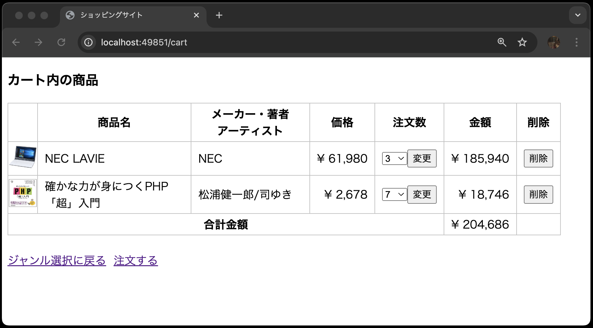
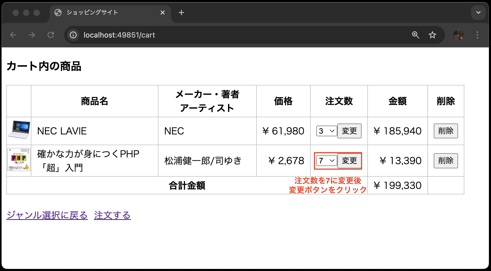

# 【課題】カート内の商品画面の修正（削除・更新機能）

- [【課題】カート内の商品画面の修正（削除・更新機能）](#課題カート内の商品画面の修正削除更新機能)
  - [事前準備](#事前準備)
  - [本章の狙い](#本章の狙い)
  - [カート内の商品画面(削除・更新機能)の仕様](#カート内の商品画面削除更新機能の仕様)
  - [①データベース環境構築](#データベース環境構築)
  - [②カートの削除機能を実装](#カートの削除機能を実装)
    - [②-1 ルーティングの設定](#-1-ルーティングの設定)
    - [②-2 削除ボタンの追加](#-2-削除ボタンの追加)
    - [②-3 コントローラに削除機能を実装](#-3-コントローラに削除機能を実装)
    - [②-4 動作確認(削除機能)](#-4-動作確認削除機能)
  - [③カートの更新機能を実装](#カートの更新機能を実装)
    - [③-1 ルーティングの設定](#-1-ルーティングの設定-1)
    - [③-2 更新ボタンの追加](#-2-更新ボタンの追加)
    - [③-3 コントローラに更新機能を実装](#-3-コントローラに更新機能を実装)
    - [③-4 動作確認(更新機能)](#-4-動作確認更新機能)
  - [課題の提出について](#課題の提出について)
    - [課題の合格基準](#課題の合格基準)
    - [合格確認方法](#合格確認方法)

## 事前準備

1. [こちらのページ]()から、ソースコードを`C:¥sys_dev_exe`へcloneする
2. VSCode上で、`Ctrl+Shift+P`(Macの場合は`Cmd+Shift+P`)を押し、コンテナを起動する
3. VSCode上で、`Ctrl+J`(Macの場合は`Cmd+J`)を押し、ターミナルを表示する
4. `composer create-project laravel/laravel .` を実行し、Laravel環境を構築する
5. 過去に作成した以下のコードを、上記「1.」でcloneしたソースコードと同じ場所に上書きする

    ```text
    app
    ├── Http
    │   └── Controllers
    │   │   ├── CartController.php
    │   │   └── ItemController.php
    ├── Models
    │   ├── Cart.php
    │   └── Item.php
    │
    途中省略
    │
    database
    ├── migrations
    │   ├── 20XX_XX_XX_XXXXXX_create_items_table.php
    │   └── 20XX_XX_XX_XXXXXX_create_cart_table.php
    ├── seeds
    │   ├── DatabaseSeeder.php
    │   └── ItemsTableSeeder.php
    │
    途中省略
    │
    public
    ├── css
    │   └── minishop.css
    ├── images
    │   └── xxx.png(15個の画像ファイル)
    │
    resources
    ├── views
    │   ├── cart
    │   │   └── index.blade.php
    │   ├── items
    │   │   ├── index.blade.php 
    │   │   └── show.blade.php    
    │   └── index.blade.php
    routes
    ├── web.php
    │
    途中省略
    │
    .env
    ```

## 本章の狙い

- [CRUD機能を作ろう！(UPDATE、DELETE編)](../shop_cart_delete_update/README.md)で学んだ知識を定着させる
- カート内の商品画面(削除・更新機能)を再構築する

## カート内の商品画面(削除・更新機能)の仕様



- 削除ボタンを押すと、カート内の特定の商品が削除される
- 更新ボタンを押すと、カート内の商品の注文数が変更される

## ①データベース環境構築

新しくソースコードをcloneしたので、再度データベース環境構築をする必要があります。
`items`テーブルと`cart`テーブルを作成してください。

マイグレーションファイルとシーダーファイルがすでにあるので、`php artisan migrate:fresh --seed`でデータベースが構築されます。

## ②カートの削除機能を実装

まずは、カート内の商品を削除する機能を実装します。

### ②-1 ルーティングの設定

---

`routes/web.php`に以下のルーティングを追加します。

- `DELETE`リクエストを受け付けるルーティングであること
- URLが`cart/{xxxx}`であること(※ヒント:`xxxx`にはルートモデルバインディングを利用するための文字列が入ります)
- `CartController`の`destroy`メソッドを呼び出すこと
- ルーティング名を`cart.destroy`に設定すること

### ②-2 削除ボタンの追加

`resources/views/cart/index.blade.php`を以下のように修正します。
穴埋めになっている箇所は、[CRUD機能を作ろう！(UPDATE、DELETE編)](../shop_cart_delete_update/README.md)を参考に、埋めるようにしてください。

```php
<!DOCTYPE html>
<html lang="ja">
<head>
<meta charset="UTF-8">
<meta name="viewport" content="width=device-width, initial-scale=1.0">
<link rel="stylesheet" href="{{ asset('css/minishop.css')}}">
<title>ショッピングサイト</title>
</head>
<body>
    <!-- 以下を追加 -->
    <!-- カート内の情報が空になった場合の条件を定義する(穴埋め)-->
    @if(                    )
        <h3>カート内に商品はありません</h3>
        <!-- ジャンル選択画面へのルーティングを設定する(穴埋め) -->
        <a href="{{                }}">ジャンル選択に戻る</a>
    @else
    <!-- ここまで -->
        <h3>カート内の商品</h3>
        <table>
        <tr>
            <th>&nbsp;</th>
            <th>商品名</th>
            <th>メーカー・著者<br>アーティスト</th>
            <th>価格</th>
            <th>注文数</th>
            <th>金額</th>
            <th>削除</th> // 追加
        </tr>
        @php
            $total = 0;
        @endphp
        @foreach( $carts  as  $cart )
            <tr>
                <td class="td_mini_img">item->image )}}"></td>
                <td class="td_item_name"> {{ $cart->item->name }} </td>
                <td class="td_item_maker"> {{ $cart->item->maker }} </td>
                <td class="td_right">&yen; {{  number_format( $cart->item->price) }} </td>
                <td class="td_right"> {{ $cart->quantity }} </td>
                <td class="td_right">&yen; {{ number_format( $cart->item->price * $cart->quantity) }}</td>
                <!-- 以下を追加 -->
                <td>
                    <!-- action属性にルーティングを設定する(穴埋め) -->
                    <form method="POST" action="{{                                                 }}">
                        <!-- CSRF保護(穴埋め) -->
                        @
                        <!-- DELETEメソッドを使うことを指定する(穴埋め) -->
                        @
                        <input type="submit" value="削除">
                    </form>
                </td>
                <!-- ここまで -->
            </tr>
            @php
                $total += $cart->item->price * $cart->quantity;
            @endphp
        @endforeach
        <tr>
            <th colspan="5">合計金額</th><td class="td_right">&yen; {{ number_format($total) }}</td>
            <td>&nbsp;</td> // 追加
        </tr>
        </table>
        <br>
        <!-- 注文に関するルーティングはまだ作成していないので、href属性は空にしています -->
        <a href="{{ route('index') }}">ジャンル選択に戻る</a>&nbsp;&nbsp;<a href="">注文する</a>
    @endif
</body>
</html>
```

### ②-3 コントローラに削除機能を実装

---

`app/Http/Controllers/CartController.php`を以下のように修正します。

```php
<?php
namespace App\Http\Controllers;

use Illuminate\Http\Request;
use App\Models\Cart;

class CartController extends Controller
{
    // 途中省略

    // --- 以下を追加 ---
    // 引数にカートのオブジェクトを受け取る(穴埋め)
    public function destroy(          )
    {
        // レコードを削除する(穴埋め)
        $
        // カート内の商品一覧画面にリダイレクトする(穴埋め)
        return 
    }
    // --- ここまで追加 ---
}
```

以上で、カート内の商品を削除する機能が実装できました。

### ②-4 動作確認(削除機能)

以下のようにカート内の商品画面で削除ボタンを押し、商品が削除されることを確認してください。


phpMyAdminでもデータの整合性を確認してみましょう。


## ③カートの更新機能を実装

次に、カート内の商品の注文数を変更する機能を実装します。

### ③-1 ルーティングの設定

---

`routes/web.php`に以下のルーティングを追加します。

- `PATCH`リクエストを受け付けるルーティングであること
- URLが`cart/{xxxx}`であること(※ヒント:`xxxx`にはルートモデルバインディングを利用するための文字列が入ります)
- `CartController`の`update`メソッドを呼び出すこと
- ルーティング名を`cart.update`に設定すること

### ③-2 更新ボタンの追加

`resources/views/cart/index.blade.php`を以下のように修正します。

```php
<!DOCTYPE html>
<html lang="ja">
<head>
<meta charset="UTF-8">
<meta name="viewport" content="width=device-width, initial-scale=1.0">
<link rel="stylesheet" href="{{ asset('css/minishop.css')}}">
<title>ショッピングサイト</title>
</head>
<body>
    
    <!-- 途中省略 -->
        @foreach( $carts  as  $cart )
            <tr>
                <td class="td_mini_img">item->image )}}"></td>
                <td class="td_item_name"> {{ $cart->item->name }} </td>
                <td class="td_item_maker"> {{ $cart->item->maker }} </td>
                <td class="td_right">&yen; {{  number_format( $cart->item->price) }} </td>
                <!-- 既存の注文数はコメントアウト -->
                <!-- <td class="td_right"> {{ $cart->quantity }} </td> -->
                
                <!-- 以下を追加 -->
                <td>
                    <!-- action属性にルーティングを設定する(穴埋め) -->
                    <form method="POST" action="{{                                                 }}">
                        <!-- CSRF保護(穴埋め) -->
                        @
                        <!-- PATCHソッドを使うことを指定する(穴埋め) -->
                        @
                        <select name="quantity">
                            <!-- forディレクティブを使って、1から10までの選択肢を生成する(穴埋め) -->
                            @for (                      )
                                <!-- value属性にループ変数$iを設定する(穴埋め) -->
                                <option value="       "
                                <!-- ループ変数$iとカート内の商品の注文数が一致したらselectedを設定する(穴埋め) -->
                                @if(                    )
                                    selected
                                @endif
                                > {{ $i }} </option>
                            @endfor
                            &nbsp;
                            <input type="submit" value="変更">
                    </form>
                </td>
                <!-- ここまで、以下省略 -->
```

### ③-3 コントローラに更新機能を実装

---

`app/Http/Controllers/CartController.php`を以下のように修正します。

```php
<?php
namespace App\Http\Controllers;

use Illuminate\Http\Request;
use App\Models\Cart;

class CartController extends Controller
{
    // 途中省略

    // --- 以下を追加 ---
    // 引数にリクストのオブジェクトとカートのオブジェクトを受け取る(穴埋め)
    public function update(                            )
    {
        // バリデーションを行う(穴埋め)
        $validated = $request->validate([
            
        ]);
        // カートの注文数を更新する(穴埋め)
        $
        // カート内の商品一覧画面にリダイレクトする(穴埋め)
        return 
    }
    // --- ここまで ---
}
```

### ③-4 動作確認(更新機能)

---

以下のようにカート内の商品画面で注文数を変更し、更新ボタンを押すと、注文数が変更されることを確認してください。





phpMyAdminでもデータの整合性を確認してみましょう。


## 課題の提出について

提出した課題はGitHub上で自動採点されます。
従来通りGitHub上にpushすれば完了で、自動採点がはじまります。

### 課題の合格基準

---

以下を合格基準とします。

1. カート内の特定の商品を削除できる
2. カート内の特定商品の注文数を変更できる
3. カート内の商品がなくなると、`カート内に商品はありません`と表示される

### 合格確認方法

---

1. 本課題の[課題ページ]()に再度アクセスする
2. 画面上部にある`Actions`をクリックする<br>

1. **一番上**の行に、緑色のチェックが入っていればOK<br>

