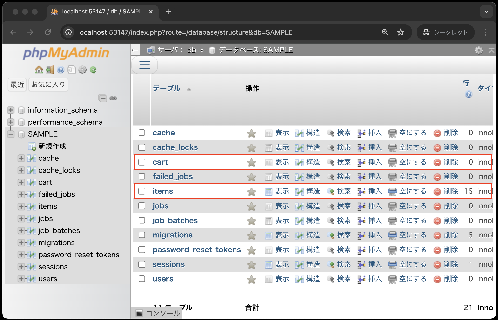

# カート内の商品画面

- [カート内の商品画面](#カート内の商品画面)
  - [事前準備](#事前準備)
  - [はじめに](#はじめに)
  - [データベース環境構築](#データベース環境構築)
  - [マイグレーション](#マイグレーション)
  - [シーダー](#シーダー)
  - [phpMyAdminでのデータ確認](#phpmyadminでのデータ確認)
  - [モデルの作成](#モデルの作成)
  - [コントローラの作成](#コントローラの作成)
  - [ルーティングと商品詳細画面の修正](#ルーティングと商品詳細画面の修正)
    - [ルーティングの修正](#ルーティングの修正)
    - [商品詳細画面の修正](#商品詳細画面の修正)
  - [CartControllerのindexメソッドの作成](#cartcontrollerのindexメソッドの作成)
  - [動作確認](#動作確認)
  - [まとめ](#まとめ)

## 事前準備

1. [こちらのページ]()から、ソースコードを`C:¥sys_dev_exe`へcloneする
2. VSCode上で、`Ctrl+Shift+P`(Macの場合は`Cmd+Shift+P`)を押し、コンテナを起動する
3. VSCode上で、`Ctrl+J`(Macの場合は`Cmd+J`)を押し、ターミナルを表示する
4. `composer create-project laravel/laravel .` を実行し、Laravel環境を構築する
5. 過去に作成した以下のコードを、上記「1.」でcloneしたソースコードと同じ場所に上書きする
   
    ```text
    app
    ├── Http
    │   └── Controllers
    │       └── ItemController.php
    ├── Models
    │   └── Item.php
    database
    ├── migrations
    │   └── 20xx_xx_xx_xxxxxx_create_items_table.php
    ├── seeders
    │   └── ItemTableSeeder.php
    │
    途中省略
    │
    resources
    ├── views
    │   ├── items
    │       ├── index.blade.php
    │       └── show.blade.php
    │   └── index.blade.php
    routes
    ├── web.php
    .env
    ```

## はじめに

本章では、カート内の商品画面を通じて、Laravelのモデル、コントローラ、ビュー、ルーティングの復習を行います。

## データベース環境構築

新しくソースコードをcloneしたので、再度データベース環境構築をする必要があります。
今回は、itemsテーブルに加え、カート内の商品を管理するためのcartテーブルを作成します。
なお、.envファイルは既に編集済みのものを上書きしているので、再度編集する必要はありません。

## マイグレーション

今回は、cartテーブルを作成するためのマイグレーションファイルを追加し、コマンドを実行してテーブルを作成します。
なお、cartテーブルの構造は前期同様以下の通りです。

| カラム名 | データ型 | 制約 | 備考 |
| - | - | - | - |
|ident|int型|主キー|商品番号|
|quantity|int型||注文数|

1. VSCode上で、`Ctrl+Shift+P`(Macの場合は`Cmd+Shift+P`)を押し、コンテナを起動する(既に起動しているなら不要)
2. VSCode上で、`Ctrl+J`(Macの場合は`Cmd+J`)を押し、ターミナルを表示する
3. 以下のコマンドを実行して、cartテーブル用のマイグレーションファイルを作成する

```bash
php artisan make:migration create_cart_table
```

4. `database/migrations/20xx_xx_xx_xxxxxx_create_cart_table.php` が作成されていることを確認する
5. `up`メソッドを以下のように修正する

    ```php
    public function up(): void
        {
            Schema::create('cart', function (Blueprint $table) {
                // デフォルトの記述はコメントアウト
                // $table->id();
                // $table->timestamps();

                // --- 以下を追加 ---
                $table->integer('ident')->primary();
                $table->integer('quantity');
                // 外部キー制約を追加
                $table->foreign('ident')->references('ident')->on('items')->onDelete('cascade');
                // --- ここまで ---
            });
        }
    ```

    **【解説】**

    `$table->foreign('ident')->references('ident')->on('items')->onDelete('cascade');`: <br>
    上記はメソッドチェーンと呼ばれる記述方法です。
    メソッドチェーンは、メソッドを連続して呼び出す記述方法で、コードを簡潔に書くことができます。

    `foreign`メソッドは、外部キー制約を追加するメソッドです。
    ここでは、`cart`テーブルの`ident`カラムに外部キー制約を追加しています。
    `references`メソッドで、外部キー制約の参照先を指定しています。
    ここでは、`items`テーブルの`ident`カラムを参照しています。
    `onDelete('cascade')`は、参照先のレコードが削除された際に、`cart`テーブルのレコードも削除されるように設定しています。

    そもそも外部キー制約とはなんでしょうか？
    外部キー制約とは、テーブル間の関連性を強制する制約のことです。
    例えば、`cart`テーブルの`ident`カラムに外部キー制約を設定することで、`cart`テーブルの`ident`カラムには、`items`テーブルの`ident`カラムに存在する値のみが入るように制約を設けることができます。

6. 以下のコマンドを実行して、マイグレーションを実行する

    ```bash
    php artisan migrate
    ```

これで、itemsテーブルと新たにcartテーブルが作成されました。

## シーダー

シーダーは新たに作成するファイルはないので、前回と同じItemTableSeeder.phpを実行するのみです。

1. VSCode上で、`Ctrl+Shift+P`(Macの場合は`Cmd+Shift+P`)を押し、コンテナを起動する(既に起動しているなら不要)
2. VSCode上で、`Ctrl+J`(Macの場合は`Cmd+J`)を押し、ターミナルを表示する
3. 以下のコマンドを実行して、シーダーを実行する

    ```bash
    php artisan db:seed --class=ItemTableSeeder
    ```

以上で、itemsテーブルにデータが挿入されました。

## phpMyAdminでのデータ確認

itemsテーブルとcartテーブルが作成されたか、phpMyAdminを使って確認してみましょう。

1. VSCode上で、`Ctrl+Shift+P`(Macの場合は`Cmd+Shift+P`)を押し、コンテナを起動する(既に起動している場合は不要)
2. VSCode上で、`Ctrl+J`(Macの場合は`Cmd+J`)を押し、ポートをクリックする
3. 地球儀マークをクリックする<br>
   
4. 以下の手順により、itemsテーブルにデータが挿入されているか確認する
   
   

   ※画像を見ると、itemsテーブル以外にも、いくつかのテーブルが作成されていることがわかりますが、これらはLaravelのデフォルトで作成されるテーブルです。
   database/migrationsディレクトリには、これらのテーブルを作成するためのマイグレーションファイルが用意されており、`php artisan migrate`コマンドを実行することで、これらのテーブルが作成されました。

以上で、データベースの準備が整いました。

## モデルの作成

前回同様コマンドを使ってモデルを作成します。

1. VSCode上で、`Ctrl+Shift+P`(Macの場合は`Cmd+Shift+P`)を押し、コンテナを起動する(既に起動している場合は不要)
2. VSCode上で、`Ctrl+J`(Macの場合は`Cmd+J`)を押し、ターミナルを表示する
3. 以下のコマンドを実行して、Itemモデルを作成する

```bash
php artisan make:model Cart
```

4. app/Models/Cart.php が作成されていることを確認する
5. 以下のようにCart.phpを修正する

    ```php
    <?php

    namespace App\Models;

    use Illuminate\Database\Eloquent\Factories\HasFactory;
    use Illuminate\Database\Eloquent\Model;

    class Cart extends Model
    {
        use HasFactory;
        // --- 以下を追加 ---
        protected $table = 'cart';
        protected $primaryKey = 'ident';
        // --- ここまで ---
    }
    ```

    **【解説】**

    `protected $table = 'cart';`: <br>
    `protected $table`プロパティは、モデルが対応するテーブル名を指定するプロパティです。
    Laravelでは、基本的には、モデル名は単数形、そのモデルに対応するテーブル名は複数形でなければエラーが発生します。
    例えば、`Item`モデルに対応するテーブルは`items`テーブルであるため、`Item`モデルの`$table`プロパティには自動的に`items`が指定され、これにより`Item`モデルによるデータベース操作が可能になります。

    しかし今回の場合は、`Cart`モデルに対応するテーブルは`cart`テーブルであるため、明示的に`$table`プロパティには`cart`を指定しています。
    これにより、今までどおりコントローラで`Cart`モデルを使ってデータベースとのやり取りを行うことができます。

## コントローラの作成

コマンドを使ってコントローラを作成します。

1. VSCode上で、`Ctrl+Shift+P`(Macの場合は`Cmd+Shift+P`)を押し、コンテナを起動する(既に起動している場合は不要)
2. VSCode上で、`Ctrl+J`(Macの場合は`Cmd+J`)を押し、ターミナルを表示する
3. 以下のコマンドを実行して、CartControllerを作成する

```bash
php artisan make:controller CartController
```

4. app/Http/Controllers/CartController.php が作成されていることを確認する
5. 作成されたCartController.phpをVSCodeで開き、まずはcartテーブルに必要なデータを登録するstoreメソッドを追加する

    ```php
    <?php
    namespace App\Http\Controllers;

    use Illuminate\Http\Request;
    use App\Models\Cart; // 追加

    class ItemController extends Controller
    {
        // --- 以下を追加 ---

        public function store(Request $request)
        {
            $cart = Cart::create([
                'ident' => $request->ident,
                'quantity' => $request->quantity,
            ]);
            return redirect()->route('cart.index');
        }
        // --- ここまで ---
    }
    ```

**【解説】**

`use App\Models\Cart`: `Cart`モデルを使用する宣言をします。

`public function store`: <br>
Laravelでは、コントローラに記述する`store` メソッドは、「データを新規登録するためのメソッド」として一般的に使われます。

`$cart = Cart::create`: <br>
`Cart::create`メソッドは、`Cart`モデルを使って、データベースに新しいレコードを登録するメソッドです。
`create`メソッドの引数には、登録するデータを連想配列で指定します。
ここでは、`ident`カラムに`$request->ident`の値、`quantity`カラムに`$request->quantity`の値を登錺します。

`return redirect()->route('cart.index');`: <br>
`redirect`関数は、指定したURLにリダイレクトする関数です。
`route`関数は、指定したルートのURLを返す関数です。
ここでは、`cart.index`という名前のルートにリダイレクトしています。
ちなみに、`cart.index`という名前のルートはまだ存在していませんが、後ほど作成するindexメソッドに対応するルートです。

## ルーティングと商品詳細画面の修正

### ルーティングの修正

CartControllerの`store`メソッドを定義しましたが、そもそも商品詳細画面から`store`メソッドにリクエストを送信するためのルーティングが設定されていません。

また、`store`メソッドでカートに商品を追加した後、合わせてカートの一覧を表示するための`index`メソッドも作成するため、そのルーティングも追加します。

そのため、ルーティングを追加する必要があります。
**routes/web.php**を以下のように修正してください。

```php
<?php

use Illuminate\Support\Facades\Route;
use App\Http\Controllers\ItemController;
use App\Http\Controllers\CartController; // 追加

// Route::get('/', function () {
//     return view('welcome');
// });

Route::get('/', function () {
    return view('index');
})->name('index');

//Route::post('item', [ItemController::class, 'index'])->name('item.index');
Route::match(['get', 'post'], 'item/{genre?}', [ItemController::class, 'index'])->name('item.index');
Route::get('item/show/{item}', [ItemController::class, 'show'])->name('item.show');

// --- 以下を追加 ---
Route::get('cart', [CartController::class, 'index'])->name('cart.index');
Route::post('cart', [CartController::class, 'store'])->name('cart.store');
// --- ここまで ---
```

**【解説】**

`use App\Http\Controllers\CartController;`: <br>
`CartController`クラスを使うための宣言です。

`Route::get('cart', [CartController::class, 'index'])->name('cart.index');`: <br>
`cart`というURLにGETリクエストが送信された場合、`CartController`クラスの`index`メソッドが呼び出されるように設定しています。
また、`name`メソッドで、このルートに`cart.index`という名前を付けています。

`Route::post('cart', [CartController::class, 'store'])->name('cart.store');`: <br>
`cart`というURLにPOSTリクエストが送信された場合、`CartController`クラスの`store`メソッドが呼び出されるように設定しています。

### 商品詳細画面の修正

商品詳細画面のフォームの`action`属性を`route`関数を使って`cart.store`ルートに変更してください。

`resources/views/item/show.blade.php`を以下のように修正してください。

```php
<!DOCTYPE html>
<html lang="ja">
<head>
<meta charset="UTF-8">
<meta name="viewport" content="width=device-width, initial-scale=1.0">
<link rel="stylesheet" href="{{ asset('css/minishop.css')}}">
<title>ショッピングサイト</title>
</head>
<body>
<h3>商品詳細</h3>
<!-- action属性をroute関数を使ってcart.storeルートに変更 -->
<form method="POST" action="{{ route('cart.store') }}">
    @csrf
    <input type="hidden" name="ident" value="{{ $item->ident }}">
    <table>
        <tr><th>商品名</th>
        <td>{{ $item->name }}</td></tr>
        <tr><td colspan="2"><div class="td_center">
        image )}}"></div></td></tr>
        <tr><th>メーカー・著者<br>アーティスト</th>
        <td>{{ $item->maker }}</td></tr>
        <tr><th>価 格</th>
        <td>&yen;{{  number_format( $item->price) }}</td></tr>
        <tr><th>注文数</th>
        <td><select name="quantity">
            @for ( $i=1;  $i<=10;  $i++ )
                <option value="{{ $i }}"> {{ $i }} </option>
            @endfor
        </select></td></tr>
        <tr><th colspan="2"><input type="submit" value="カートに入れる"></th></tr>
    </table>
</form>
<br>
<a href="{{ route('item.index',['genre' => $item->genre])}}">ジャンル別商品一覧に戻る</a>
</body>
</html>
```

**【解説】**

`<form method="POST" action="{{ route('cart.store') }}">`: <br>
`route`関数を使って、`cart.store`ルートにリクエストを送信するようにしています。

## CartControllerのindexメソッドの作成


## 動作確認


## まとめ

本章では、Laravelのモデルとコントローラについて学びました。
前章と合わせて、Laravelを通じて、MVCモデルの基本である、モデル、ビュー、コントローラについて経験しましたがいかがだったでしょうか。

大切なことは、Laravelの基本的なルールに従いコードを作成することにより、意識せずともMVCモデルを実装できる、つまり、オブジェクト思考に則った効率性・保守性の高いコードに標準化されるということです。

これがフレームワークが大規模開発に向いていると言われる理由の一つです。
