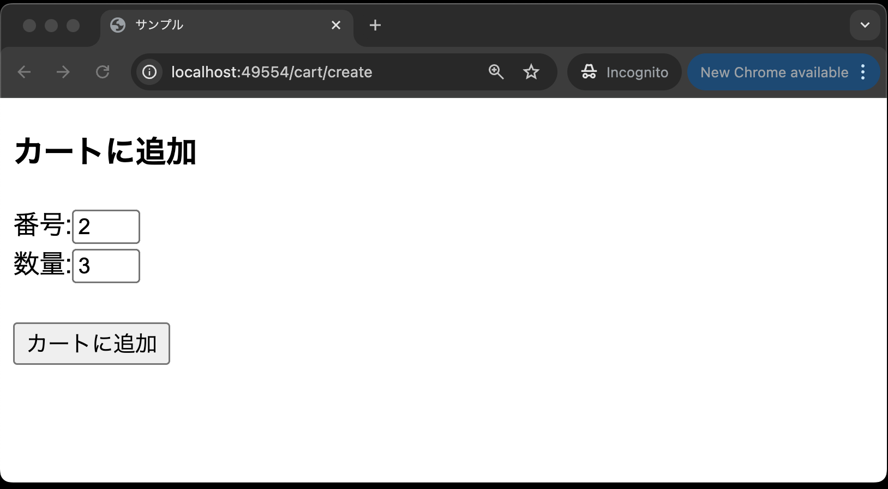
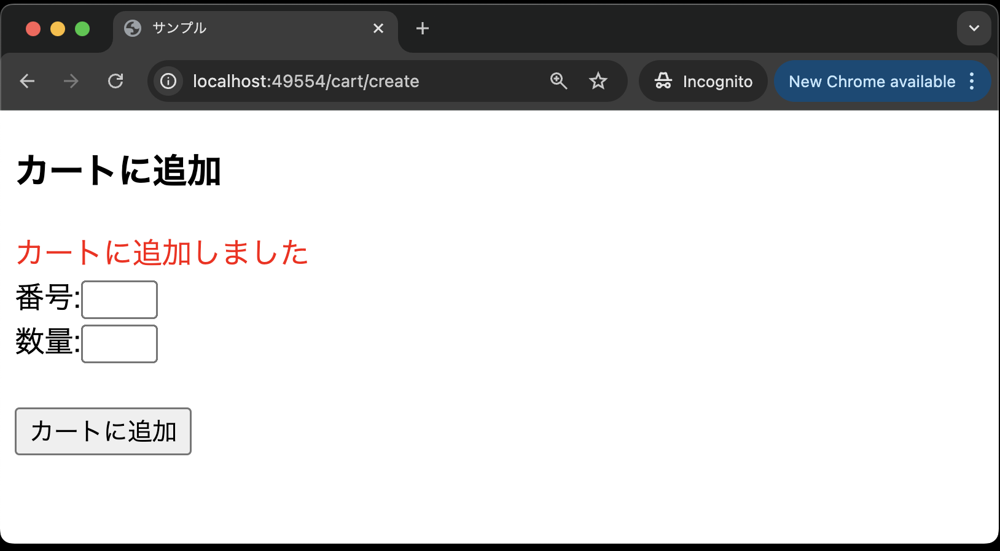
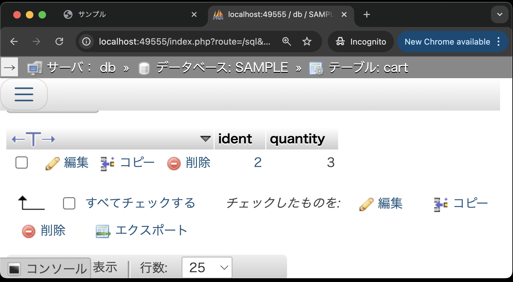

# CRUD機能を作ろう！(Create編)

- [CRUD機能を作ろう！(Create編)](#crud機能を作ろうcreate編)
  - [事前準備](#事前準備)
  - [本章の狙い](#本章の狙い)
  - [CRUDとは](#crudとは)
  - [データベース環境構築](#データベース環境構築)
    - [マイグレーション](#マイグレーション)
  - [モデルの作成](#モデルの作成)
  - [コントローラの作成](#コントローラの作成)
  - [ビューの作成(カート追加画面)](#ビューの作成カート追加画面)
  - [ルーティングの修正](#ルーティングの修正)
  - [コントローラの修正(storeメソッドの追加)](#コントローラの修正storeメソッドの追加)
  - [ビューの修正(カート追加画面)](#ビューの修正カート追加画面)
  - [動作確認](#動作確認)
  - [まとめ](#まとめ)

## 事前準備

前回の[Laravelの便利な実装(ルートモデルバインディング)](../shop_item_show/README.md)で使用したコード(`21-first-laravel-GitHubアカウント名`)をそのまま利用してください。

## 本章の狙い

- LaravelでCRUD機能を実装する方法を学ぶ

## CRUDとは

まず、CRUDについておさらいしましょう。
Laravelのみならず他の言語でも多用される言葉ですので、ここでしっかりとおさえておいてください。

CRUDとは、データベース操作の基本的な機能の頭文字を取ったものです。
具体的には、以下の4つの操作を指します。

- Create（作成）: SQLのINSERT文に相当
- Read（読み取り）: SQLのSELECT文に相当←既に実装済み
- Update（更新）: SQLのUPDATE文に相当
- Delete（削除）: SQLのDELETE文に相当

本章では、CRUDのうち、Createの機能を実装します。

## データベース環境構築

今回は、itemsテーブルに加え、カート内の商品を管理するための`cart`テーブルを作成します。
なお、`.env`ファイルは既に編集済みのものを上書きしているので、再度編集する必要はありません。

### マイグレーション

---

今回は、`cart`テーブルを作成するためのマイグレーションファイルを追加し、コマンドを実行してテーブルを作成します。
なお、`cart`テーブルの構造は前期同様以下の通りです。

| カラム名 | データ型 | 制約 | 備考 |
| - | - | - | - |
|ident|int型|主キー|商品番号|
|quantity|int型||注文数|

1. VSCode上で、`Ctrl+Shift+P`(Macの場合は`Cmd+Shift+P`)を押し、コンテナを起動する(既に起動しているなら不要)
2. VSCode上で、`Ctrl+J`(Macの場合は`Cmd+J`)を押し、ターミナルを表示する
3. 以下のコマンドを実行して、`cart`テーブル用のマイグレーションファイルを作成する

    ```bash
    php artisan make:migration create_cart_table
    ```

4. `database/migrations/20xx_xx_xx_xxxxxx_create_cart_table.php` が作成されていることを確認する
5. `up`メソッドを以下のように修正する

    ```php
    public function up(): void
    {
        Schema::create('cart', function (Blueprint $table) {
            // デフォルトの記述はコメントアウト
            // $table->id();
            // $table->timestamps();

            // --- 以下を追加 ---
            $table->integer('ident')->primary();
            $table->integer('quantity');
            // 外部キー制約を追加
            $table->foreign('ident')->references('ident')->on('items')->onDelete('cascade');
            // --- ここまで ---
        });
    }
    ```

    **【解説】**

    `$table->foreign('ident')->references('ident')->on('items')->onDelete('cascade');`: <br>
    上記はメソッドチェーンと呼ばれる記述方法です。
    メソッドチェーンは、メソッドを連続して呼び出す記述方法で、コードを簡潔に書くことができます。

    `foreign`メソッドは、外部キー制約を追加するメソッドです。
    ここでは、`cart`テーブルの`ident`カラムに外部キー制約を追加しています。
    `references`メソッドで、外部キー制約の参照先を指定しています。
    ここでは、`items`テーブルの`ident`カラムを参照しています。
    `onDelete('cascade')`は、参照先のレコードが削除された際に、`cart`テーブルのレコードも削除されるように設定しています。

    **【補足(外部キー制約について)】**
    そもそも外部キー制約とはなんでしょうか？
    外部キー制約とは、テーブル間の関連性を強制する制約のことです。
    例えば、`cart`テーブルの`ident`カラムに外部キー制約を設定することで、`cart`テーブルの`ident`カラムには、`items`テーブルの`ident`カラムに存在する値のみが入るように制約を設けることができます。

6. 以下のコマンドを実行して、マイグレーションを実行する

    ```bash
    php artisan migrate
    ```

これで、`cart`テーブルが作成されました。

## モデルの作成

以下のコマンドで作成した`Cart`モデルを使って、`cart`テーブルとのやり取りを行います。

```bash
php artisan make:model Cart
```

**app/Models/Cart.php**

```php
<?php

namespace App\Models;

use Illuminate\Database\Eloquent\Factories\HasFactory;
use Illuminate\Database\Eloquent\Model;

class Cart extends Model
{
    use HasFactory;
    // --- 以下を追加 ---
    protected $table = 'cart';
    protected $primaryKey = 'ident';
    protected $fillable = ['ident','quantity'];
    public $timestamps = false;

    public function item()
    {
        return $this->belongsTo(Item::class, 'ident', 'ident');
    }
    // --- ここまで ---
}
```

**【解説】**

`protected $table = 'cart';`: <br>
`protected $table`プロパティは、モデルが対応するテーブル名を指定するプロパティです。

Laravelでは、基本的には、**モデル名は単数形**、そのモデルに対応する**テーブル名は複数形**でなければ追加の設定を記述しなければエラーとなります。
以前作成した、`Item`モデルに対応するテーブルが`items`テーブルで、上記ルールに則っていたため、エラーなくデータベース操作が可能でした。

しかし今回の場合は、`Cart`モデルに対応するテーブルは`cart`テーブルであり、テーブル名が**単数系**です。
この場合、明示的に`$table`プロパティに`cart`を指定しています。
これにより、今までどおりコントローラで`Cart`モデルを使ってデータベースとのやり取りを行うことができます。

`protected $primaryKey = 'ident';`: <br>
`protected $primaryKey`プロパティは、モデルの主キーを指定するプロパティです。
ここでは、`cart`テーブルの主キーが`ident`カラムであるため、`$primaryKey`プロパティに`ident`を指定しています。

`protected $fillable = ['ident','quantity'];`: <br>
`protected $fillable`プロパティは、モデルのプロパティに値を代入する際に、代入可能なカラムを指定するプロパティです。
ここでは、`cart`テーブルの`ident`カラムと`quantity`カラムに値を代入することを許可しています。

`public $timestamps = false;`: <br>
`public $timestamps`プロパティは、モデルの作成日時と更新日時を自動で更新するかどうかを指定するプロパティです。
ここでは、`cart`テーブルには作成日時と更新日時を持たせないため、`false`を指定しています。

public function item()`: <br>
`item`メソッドは、`Cart`モデルと`Item`モデルのリレーションを設定するメソッドです。

`return $this->belongsTo(Item::class, 'ident', 'ident');`: <br>
`belongsTo`メソッドは、リレーション先のモデルを取得するメソッドです。
第1引数には、リレーション先のモデルを指定します。
第2引数には、リレーション先のモデルの外部キー(`items`テーブルの`ident`カラム)を指定します。
第3引数には、リレーション先のモデルの主キー(`cart`テーブルの`ident`カラム)を指定します。

**【補足(リレーションについて)】**

`Cart`モデルに`item`メソッドを追加する理由は、`Cart`モデルと`Item`モデルのリレーションを設定するためです。
リレーションとは、データベースのテーブル間における関連性をモデル間にも反映させるための機能です。
リレーションを設定することで、モデル間のデータ取得が容易になり、コードの記述量が減ります。

では、今回の場合は`Cart`モデルと`Item`モデルにどのような関連性があるのでしょうか。
それには、`cart`テーブルと`items`テーブルの`ident(商品番号)`カラムが関連しているということが挙げられます。
ここでいう関連しているとは、`cart`テーブルの`ident`カラムの値が`items`テーブルの`ident`カラムの値と一致するということです。

また、1つのカートに対して複数の商品が存在します。
このことをデータベースの用語で言うと、`cart`テーブルと`items`テーブルは**1対多の関係にある**と言えます。
これらを踏まえて、`Cart`モデルに`item`メソッドを追加します。

## コントローラの作成

コマンドで作成した`CartController`を使って、コントローラを作成します。

```bash
php artisan make:controller CartController
```

まずは、カート情報を追加するためのフォームを表示する`create`メソッドを作成します。

**app/Http/Controllers/CartController.php**

    ```php
    <?php
    namespace App\Http\Controllers;

    use Illuminate\Http\Request;
    use App\Models\Cart; // 追加

    class CartController extends Controller
    {
        // --- 以下を追加 ---
        public function create()
        {
            return view('cart.create');
        }
        // --- ここまで ---
    }
    ```

**【解説】**

`use App\Models\Cart`: `Cart`モデルを使用する宣言をします。

`public function create`: <br>
Laravelでは、コントローラに記述する`create` メソッドは、「新規登録画面を表示するためのメソッド」として一般的に使われます。

`return view('cart.create');`: <br>
`view`関数は、ビューを返す関数です。
ここでは、`cart.create`ビューファイルを表示するように設定しています。

## ビューの作成(カート追加画面)

次に、カートに商品を追加するためのフォームを作成します。

1. `resources/views`ディレクトリに`cart`ディレクトリを作成する
2. `cart`ディレクトリに`create.blade.php`を作成し、以下のように記述する

    ```php
    <!DOCTYPE html>
    <html lang="ja">
    <head>
    <meta charset="UTF-8">
    <meta name="viewport" content="width=device-width, initial-scale=1.0">
    <title>サンプル</title>
    </head>
    <body>
        <h3>商品をカートに追加</h3>
        <form action="{{ route('cart.store') }}" method="POST">
        @csrf
        番号:<input type="number" name="ident" min="1" max="15"><br>
        数量:<input type="number" name="quantity" min="1" max="10"><br><br>
        <input type="submit" value="カートに追加">
        </form>
    </body>
    </html>
    ```

## ルーティングの修正

`CartController`の`create`メソッドにアクセスするためのルーティングを追加します。
また、併せてカート情報を登録するための`store`メソッドにアクセスするためのルーティングも追加します。

**routes/web.php**を以下のように修正してください。

```php
<?php

use Illuminate\Support\Facades\Route;
use App\Http\Controllers\ItemController;
use App\Http\Controllers\CartController; // 追加

// 途中省略

// --- 以下を追加 ---
Route::get('cart/create', [CartController::class, 'create'])->name('cart.create');
Route::post('cart', [CartController::class, 'store'])->name('cart.store');
// --- ここまで ---
```

**【解説】**

`use App\Http\Controllers\CartController;`: <br>
`CartController`クラスを使うための宣言です。

`Route::get('cart', [CartController::class, 'create'])->name('cart.create');`: <br>
`cart`というURLに`GET`リクエストが送信された場合、`CartController`クラスの`create`メソッドが呼び出されるように設定しています。

`Route::post('cart', [CartController::class, 'store'])->name('cart.store');`: <br>
`cart`というURLに`POST`リクエストが送信された場合、`CartController`クラスの`store`メソッドが呼び出されるように設定しています。

## コントローラの修正(storeメソッドの追加)

次に、カート情報を登録するための`store`メソッドを作成します。

**app/Http/Controllers/CartController.php**

    ```php
    <?php
    namespace App\Http\Controllers;

    use Illuminate\Http\Request;
    use App\Models\Cart;

    class CartController extends Controller
    {
        public function create()
        {
            return view('cart.create');
        }

        // --- 以下を追加 ---

        public function store(Request $request)
        {
            $validated = $request->validate([
                'ident' => 'required|integer',
                'quantity' => 'required|integer',
            ]);
            $cart = Cart::create($validated);
            $request->session()->flash('message', 'カートに追加しました');
            return back();
        }
        // --- ここまで ---
    }
    ```

**【解説】**

`public function store`: <br>
Laravelでは、コントローラに記述する`store` メソッドは、「データを新規登録するためのメソッド」として一般的に使われます。

`$validated = $request->validate([`<br>
`validate`メソッドは、リクエストデータのバリデーションを行うメソッドです。
第1引数には、バリデーションルールを指定します。
ここでは、`ident`カラムと`quantity`カラムに対して、`required`と`integer`のバリデーションルールを設定しています。

**【補足(バリデーションについて)】**<br>
バリデーションとは、データの正当性を検証することです。
バリデーションを行うことで、不正なデータがデータベースに登録されることを防ぐことができます。
今回は、クライアント側でも"number"型の入力を制限していますが、サーバ側でもバリデーションを行うことで、より安全なデータベース操作を実現します。

`$cart = Cart::create($validated);`: <br> 
`create`メソッドは、モデルを新規登録するメソッドです。
ここでは、`Cart`モデルを使って、`cart`テーブルにデータを新規登録しています。

`$request->session()->flash('message', 'カートに追加しました');`: <br>
`session`メソッドは、セッションを扱うメソッドです。
`flash`メソッドは、セッションに一時的なデータを保存するメソッドです。
ここでは、`message`というキーで`カートに追加しました`というメッセージをセッションに保存しています。

`return back();`: <br>
`back`関数は、直前のページにリダイレクトする関数です。

## ビューの修正(カート追加画面)

先ほどの`create.blade.php`に、セッションに保存したメッセージを表示するためのコードを追加します。

**resources/views/cart/create.blade.php**


```php
<!DOCTYPE html>
<html lang="ja">
<head>
<meta charset="UTF-8">
<meta name="viewport" content="width=device-width, initial-scale=1.0">
<title>サンプル</title>
</head>
<body>
    <h3>カートに追加</h3>
    <!-- 以下を追加 -->
    @if (session('message'))
        <font color="red">{{ session('message') }}</font>
    @endif
    <!-- 以下を追加 -->
    <form action="{{ route('cart.store') }}" method="POST">
    @csrf
    番号:<input type="number" name="ident" min="1" max="15"><br>
    数量:<input type="number" name="quantity" min="1" max="10"><br><br>
    <input type="submit" value="カートに追加">
    </form>
</body>
</html>
```



**【解説】**

`@if (session('message'))`: <br>
`session`関数は、セッションに保存されたデータを取得する関数です。
ここでは、`message`というキーで保存されたデータがあるかどうかを判定しています。

## 動作確認

1. VSCode上で、`Ctrl+Shift+P`(Macの場合は`Cmd+Shift+P`)を押し、コンテナを起動する(既に起動しているなら不要)
2. VSCode上で、`Ctrl+J`(Macの場合は`Cmd+J`)を押し、画面下部のポートをクリックし、地球儀マークをクリックする<br>
   
3. ブラウザのアドレスバーの末尾に`/cart/create`を追加し、Enterキーを押す
4. カート追加フォームが表示されるので、商品番号と数量を入力し、「カートに追加」ボタンをクリック<br>
   <br>
5. 追加されたら、メッセージが表示される<br>
   <br>
6. phpMyAdminで`cart`テーブルを確認し、追加されたデータが確認できればOK<br>
<br>

## まとめ

本章では、CRUDのうち、Createの機能を実装しました。(※Readの機能は既に実装済みです)
次章では、CRUDの残りのUpdateとDeleteの機能を実装します。
