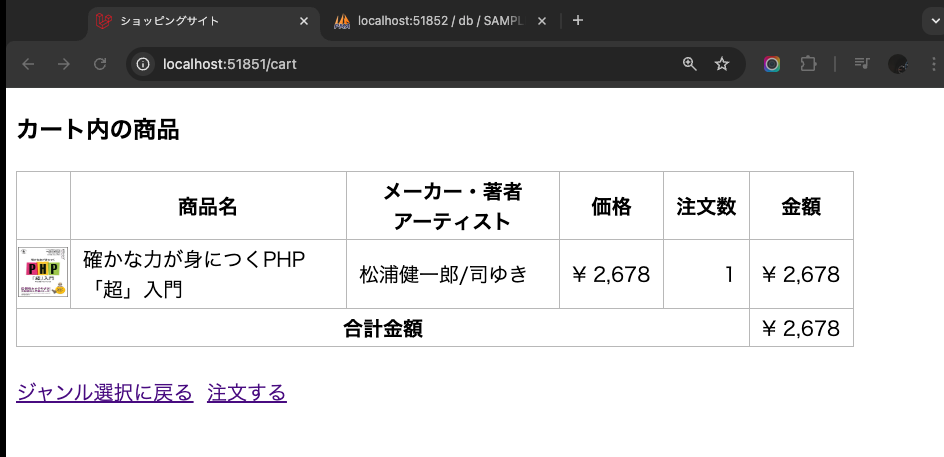

# CRUD機能を作ろう！(Create、Read編)

- [CRUD機能を作ろう！(Create、Read編)](#crud機能を作ろうcreateread編)
  - [事前準備](#事前準備)
  - [本章の狙い](#本章の狙い)
  - [CRUDとは](#crudとは)
  - [データベース環境構築](#データベース環境構築)
    - [マイグレーション](#マイグレーション)
  - [モデルの作成](#モデルの作成)
  - [コントローラの作成](#コントローラの作成)
  - [ルーティングの修正](#ルーティングの修正)
  - [商品追加フォームの作成](#商品追加フォームの作成)
  - [CartControllerのindexメソッドの作成](#cartcontrollerのindexメソッドの作成)
  - [Cartモデルのitemメソッドの作成](#cartモデルのitemメソッドの作成)
  - [カート内の商品画面の作成](#カート内の商品画面の作成)
  - [商品追加のバグ修正](#商品追加のバグ修正)
  - [まとめ](#まとめ)

## 事前準備

前回の[Laravelの便利な実装(ルートモデルバインディング)](../shop_item_show/README.md)で使用したコード(`21-first-laravel-GitHubアカウント名`)をそのまま利用してください。

## 本章の狙い

- LaravelでCRUD機能を実装する方法を学ぶ
- ルーティングの可読性を実感する

## CRUDとは

まず、CRUDについておさらいしましょう。
Laravelのみならず他の言語でも多用される言葉ですので、ここでしっかりとおさえておいてください。

CRUDとは、データベース操作の基本的な機能の頭文字を取ったものです。
具体的には、以下の4つの操作を指します。

- Create（作成）: SQLのINSERT文に相当
- Read（読み取り）: SQLのSELECT文に相当
- Update（更新）: SQLのUPDATE文に相当
- Delete（削除）: SQLのDELETE文に相当

本章では、CRUDのうち、CreateとReadの機能を実装します。

## データベース環境構築

今回は、itemsテーブルに加え、カート内の商品を管理するためのcartテーブルを作成します。
なお、.envファイルは既に編集済みのものを上書きしているので、再度編集する必要はありません。

### マイグレーション

---

今回は、cartテーブルを作成するためのマイグレーションファイルを追加し、コマンドを実行してテーブルを作成します。
なお、cartテーブルの構造は前期同様以下の通りです。

| カラム名 | データ型 | 制約 | 備考 |
| - | - | - | - |
|ident|int型|主キー|商品番号|
|quantity|int型||注文数|

1. VSCode上で、`Ctrl+Shift+P`(Macの場合は`Cmd+Shift+P`)を押し、コンテナを起動する(既に起動しているなら不要)
2. VSCode上で、`Ctrl+J`(Macの場合は`Cmd+J`)を押し、ターミナルを表示する
3. 以下のコマンドを実行して、cartテーブル用のマイグレーションファイルを作成する
   - 以下のコマンドは、[モデル、コントローラ](../shop_item_index/README.md)の最後に説明した、マイグレーション、シーダー、モデル、コントローラの作成を一括で行うコマンド

```bash
php artisan make:model Cart -msc
```

4. `database/migrations/20xx_xx_xx_xxxxxx_create_cart_table.php` が作成されていることを確認する
5. `up`メソッドを以下のように修正する

    ```php
    public function up(): void
        {
            Schema::create('cart', function (Blueprint $table) {
                // デフォルトの記述はコメントアウト
                // $table->id();
                // $table->timestamps();

                // --- 以下を追加 ---
                $table->integer('ident')->primary();
                $table->integer('quantity');
                // 外部キー制約を追加
                $table->foreign('ident')->references('ident')->on('items')->onDelete('cascade');
                // --- ここまで ---
            });
        }
    ```

    **【解説】**

    `$table->foreign('ident')->references('ident')->on('items')->onDelete('cascade');`: <br>
    上記はメソッドチェーンと呼ばれる記述方法です。
    メソッドチェーンは、メソッドを連続して呼び出す記述方法で、コードを簡潔に書くことができます。

    `foreign`メソッドは、外部キー制約を追加するメソッドです。
    ここでは、`cart`テーブルの`ident`カラムに外部キー制約を追加しています。
    `references`メソッドで、外部キー制約の参照先を指定しています。
    ここでは、`items`テーブルの`ident`カラムを参照しています。
    `onDelete('cascade')`は、参照先のレコードが削除された際に、`cart`テーブルのレコードも削除されるように設定しています。

    **【補足(外部キー制約について)】**
    そもそも外部キー制約とはなんでしょうか？
    外部キー制約とは、テーブル間の関連性を強制する制約のことです。
    例えば、`cart`テーブルの`ident`カラムに外部キー制約を設定することで、`cart`テーブルの`ident`カラムには、`items`テーブルの`ident`カラムに存在する値のみが入るように制約を設けることができます。

6. 以下のコマンドを実行して、マイグレーションを実行する

    ```bash
    php artisan migrate
    ```

これで、cartテーブルが作成されました。

## モデルの作成

先ほどの[マイグレーション](#マイグレーション)の以下のコマンドで作成した`Cart`モデルを使って、`cart`テーブルとのやり取りを行います。

```bash
php artisan make:model Cart -msc
```

**app/Models/Cart.php**

    ```php
    <?php

    namespace App\Models;

    use Illuminate\Database\Eloquent\Factories\HasFactory;
    use Illuminate\Database\Eloquent\Model;

    class Cart extends Model
    {
        use HasFactory;
        // --- 以下を追加 ---
        protected $table = 'cart';
        protected $primaryKey = 'ident';
        // --- ここまで ---
    }
    ```

    **【解説】**

    `protected $table = 'cart';`: <br>
    `protected $table`プロパティは、モデルが対応するテーブル名を指定するプロパティです。

    Laravelでは、基本的には、**モデル名は単数形**、そのモデルに対応する**テーブル名は複数形**でなければ追加の設定を記述しなければエラーとなります。
    以前作成した、`Item`モデルに対応するテーブルが`items`テーブルで、上記ルールに則っていたため、エラーなくデータベース操作が可能でした。

    しかし今回の場合は、`Cart`モデルに対応するテーブルは`cart`テーブルであり、テーブル名が**単数系**です。
    この場合、明示的に`$table`プロパティに`cart`を指定しています。
    これにより、今までどおりコントローラで`Cart`モデルを使ってデータベースとのやり取りを行うことができます。

    `protected $primaryKey = 'ident';`: <br>

    `protected $primaryKey`プロパティは、モデルの主キーを指定するプロパティです。
    ここでは、`cart`テーブルの主キーが`ident`カラムであるため、`$primaryKey`プロパティに`ident`を指定しています。

## コントローラの作成

先ほどの[マイグレーション](#マイグレーション)の以下のコマンドで作成した`CartController`を使って、コントローラを作成します。

```bash
php artisan make:model Cart -msc
```

まずはcartテーブルに必要なデータを登録する`store`メソッドを追加する

**app/Http/Controllers/CartController.php**

    ```php
    <?php
    namespace App\Http\Controllers;

    use Illuminate\Http\Request;
    use App\Models\Cart; // 追加

    class CartController extends Controller
    {
        // --- 以下を追加 ---

        public function store(Request $request)
        {
            $cart = Cart::create([
                'ident' => $request->ident,
                'quantity' => $request->quantity,
            ]);
            return redirect()->route('cart.index');
        }
        // --- ここまで ---
    }
    ```

**【解説】**

`use App\Models\Cart`: `Cart`モデルを使用する宣言をします。

`public function store`: <br>
Laravelでは、コントローラに記述する`store` メソッドは、「データを新規登録するためのメソッド」として一般的に使われます。

`$cart = Cart::create`: <br>
`Cart::create`メソッドは、`Cart`モデルを使って、データベースに新しいレコードを登録するメソッドです。
`create`メソッドの引数には、登録するデータを連想配列で指定します。
ここでは、`ident`カラムに`$request->ident`の値、`quantity`カラムに`$request->quantity`の値を登録しています。

`return redirect()->route('cart.index');`: <br>
`redirect`関数は、指定したURLにリダイレクトする関数です。
`route`関数は、指定したルートのURLを返す関数です。
ここでは、`cart.index`という名前のルートにリダイレクトしています。
ちなみに、`cart.index`という名前のルートはまだ存在していませんが、後ほど作成するindexメソッドに対応するルートです。

## ルーティングの修正

`CartController`の`store`メソッドにアクセスするためのルーティングを追加します。

また、`store`メソッドでカートに商品を追加した後、併せてカートの一覧を表示するための`index`メソッドも作成します。
そのため、`index`メソッド用のルーティングを追加する必要があります。

**routes/web.php**を以下のように修正してください。

```php
<?php

use Illuminate\Support\Facades\Route;
use App\Http\Controllers\ItemController;
use App\Http\Controllers\CartController; // 追加

// 途中省略

// --- 以下を追加 ---
Route::get('cart', [CartController::class, 'index'])->name('cart.index');
Route::post('cart', [CartController::class, 'store'])->name('cart.store');
// --- ここまで ---
```

**【解説】**

`use App\Http\Controllers\CartController;`: <br>
`CartController`クラスを使うための宣言です。

`Route::get('cart', [CartController::class, 'index'])->name('cart.index');`: <br>
`cart`というURLにGETリクエストが送信された場合、`CartController`クラスの`index`メソッドが呼び出されるように設定しています。
また、`name`メソッドで、このルートに`cart.index`という名前を付けています。

`Route::post('cart', [CartController::class, 'store'])->name('cart.store');`: <br>
`cart`というURLにPOSTリクエストが送信された場合、`CartController`クラスの`store`メソッドが呼び出されるように設定しています。

## 商品追加フォームの作成

次に、カートに商品を追加するためのフォームを作成します。

1. `resources/views`ディレクトリに`cart`ディレクトリを作成する
2. `cart`ディレクトリに`create.blade.php`を作成し、以下のように記述する

    ```php
    <!DOCTYPE html>
    <html lang="ja">
    <head>
    <meta charset="UTF-8">
    <meta name="viewport" content="width=device-width, initial-scale=1.0">
    <title>サンプル</title>
    </head>
    <body>
        <h3>商品をカートに追加</h3>
        <form action="{{ route('cart.store') }}" method="POST">
        @csrf
        <input type="number" name="ident">
        <input type="number" name="quantity">
        <input type="submit" value="カートに追加">
        </form>
    </body>
    </html>
    ```

## CartControllerのindexメソッドの作成

次に、カート内の商品を一覧表示するための`index`メソッドを作成します。
作成したCartController.phpを開き、以下のように`index`メソッドを追加してください

**app/Http/Controllers/CartController.php**

```php
<?php
namespace App\Http\Controllers;

use Illuminate\Http\Request;
use App\Models\Cart;

class CartController extends Controller
{
    // --- 以下を追加 ---
    public function index()
    {
        $carts = Cart::all();
        return view('cart.index', ['carts' => $carts]);
    }
    // --- ここまで ---

    public function store(Request $request)
    {
        $cart = Cart::create([
            'ident' => $request->ident,
            'quantity' => $request->quantity,
        ]);
        return redirect()->route('cart.index');
    }
}
```

**【解説】**

`$carts = Cart::with('item')->get();`: <br>
`Cart`モデルの`with`メソッドは、リレーション先のモデルを取得するメソッドです。
ここでは、`Cart`モデルの`item`メソッドを取得しています。
`get`メソッドは、取得したデータをコレクションで返すメソッドです。
つまり、`$carts`には、`Cart`モデルのデータとそれに紐づく`Item`モデルのデータが入ったコレクションが代入されます。

ただし、`Cart`モデルに`item`メソッドが存在しないため、エラーが発生します。
そのため、`Cart`モデルに`item`メソッドを追加する必要があります。
それについては次項で説明します。

`return view('cart.index', ['carts' => $carts]);`: <br>
`view`関数は、ビューを返す関数です。
第1引数には、表示するビューファイルのパスを指定します。
第2引数には、ビューファイルに渡すデータを連想配列で指定します。
ここでは、`cart.index`ビューファイルに`$carts`を渡しています。

## Cartモデルのitemメソッドの作成

`Cart`モデルに`item`メソッドを追加します。
その前に、なぜ`Cart`モデルに`item`メソッドを追加するのかについて説明します。

`Cart`モデルに`item`メソッドを追加する理由は、`Cart`モデルと`Item`モデルのリレーションを設定するためです。
リレーションとは、データベースのテーブル間における関連性をモデル間にも反映させるための機能です。
リレーションを設定することで、モデル間のデータ取得が容易になり、コードの記述量が減ります。

では、今回の場合は`Cart`モデルと`Item`モデルにどのような関連性があるのでしょうか。
それには、`cart`テーブルと`items`テーブルの`ident(商品番号)`カラムが関連しているということが挙げられます。
ここでいう関連しているとは、`cart`テーブルの`ident`カラムの値が`items`テーブルの`ident`カラムの値と一致するということです。

また、1つのカートに対して複数の商品が存在します。
このことをデータベースの用語で言うと、`cart`テーブルと`items`テーブルは**1対多の関係にある**と言えます。
これらを踏まえて、`Cart`モデルに`item`メソッドを追加します。

1. `app/Models/Cart.php`を開き、以下のように`item`メソッドを追加してください

    ```php
        <?php

        namespace App\Models;

        use Illuminate\Database\Eloquent\Factories\HasFactory;
        use Illuminate\Database\Eloquent\Model;

        class Cart extends Model
        {
            use HasFactory;
            protected $table = 'cart';
            protected $primaryKey = 'ident';

            // --- 以下を追加 ---
            public function item()
            {
                return $this->belongsTo(Item::class, 'ident', 'ident');
            }
            // --- ここまで ---
        }
    ```

**【解説】**

`public function item()`: <br>
`item`メソッドは、`Cart`モデルと`Item`モデルのリレーションを設定するメソッドです。

`return $this->belongsTo(Item::class, 'ident', 'ident');`: <br>
`belongsTo`メソッドは、リレーション先のモデルを取得するメソッドです。
第1引数には、リレーション先のモデルを指定します。
第2引数には、リレーション先のモデルの外部キー(`items`テーブルの`ident`カラム)を指定します。
第3引数には、リレーション先のモデルの主キー(`cart`テーブルの`ident`カラム)を指定します。

以上で、`Cart`モデルと`Item`モデルのリレーションが設定されました。

## カート内の商品画面の作成

最後に、カート内の商品を一覧表示するビューを作成します。

1. `resources/views`ディレクトリに`cart`ディレクトリを作成する
2. `cart`ディレクトリに`index.blade.php`を作成し、以下のように記述する

    **resources/views/cart/index.blade.php**

    ```php
    <!DOCTYPE html>
    <html lang="ja">
    <head>
    <meta charset="UTF-8">
    <meta name="viewport" content="width=device-width, initial-scale=1.0">
    <link rel="stylesheet" href="{{ asset('css/minishop.css')}}">
    <title>ショッピングサイト</title>
    </head>
    <body>
        <h3>カート内の商品</h3>
        <table>
        <tr>
            <th>&nbsp;</th>
            <th>商品名</th>
            <th>メーカー・著者<br>アーティスト</th>
            <th>価格</th>
            <th>注文数</th>
            <th>金額</th>
        </tr>
        @php
            $total = 0;
        @endphp
        @foreach( $carts  as  $cart )
            <tr>
                <td class="td_mini_img">item->image )}}"></td>
                <td class="td_item_name"> {{ $cart->item->name }} </td>
                <td class="td_item_maker"> {{ $cart->item->maker }} </td>
                <td class="td_right">&yen; {{  number_format( $cart->item->price) }} </td>
                <td class="td_right"> {{ $cart->quantity }} </td>
                <td class="td_right">&yen; {{ number_format( $cart->item->price * $cart->quantity) }}</td>
            </tr>
            @php
                $total += $cart->item->price * $cart->quantity;
            @endphp
        @endforeach
        <tr>
            <th colspan="5">合計金額</th><td class="td_right">&yen; {{ number_format($total) }}</td>
        </tr>
        </table>
        <br>
        <-- 注文するリンクはまだ作成していないので、href属性は空にしています -->
        <a href="{{ route('index') }}">ジャンル選択に戻る</a>&nbsp;&nbsp;<a href="">注文する</a>
    </body>
    </html>
    ```

**【解説】**

`@php $total = 0; @endphp`、`@php $total += $cart->item->price * $cart->quantity; @endphp`: <br>
`@php`ディレクティブは、PHPのコードを埋め込むためのディレクティブです。
上記では変数を初期化するのに利用しています。

`$cart->item->image`: <br>
`$cart`は`Cart`モデルのインスタンスです。
`$cart->item`は、`Cart`モデルの`item`メソッドを呼び出して、`Item`モデルのインスタンスを取得しています。
`$cart->item->image`は、`Item`モデルの`image`カラムの値を取得しています。
その他の、`$cart->item->name`、`$cart->item->maker`、`$cart->item->price`、`$cart->quantity`も同様です。

逆に、`$cart->quantity`の場合は、`$cart`は`Cart`モデルのインスタンスですが、`quantity`カラムは`cart`テーブルに存在するため、`$cart->quantity`で値を取得できます。

それでは動作確認してみましょう。

1. VSCode上で、`Ctrl+Shift+P`(Macの場合は`Cmd+Shift+P`)を押し、コンテナを起動する(既に起動しているなら不要)
2. VSCode上で、`Ctrl+J`(Macの場合は`Cmd+J`)を押し、画面下部のポートをクリックし、地球儀マークをクリックする<br>
   
3. ブラウザが立ち上がったら商品詳細画面に遷移し、「カートに入れる」ボタンをクリック
4. 実は、現状のままだと以下のようなエラーが出る
   <br><br>

   エラーメッセージは以下の通りです。
    ```text
    Add [ident] to fillable property to allow mass assignment on [App\Models\Cart].
    ```
    このエラーメッセージは、`Cart`モデルの`$fillable`プロパティに`ident`カラムを追加するように指示しています。(※`quantity`カラムも追加する必要があります)
    これは、Laravelのセキュリティ機能の一つで、モデルの`$fillable`プロパティに指定されていないカラムに対して、`create`メソッドを使ってデータを登録しようとするとエラーが発生する仕組みです。

    このエラーを解消するために、`Cart`モデルの`$fillable`プロパティに`ident`と`quantity`カラムを追加します。

5. `app/Models/Cart.php`を開き、以下のように`$fillable`プロパティを追加する

    ```php
    <?php

        namespace App\Models;

        use Illuminate\Database\Eloquent\Factories\HasFactory;
        use Illuminate\Database\Eloquent\Model;

        class Cart extends Model
        {
            use HasFactory;
            protected $table = 'cart';
            protected $primaryKey = 'ident';
            protected $fillable = ['ident','quantity']; // 追加
            
            public function item()
            {
                return $this->belongsTo(Item::class, 'ident', 'ident');
            }
        }
    ```
    **【解説】**

    `protected $fillable = ['quantity'];`: <br>
    `$fillable`プロパティは、モデルのデータを一括代入する際に、代入を許可するカラムを指定するプロパティです。

6. 再度、商品詳細画面に遷移し、「カートに入れる」ボタンをクリック
7. 実はまだ以下のようなエラーが出る
   <br><br>

   エラーメッセージは以下の通りです。
    ```text
    SQLSTATE[42S22]: Column not found: 1054 Unknown column 'updated_at' in 'field list' (Connection: mysql, SQL: insert into `cart` (`quantity`, `updated_at`, `created_at`) values (1, 2024-08-31 09:05:17, 2024-08-31 09:05:17))
    ```
    このエラーメッセージは、`cart`テーブルに`updated_at`カラムが存在しないため、エラーが発生していることを示しています。(※`created_at`カラムも存在しません)<br><br>
    Laravelでは、デフォルトで`created_at`カラムと`updated_at`カラムが存在することを前提としているため、これらのカラムが存在しない場合は、`$timestamps`プロパティを`false`に設定する必要があります。<br><br>
    このエラーを解消するために、`Cart`モデルの`$timestamps`プロパティを`false`に設定します。<br><br>

    ```php
    <?php

        namespace App\Models;

        use Illuminate\Database\Eloquent\Factories\HasFactory;
        use Illuminate\Database\Eloquent\Model;

        class Cart extends Model
        {
            use HasFactory;
            protected $table = 'cart';
            protected $primaryKey = 'ident';
            protected $fillable = ['quantity'];
            public $timestamps = false; // 追加
            
            public function item()
            {
                return $this->belongsTo(Item::class, 'ident', 'ident');
            }
        }
    ```
    **【解説】**

    `public $timestamps = false;`: <br>
    `$timestamps`プロパティは、モデルの`created_at`カラムと`updated_at`カラムを自動更新する機能を無効にするプロパティです。

8. 再度、商品詳細画面に遷移し、「カートに入れる」ボタンをクリック
9. カート内の商品が一覧表示されればOK
    

## 商品追加のバグ修正

前期授業と同様ですが、現在の実装では、カートに同じ商品を複数回追加することができません。追加しようとすると、以下のようなエラーが発生します。

```text
SQLSTATE[23000]: Integrity constraint violation: 1062 Duplicate entry '6' for key 'cart.PRIMARY' (Connection: mysql, SQL: insert into `cart` (`ident`, `quantity`) values (6, 3))
```

このエラーは、`cart`テーブルの`ident`カラムに一意制約が設定されているため発生します。
一意制約とは、テーブルのカラムに一意性を持たせる制約のことで、同じ値を複数回登録することを禁止します。

このエラーを解消するために、カートに同じ商品を複数回追加した場合は、その商品の数量を更新するように修正します。
なお、前期同様、更新する際の制約として、カートに追加する商品の数量の上限は10とします。

それでは、修正を行いましょう。
`CartController`の`store`メソッドを以下のように修正してください。

**app/Http/Controllers/CartController.php**

```php
<?php
namespace App\Http\Controllers;

use Illuminate\Http\Request;
use App\Models\Cart;

class CartController extends Controller
{
    public function index()
    {
        $carts = Cart::with('item')->get();
        return view('cart.index', ['carts' => $carts]);
    }

    public function store(Request $request)
    {
        // 既にカートに入っている商品かチェック
        $cart = Cart::find($request->ident);
        if ($cart) {
            $new_quantity = $request->quantity + $cart->quantity;
            if ($new_quantity > 10) {
                $new_quantity = 10;
            }
            $cart->quantity = $new_quantity;
            $cart->update(['quantity' => $new_quantity]);
        } else {
            Cart::create([
                'ident' => $request->ident,
                'quantity' => $request->quantity,
            ]);
        }
        return redirect()->route('cart.index');
    }
}
```

**【解説】**

`$cart = Cart::find($request->ident);`: <br>
`Cart`モデルの`find`メソッドは、指定した主キーに対応するレコードを取得するメソッドです。
ここでは、`$request->ident`の値に対応するレコードを取得しています。

`if ($cart) { ... } else { ... }`: <br>
`$cart`が取得できた場合は、カートに既に同じ商品が入っているということなので、その商品の数量を更新します。
`$cart`が取得できなかった場合は、カートに新しく商品を追加します。

`$new_quantity = $request->quantity + $cart->quantity;`: <br>
`$new_quantity`には、既にカートに入っている商品の数量と、追加しようとする商品の数量を合計した値が代入されます。

`$cart->update(['quantity' => $new_quantity]);`: <br>
`update`メソッドは、レコードを更新するメソッドです。
ここでは、`$cart`の`quantity`カラムの値を`$new_quantity`に更新しています。

以上で、カートに同じ商品を複数回追加してもエラーが発生しないようになりました。

## まとめ

本章では、カートへの商品追加機能を実装しました。
今回の実装で実感できたかと思いますが、Laravelをはじめとするフレームワークでは、あらかじめ決められるたルールがあり、それを守らなければエラーが発生します。

ただし、そのルールを守ることで、セキュリティや保守性が向上し、開発効率が向上するというメリットがあります。これがいわゆる「標準化」と呼ばれるもので、大規模開発においてフレームワークが重宝される理由の一つです。
