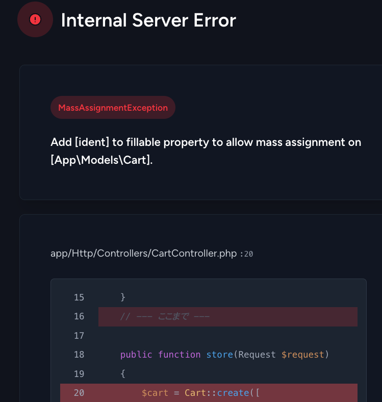

# 【課題】カート内の商品画面の作成

- [【課題】カート内の商品画面の作成](#課題カート内の商品画面の作成)
  - [事前準備](#事前準備)
  - [本章の狙い](#本章の狙い)
  - [カート内の商品画面の仕様](#カート内の商品画面の仕様)
  - [①データベース環境構築](#データベース環境構築)
  - [②モデルの作成](#モデルの作成)
  - [③ルーティングの修正](#ルーティングの修正)
  - [④コントローラに`store`メソッドを作成](#コントローラにstoreメソッドを作成)
  - [⑤コントローラに`index`メソッドを作成](#コントローラにindexメソッドを作成)
  - [⑥ビュー(商品詳細画面)の修正](#ビュー商品詳細画面の修正)
  - [⑦ビュー(カート内の商品画面)の作成](#ビューカート内の商品画面の作成)
  - [動作確認](#動作確認)
  - [商品追加のバグ修正](#商品追加のバグ修正)
  - [まとめ](#まとめ)

## 事前準備

1. [こちらのページ]()から、ソースコードを`C:¥sys_dev_exe`へcloneする
2. VSCode上で、`Ctrl+Shift+P`(Macの場合は`Cmd+Shift+P`)を押し、コンテナを起動する
3. VSCode上で、`Ctrl+J`(Macの場合は`Cmd+J`)を押し、ターミナルを表示する
4. `composer create-project laravel/laravel .` を実行し、Laravel環境を構築する
5. 過去に作成した以下のコードを、上記「1.」でcloneしたソースコードと同じ場所に上書きする
   
    ```text
    app
    ├── Http
    │   └── Controllers
    │       └── ItemController.php
    ├── Models
    │   └── Item.php
    │
    途中省略
    │
    database
    ├── migrations
    │   └── 20XX_XX_XX_XXXXXX_create_items_table.php
    ├── seeds
    │   ├── DatabaseSeeder.php
    │   └── ItemsTableSeeder.php
    public
    ├── css
    │   └── minishop.css
    ├── images
    │   └── xxx.png(15個の画像ファイル)
    │
    resources
    ├── views
    │   ├── items
    │   │   └── index.blade.php    
    │   └── index.blade.php
    routes
    ├── web.php
    │
    途中省略
    │
    .env
    ```

## 本章の狙い

- [モデル、コントローラ](../shop_item_index/README.md)の章で学んだ知識(CRUDのCreate)を定着させる
- カート内の商品画面を再構築する

## カート内の商品画面の仕様

ここでは、カート内の商品画面の仕様を説明します。
今回は、

- カート内の商品追加
- カート内の商品一覧表示

の2つの機能を実装します。

## ①データベース環境構築

新しくソースコードをcloneしたので、再度データベース環境構築をする必要があります。
今回は、`items`テーブルに加え、カート内の商品を管理するための`cart`テーブルを作成します。

[CRUD機能を作ろう！(Create編)](../shop_cart_index/README.md)を参考に、データベース環境を作成してください。
なお、`.env`ファイルは既に編集済みのものを上書きしているので、再度編集する必要はありません。

## ②モデルの作成

[CRUD機能を作ろう！(Create編)](../shop_cart_index/README.md)と同様の`Cart`モデルを作成してください。

## ③ルーティングの修正

次の[④コントローラの作成](#コントローラの作成)にて、`CartController`の以下の2つのメソッドを作成します。

- `store`メソッド: カートに商品を追加する処理
- `index`メソッド: カート内の商品を一覧表示する処理

そのため、ルーティングを追加し、URLとコントローラのメソッドをマッピングする必要があります。
以下の条件を満たすように、`routes/web.php`を修正してください。

1. `cart`というURLに`POST`リクエストが送信された場合、`CartController`クラスの`store`メソッドが呼び出されるように設定し、`cart.store`という名前を付ける
2. `cart`というURLに`GET`リクエストが送信された場合、`CartController`クラスの`index`メソッドが呼び出されるように設定し、`cart.index`という名前を付ける

## ④コントローラに`store`メソッドを作成

1. コマンドを使ってコントローラ(`CartController`)を作成する
2. 作成された`app/Http/Controllers/CartController.php`に`store`メソッドを記述する

    **【`store`メソッドによるカート追加処理の流れ】**
    1. 既にカートに入っている商品かチェック
    2. 同じ商品番号がカートに登録されている場合
       - カートに登録されている注文数と追加する注文数を加算
       - 注文数が10を超える場合は、10に設定
       - 注文数を更新
    3. 同じ商品番号がカートに登録されていない場合
       - 商品番号と注文数を登録
    4. カート内の商品一覧を表示する`index`メソッドにリダイレクト

    ただし、上記を実装するには、[CRUD機能を作ろう！(Create編)](../shop_cart_index/README.md)で学んだ知識だけでは不十分なので、以下の補足を参考にしてください。

    - 「1. 既にカートに入っている商品かチェック」を実装するには...
       - この場合は主キー(商品番号)を使い、`cart`テーブルにレコードが存在するかどうかを確認する
       - 主キーでレコードを取得する方法として、[Laravelの便利な実装(ルートモデルバインディング)](../shop_item_show/README.md)の章にて「ルートモデルバインディング」を説明したが、今回は`GET`リクエストではなく、`POST`リクエストで商品番号を取得するため、ルートモデルバインディングは使えない
       - そのため、`Cart`モデルの`find`メソッドを使って、商品番号を指定してレコードを取得する

        ```php
        // $request->identでPOSTリクエストで渡ってきた商品番号を取得
        $cart = Cart::find($request->ident);
        ```

       - なお、前期と同様にレコードが取得できたかどうかは、`if($cart)`で判定できる
  
    - 「カートに登録されている注文数」や「追加する注文数」を取得するには...
       - `find`で取得したレコードを格納した`$cart`を使い、`$cart->quantity`でカートに登録されている注文数を取得できる
       - `Post`リクエストで渡ってきたデータである「追加する注文数」は、`$request->quantity`で取得できるが、今回は事前にバリデーションを実施しているため、`$validated['quantity']`で取得できる

    - 「注文数を更新」を実装するには...
       - `update`メソッドを使って、レコードを更新する
       - ここでは、`quantity`カラムを更新するため、`$cart->update(['quantity' => $new_quantity]);`と記述する

    - 「4. カート内の商品一覧を表示する`index`メソッドにリダイレクト」を実装するには...
       - `return redirect()->route('cart.index');`を使って、`cart.index`ルートにリダイレクトする

    これらを踏まえて、以下を穴埋めしながら`store`メソッドを作成してください。

    ```php
    <?php
    namespace App\Http\Controllers;

    use Illuminate\Http\Request;
    // Cartモデルを使う宣言を追加(穴埋め)
    use                        

    // 引数にRequestクラスを指定(穴埋め)
    public function store(              )
    {
        // バリデーションを実施
        $validated = $request->validate([
            // itemsテーブルのidentカラムに対して、必須入力と整数型のバリデーションを設定
            'ident' => 'required|exists:items,ident',
            // cartテーブルのquantityカラムに対して、必須入力、整数型のバリデーション、最小値1、最大値10のバリデーションを設定
            'quantity' => 'required|integer|min:1|max:10',
        ]);
        // 主キーでレコードを取得(穴埋め)
        $cart = 
        // 既にカートに商品が入っている場合(穴埋め)
        if (    ) {
            // カートに登録されている注文数と追加する注文数を加算(穴埋め)
            $new_quantity = 
            // 注文数が10を超える場合は、10に設定(穴埋め)
            if (                  ) {
                $new_quantity = 
            }
            // 注文数を更新(穴埋め)
            $cart->
        // カートに商品が入っていない場合
        } else {
            // 商品番号と注文数を登録(穴埋め)
            Cart::
        }
        // カート内の商品一覧を表示するindexメソッドにリダイレクト(穴埋め)
        return 
    ```

## ⑤コントローラに`index`メソッドを作成

作成した`CartController`に`index`メソッドを追加してください。
ただし、[CRUD機能を作ろう！(Create編)](../shop_cart_index/README.md)で学んだ知識だけでは不十分なので、以下の補足を参考にしてください。

- カート内の商品一覧を取得するには...
  - [CRUD機能を作ろう！(Create編)](../shop_cart_index/README.md)ではカートの情報だけを取得したが、今回はカートに入っている商品の詳細情報も取得する必要がある
  - 前期のPHPではSQL文に`JOIN`を使って複数のテーブルからデータを取得したが、Laravelではモデルのリレーションを使ってデータを取得する
  - モデルのリレーションは既に設定しているが、コントローラ側では、以下のように`with`メソッドを使ってリレーション先のモデルを取得する

    ```php
    // Cartモデルのデータとそれに紐づくItemモデルのデータを取得
    $carts = Cart::with('item')->get();
    ```

これを踏まえて、以下を穴埋めしながら`CartController`に`index`メソッドを追加してください。

    ```php
    public function index()
    {
        // Cartモデルのデータとそれに紐づくItemモデルのデータを取得(穴埋め)
        $carts = 
        // cart.indexビューを表示(穴埋め)
        return 
    }
    ```

## ⑥ビュー(商品詳細画面)の修正

商品詳細画面(`resources/views/item/show.blade.php`)のフォームの`action`属性を`route`関数を使って`cart.store`ルートに変更してください。

## ⑦ビュー(カート内の商品画面)の作成

最後に、カート内の商品を一覧表示するビューを作成します。

1. `resources/views`ディレクトリに`cart`ディレクトリを作成する
2. `cart`ディレクトリに`index.blade.php`を作成し、以下のように穴埋めを埋めつつ記述する

    **resources/views/cart/index.blade.php**

    
    ```php
    <!DOCTYPE html>
    <html lang="ja">
    <head>
    <meta charset="UTF-8">
    <meta name="viewport" content="width=device-width, initial-scale=1.0">
    <link rel="stylesheet" href="{{ asset('css/minishop.css')}}">
    <title>ショッピングサイト</title>
    </head>
    <body>
        <h3>カート内の商品</h3>
        <table>
        <tr>
            <th>&nbsp;</th>
            <th>商品名</th>
            <th>メーカー・著者<br>アーティスト</th>
            <th>価格</th>
            <th>注文数</th>
            <th>金額</th>
        </tr>
        @php
            // 合計金額を初期化
            $total = 0;
        @endphp

        <!--  カート内の商品を一覧表示する処理を記述(穴埋め)  -->
        @foreach(              )
            <tr>
                <td class="td_mini_img">item->image )}}"></td>
                <!-- 商品名(穴埋め) -->
                <td class="td_item_name"> {{                     }} </td>
                <!-- メーカー(穴埋め) -->
                <td class="td_item_maker"> {{                     }} </td>
                <!-- 価格(穴埋め) -->
                <td class="td_right">&yen; {{  number_format(                   ) }} </td>
                <td class="td_right"> {{ $cart->quantity }} </td>
                <!-- 金額(穴埋め) -->
                <td class="td_right">&yen; {{ number_format(                                 ) }}</td>
            </tr>
            @php
                // 合計金額を計算(穴埋め)
                $total += $cart->item->price * $cart->quantity;
            @endphp
        @endforeach
        <tr>
            <th colspan="5">合計金額</th><td class="td_right">&yen; {{ number_format($total) }}</td>
        </tr>
        </table>
        <br>
        <-- 注文するリンクはまだ作成していないので、href属性は空にしています -->
        <a href="{{ route('index') }}">ジャンル選択に戻る</a>&nbsp;&nbsp;<a href="">注文する</a>
    </body>
    </html>
    ```

**【解説】**

`@php $total = 0; @endphp`、`@php $total += $cart->item->price * $cart->quantity; @endphp`: <br>
`@php`ディレクティブは、PHPのコードを埋め込むためのディレクティブです。
上記では変数を初期化するのに利用しています。

`$cart->item->image`: <br>
`$cart`は`Cart`モデルのオブジェクトです。
`$cart->item`は、`Cart`モデルの`item`メソッドを呼び出して、`Item`モデルのインスタンスを取得しています。
`$cart->item->image`は、`Item`モデルの`image`カラムの値を取得しています。

逆に、`$cart->quantity`の場合は、`$cart`は`Cart`モデルのインスタンスですが、`quantity`カラムは`cart`テーブルに存在するため、`$cart->quantity`で値を取得できます。

 

## 動作確認

1. VSCode上で、`Ctrl+Shift+P`(Macの場合は`Cmd+Shift+P`)を押し、コンテナを起動する(既に起動しているなら不要)
2. VSCode上で、`Ctrl+J`(Macの場合は`Cmd+J`)を押し、画面下部のポートをクリックし、地球儀マークをクリックする<br>
   
3. ブラウザが立ち上がったら商品詳細画面に遷移し、「カートに入れる」ボタンをクリック
4. 実は、現状のままだと以下のようなエラーが出る
   <br><br>

   エラーメッセージは以下の通りです。
    ```text
    Add [ident] to fillable property to allow mass assignment on [App\Models\Cart].
    ```
    このエラーメッセージは、`Cart`モデルの`$fillable`プロパティに`ident`カラムを追加するように指示しています。(※`quantity`カラムも追加する必要があります)
    これは、Laravelのセキュリティ機能の一つで、モデルの`$fillable`プロパティに指定されていないカラムに対して、`create`メソッドを使ってデータを登録しようとするとエラーが発生する仕組みです。

    このエラーを解消するために、`Cart`モデルの`$fillable`プロパティに`ident`と`quantity`カラムを追加します。

5. `app/Models/Cart.php`を開き、以下のように`$fillable`プロパティを追加する

    ```php
    <?php

        namespace App\Models;

        use Illuminate\Database\Eloquent\Factories\HasFactory;
        use Illuminate\Database\Eloquent\Model;

        class Cart extends Model
        {
            use HasFactory;
            protected $table = 'cart';
            protected $primaryKey = 'ident';
            protected $fillable = ['ident','quantity']; // 追加
            
            public function item()
            {
                return $this->belongsTo(Item::class, 'ident', 'ident');
            }
        }
    ```
    **【解説】**

    `protected $fillable = ['quantity'];`: <br>
    `$fillable`プロパティは、モデルのデータを一括代入する際に、代入を許可するカラムを指定するプロパティです。

6. 再度、商品詳細画面に遷移し、「カートに入れる」ボタンをクリック
7. 実はまだ以下のようなエラーが出る
   <br><br>

   エラーメッセージは以下の通りです。
    ```text
    SQLSTATE[42S22]: Column not found: 1054 Unknown column 'updated_at' in 'field list' (Connection: mysql, SQL: insert into `cart` (`quantity`, `updated_at`, `created_at`) values (1, 2024-08-31 09:05:17, 2024-08-31 09:05:17))
    ```
    このエラーメッセージは、`cart`テーブルに`updated_at`カラムが存在しないため、エラーが発生していることを示しています。(※`created_at`カラムも存在しません)<br><br>
    Laravelでは、デフォルトで`created_at`カラムと`updated_at`カラムが存在することを前提としているため、これらのカラムが存在しない場合は、`$timestamps`プロパティを`false`に設定する必要があります。<br><br>
    このエラーを解消するために、`Cart`モデルの`$timestamps`プロパティを`false`に設定します。<br><br>

    ```php
    <?php

        namespace App\Models;

        use Illuminate\Database\Eloquent\Factories\HasFactory;
        use Illuminate\Database\Eloquent\Model;

        class Cart extends Model
        {
            use HasFactory;
            protected $table = 'cart';
            protected $primaryKey = 'ident';
            protected $fillable = ['quantity'];
            public $timestamps = false; // 追加
            
            public function item()
            {
                return $this->belongsTo(Item::class, 'ident', 'ident');
            }
        }
    ```
    **【解説】**

    `public $timestamps = false;`: <br>
    `$timestamps`プロパティは、モデルの`created_at`カラムと`updated_at`カラムを自動更新する機能を無効にするプロパティです。

8. 再度、商品詳細画面に遷移し、「カートに入れる」ボタンをクリック
9. カート内の商品が一覧表示されればOK
    

## 商品追加のバグ修正

前期授業と同様ですが、現在の実装では、カートに同じ商品を複数回追加することができません。追加しようとすると、以下のようなエラーが発生します。

```text
SQLSTATE[23000]: Integrity constraint violation: 1062 Duplicate entry '6' for key 'cart.PRIMARY' (Connection: mysql, SQL: insert into `cart` (`ident`, `quantity`) values (6, 3))
```

このエラーは、`cart`テーブルの`ident`カラムに一意制約が設定されているため発生します。
一意制約とは、テーブルのカラムに一意性を持たせる制約のことで、同じ値を複数回登録することを禁止します。

このエラーを解消するために、カートに同じ商品を複数回追加した場合は、その商品の数量を更新するように修正します。
なお、前期同様、更新する際の制約として、カートに追加する商品の数量の上限は10とします。

それでは、修正を行いましょう。
`CartController`の`store`メソッドを以下のように修正してください。

**app/Http/Controllers/CartController.php**

```php
<?php
namespace App\Http\Controllers;

use Illuminate\Http\Request;
use App\Models\Cart;

class CartController extends Controller
{
    public function index()
    {
        $carts = Cart::with('item')->get();
        return view('cart.index', ['carts' => $carts]);
    }

    public function store(Request $request)
    {
        // 既にカートに入っている商品かチェック
        $cart = Cart::find($request->ident);
        if ($cart) {
            $new_quantity = $request->quantity + $cart->quantity;
            if ($new_quantity > 10) {
                $new_quantity = 10;
            }
            $cart->quantity = $new_quantity;
            $cart->update(['quantity' => $new_quantity]);
        } else {
            Cart::create([
                'ident' => $request->ident,
                'quantity' => $request->quantity,
            ]);
        }
        return redirect()->route('cart.index');
    }
}
```

**【解説】**

`$cart = Cart::find($request->ident);`: <br>
`Cart`モデルの`find`メソッドは、指定した主キーに対応するレコードを取得するメソッドです。
ここでは、`$request->ident`の値に対応するレコードを取得しています。

`if ($cart) { ... } else { ... }`: <br>
`$cart`が取得できた場合は、カートに既に同じ商品が入っているということなので、その商品の数量を更新します。
`$cart`が取得できなかった場合は、カートに新しく商品を追加します。

`$new_quantity = $request->quantity + $cart->quantity;`: <br>
`$new_quantity`には、既にカートに入っている商品の数量と、追加しようとする商品の数量を合計した値が代入されます。

`$cart->update(['quantity' => $new_quantity]);`: <br>
`update`メソッドは、レコードを更新するメソッドです。
ここでは、`$cart`の`quantity`カラムの値を`$new_quantity`に更新しています。

以上で、カートに同じ商品を複数回追加してもエラーが発生しないようになりました。

## まとめ

本章では、カートへの商品追加機能を実装しました。
今回の実装で実感できたかと思いますが、Laravelをはじめとするフレームワークでは、あらかじめ決められるたルールがあり、それを守らなければエラーが発生します。

ただし、そのルールを守ることで、セキュリティや保守性が向上し、開発効率が向上するというメリットがあります。これがいわゆる「標準化」と呼ばれるもので、大規模開発においてフレームワークが重宝される理由の一つです。
