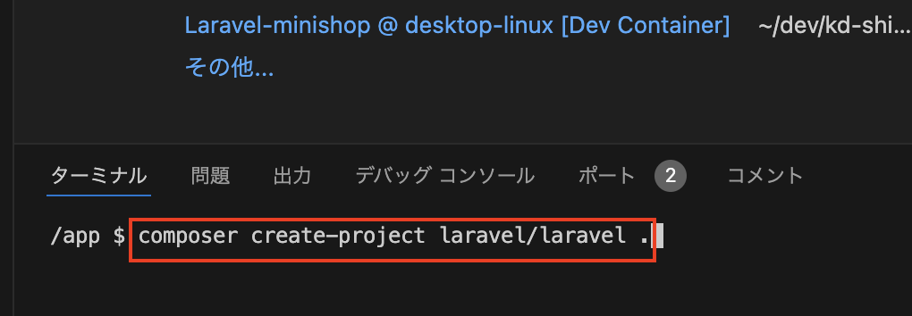

# ビュー、ルーティング

- [ビュー、ルーティング](#ビュールーティング)
  - [事前準備](#事前準備)
  - [はじめに](#はじめに)
  - [本章の狙い](#本章の狙い)
  - [Laravel環境の構築](#laravel環境の構築)
  - [ビューについて](#ビューについて)
  - [Bladeテンプレートについて](#bladeテンプレートについて)
  - [ビューの作成](#ビューの作成)
  - [ルーティングについて](#ルーティングについて)
  - [まとめ](#まとめ)
  - [【課題】ジャンル選択画面の作成](#課題ジャンル選択画面の作成)

## 事前準備

[こちらのページ]()から、ソースコードを`C:¥sys_dev_exe`へcloneしてください。

## はじめに

本章では、Laravelの基本的な機能であるビュー(Bladeテンプレート)、ルーティングについて学びます。
これらの基礎を理解することで、Laravelを使用したWebアプリケーション開発の第一歩を踏み出すことができます。

## 本章の狙い

- Laravelのビュー(Bladeテンプレート)、ルーティングの基本的な使い方を理解する
- ビューとルーティングを使って、ジャンル選択画面を再構築する

## Laravel環境の構築

後期の授業も、前期同様**コンテナを起動しアプリケーションを実行する**ことは変わりません。
ですが、Laravel環境を構築する上で、前期とは違った手順を踏む必要があります。

以降の章でも同じことを繰り返しやっていくことになりますので、しっかりと理解しておきましょう。

1. VSCode上で、`Ctrl+Shift+P`(Macの場合は`Cmd+Shift+P`)を押し、コンテナを起動する(**※初回のみ時間がかかる**)
2. VSCode上で、`Ctrl+J`(Macの場合は`Cmd+J`)を押し、ターミナルを表示する
3. ターミナルに`composer create-project laravel/laravel .` と入力し、`Enter`で実行する<br>
   
4. 30秒〜1分ぐらいして、以下のような表示がでれば、プロジェクトの作成完了となる(※2回目以降、コンテナを起動後に、上記コマンド`composer create-project laravel/laravel .`を実行する必要なし)<br>
   
5. 画面下部のポートから「web:80」の地球儀マークをクリックし、`http://localhost:{ポート番号}/`にブラウザでアクセスする<br>
   
6. 以下のような、画面が表示されればOK<br>
   

**【補足】**

Laravelを少しでも勉強している方はご存知かもしれませんが、Laravelのサーバーを起動するためには、本来は以下のコマンドを実行する必要があります。

```bash
php artisan serve
```

ただし、本授業ではコンテナ起動時に自動でサーバーが起動するため、上記のコマンドを実行する必要はありません。

## ビューについて

ビューは、MVCモデルでいうところの「V(View)」に相当します。<br>


ビューは、ユーザーに表示されるWebページのことを指します。
LaravelではBladeテンプレートを使用することで、より動的で再利用可能なコンテンツを作成することができます。

## Bladeテンプレートについて

Bladeテンプレートは、Laravelのテンプレートエンジンで、よりクリーンで保守しやすいHTMLを書くことができます。
ここでいうテンプレートエンジンとは、**HTMLテンプレート内に変数や制御構造を埋め込むための仕組み**(`{{  }}`ディレクティブ(`@`)など)のことです。

通常のHTMLファイルでは動作しないため、必ずファイル名には「**.blade.php**」という拡張子をつけることを忘れないようにしましょう。

## ビューの作成

まずは、簡単なビューを作成してみましょう。
といっても、中身は前期で学んだHTMLの知識を使ってほぼほぼ作成するだけです。
では、resources/viewsディレクトリ内に、index.blade.phpを作成してください。
以下に簡単な入力フォームを作成する例を示します。

**resources/views/index.blade.php**

```php
<!DOCTYPE html>
<html lang="ja">
<head>
<meta charset="UTF-8">
<meta name="viewport" content="width=device-width, initial-scale=1.0">
<title>サンプル</title>
</head>

<body>
<h3>入力フォーム〜プルダウン〜</h3>
<!-- サンプルのためaction属性は空白にしています-->
<form method="POST" action="">
   @csrf
   ジャンル
   <select name="genre">
      <option value="pc">パソコン</option>
      <option value="book">ブック</option>
      <option value="music">ミュージック</option>
   </select>
   <input type="submit" value="送信">
</form>
</body>
</html>
```

一部前期と違う記載方法がありますので解説します。

**【解説】**

`@csrf`<br>
Bladeテンプレートでは、上記のように`@`から始まる**ディレクティブ**を使って、特定の処理を行うことができます。
`@csrf`ディレクティブは、Laravelが自動的にCSRFトークンを生成し、フォーム送信時のセキュリティを強化します。

ここでいうCSRFトークンとは、クロスサイトリクエストフォージェリ(CSRF)攻撃からアプリケーションを保護するためのセキュリティ対策の一つです。
CSRFトークンを使うことで、フォーム送信時に外部からの不正なリクエストを防ぐことができます。

なお、Laravelのデフォルトの設定では、`<form>`タグを使用する際には、必ず`@csrf`ディレクティブを記述する必要があり、**記載しないとエラーが発生**します。

これでビューの作成が完了しました。
ただし、このビューを表示するためには、**ルーティングを定義する必要があります**。

## ルーティングについて

Laravelにおけるルーティングとは、URLとアプリケーション内の特定のロジックをマッピングすることを指します。

ここでいうマッピングとは、特定のURLにアクセスしたときにどのビューやコントローラを呼び出すかを定義することです。(※コントローラについては別の章で後述します。)

ルーティングを定義するメリットは、アプリケーションのURL構造を簡潔に保ち、**コードの可読性を向上させることができる**点です。
ただし、可読性の向上について実感できるのは、後期授業が進み、扱うPHPファイルが増えたときになりますのでしばしお待ちを。

では、Laravelのルーティングを定義する方法を見ていきましょう。
ルーティングを定義する routes/web.php ファイルを以下のように書き換えましょう。

**routes/web.php**

```php
<?php

use Illuminate\Support\Facades\Route;

// デフォルトのルート設定はコメントアウトしてください
// Route::get('/', function () {
//     return view('welcome');
// });

Route::get('/', function () {
    return view('index');
})->name('index');
```

**【解説】**

`Route`: `Route`クラスは、Laravelのルーティングを定義するためのクラスです。

`Route::get`:<br> 
`Route::get`メソッドは、GETリクエストを処理するためのルートを定義します。(※PHPでは、前期授業で述べた通り、何も指定しなければリクエスト時に使用されるメソッドはGETメソッドです。)

`Route::get`メソッドの第1引数は、URLを指定します。
上記の例では、`/` となっています。
第2引数は、クロージャです。
クロージャは、指定されたURLにアクセスされたときに実行される処理を定義します。
Laravelでは、クロージャを使って、ルートに直接ロジックを記述することができます。

上記の例では、`return view('index');` は、`index.blade.php`ビューを返す処理を定義しています。
また、`->name('index')` は、このルートに名前を付けるためのメソッドです。
名前を付けることで、ビューなどからルートを参照する際に、URLを直接記述するのではなく、名前を使って参照することができ便利です。

ここまでプログラムが作成できたら、ブラウザでアクセスしてみましょう。
以下のような画面が表示されればOKです。


なぜこの画面が表示されるのか、理由を考えてみましょう。

それは、`Route::get('/', function () { return view('index'); })->name('index');` で、`/` にアクセスしたときに、`index.blade.php` ビューを返すように**マッピングしているから**です。

## まとめ

今回学んだ内容は、Laravelの基本的な機能であるビュー、Bladeテンプレート、そしてルーティングの使い方について紹介しました。

次回以降の授業では、コントローラの使い方やデータベースとの連携について学びます。

## 【課題】ジャンル選択画面の作成

課題については、[こちら](../shop_index_kadai/README.md)に詳細を記載しています。
