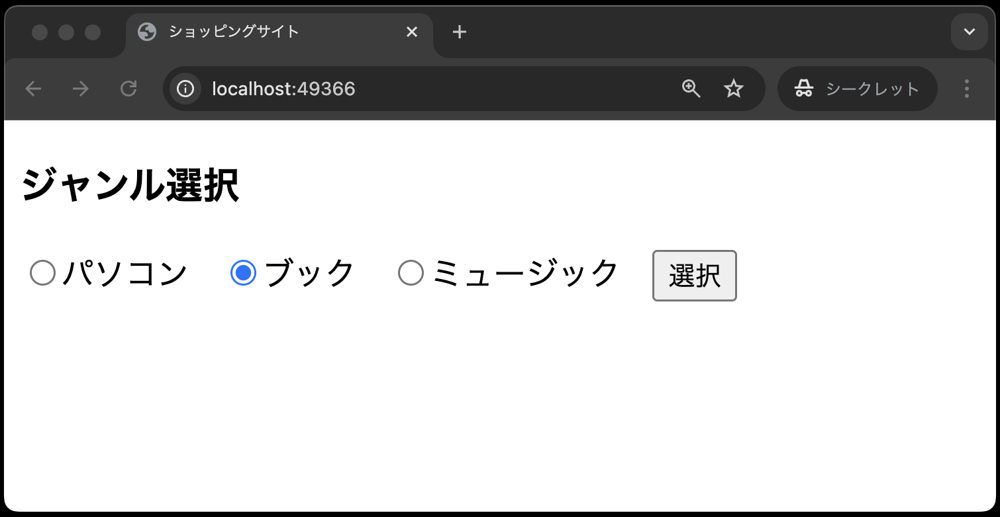

# 【課題】ジャンル選択画面の作成

- [【課題】ジャンル選択画面の作成](#課題ジャンル選択画面の作成)
  - [事前準備](#事前準備)
  - [本章の狙い](#本章の狙い)
  - [課題の説明](#課題の説明)
  - [ジャンル選択画面の仕様](#ジャンル選択画面の仕様)
  - [①Laravel環境の構築](#laravel環境の構築)
  - [②ビューの作成](#ビューの作成)
  - [③ルーティングの設定](#ルーティングの設定)
  - [動作確認](#動作確認)
  - [課題の提出について](#課題の提出について)
    - [GitHub Secretsの登録](#github-secretsの登録)
    - [課題の合格基準](#課題の合格基準)
    - [合格確認方法](#合格確認方法)

## 事前準備

[こちらのページ](https://classroom.github.com/a/E-VnbwaY)から、ソースコードを`C:¥sys_dev_exe`へcloneしてください。

## 本章の狙い

- [ビュー、ルーティング](../shop_index/README.md)の章で学んだビューとルーティングの知識を定着させる
- ビューとルーティングを使って、ジャンル選択画面を再構築する

## 課題の説明

[ビュー、ルーティング](../shop_index/README.md)の章を参考に、以下の手順に従い、ジャンル選択画面を再構築してください。

## ジャンル選択画面の仕様

ここでは、ジャンル選択画面の仕様をおさらいします。<br>


- ジャンル選択画面は、ミニショップのトップページであり、商品のジャンルを選択する画面
- 画面上部には、ヘッダーが表示されており、ヘッダーには「ジャンル選択」と表示されている
- パソコン、ブック、ミュージックの3つのジャンルをラジオボタンで選択できる
- ブックにデフォルトでチェックが入っている

以上の仕様を満たすジャンル選択画面を以下の手順で作成してください。

## ①Laravel環境の構築

1. VSCode上で、`Ctrl+Shift+P`(Macの場合は`Cmd+Shift+P`)を押し、コンテナを起動する
2. VSCode上で、`Ctrl+J`(Macの場合は`Cmd+J`)を押し、ターミナルを表示する
3. ターミナルに`composer create-project laravel/laravel .` と入力し、`Enter`で実行する<br>
   
4. 30秒〜1分ぐらいして、以下のような表示がでれば、プロジェクトの作成完了となる(※2回目以降、コンテナを起動後に、上記コマンド`composer create-project laravel/laravel .`を実行する必要なし)<br>
   
5. 画面下部のポートから「web:80」の地球儀マークをクリックし、`http://localhost:{ポート番号}/`にブラウザでアクセスする<br>
   
6. 以下のような、画面が表示されればOK<br>
   

## ②ビューの作成

1. resources/views ディレクトリ内に、index.blade.php を作成する
2. コードを index.blade.php に記述する
   - コードは前期の[ミニショップ①(ジャンル選択画面、ジャンル別商品一覧画面)](https://2024web1.github.io/web_app_dev/ec-site-i/)を参考にし、[ビュー、ルーティング](../shop_index/README.md)の章で学んだ内容を反映させること
     - `<form>`タグの`action`属性は、ルーティング設定ができていないので、空欄(`action=""`)にする
     - ディレクティブ(`@`ではじまるやつ)の記載を忘れずに！

## ③ルーティングの設定

- [ビュー、ルーティング](../shop_index/README.md)の章を参考に、routes/web.php にルーティングを設定する

## 動作確認

- 以下のような画面が表示されればOK<br>
   

## 課題の提出について

提出した課題はGitHub上で自動採点されます。
従来通りGitHub上にpushすれば完了で、自動採点がはじまります。
ただし、GitHub Classroomの仕様上、以下の作業を事前に行わないと **Lravel環境での自動採点ができない**ので、以下の対応を忘れずに行ってください。

### GitHub Secretsの登録

LaravelをGitHub上で動かすためには、`.env`ファイルが必要です。
しかし、`env`ファイルには、データベースの接続情報など、セキュリティ上の重要な情報が含まれているため、Laravelの設定上、`.env`ファイルをGitHubにpushできないようにされています。

そこで、GitHubのSecrets機能を利用して、`.env`ファイルの内容をGitHubに登録する必要があります。

1. GitHubの[課題リポジトリ](https://classroom.github.com/a/rD3Wg66b)のページに移動
2. 画面上部のSettingsをクリック<br>
   
3. 左のメニューから「Secrity」→「Secrets and variables」→「Actions」をクリック<br>
   

これで現在登録済みのSecretsが表示されます(初期状態は空っぽ)。
ここで以下の手順に従ってSecretsを登録してください。

1. `New repository secret`をクリック<br>
   
2. Nameに`DOTENV`、Secretに以下のファイルの内容をコピペ<br>
   

      ```env
      APP_NAME=Laravel
      APP_ENV=local
      APP_KEY=base64:BhoJlMO/+lbsBhF8Dn/ky+3pykh8n5Z3hwj9DtNcn18=
      APP_DEBUG=true
      APP_TIMEZONE=UTC
      APP_URL=http://localhost

      APP_LOCALE=en
      APP_FALLBACK_LOCALE=en
      APP_FAKER_LOCALE=en_US

      APP_MAINTENANCE_DRIVER=file
      # APP_MAINTENANCE_STORE=database

      BCRYPT_ROUNDS=12

      LOG_CHANNEL=stack
      LOG_STACK=single
      LOG_DEPRECATIONS_CHANNEL=null
      LOG_LEVEL=debug

      DB_CONNECTION=mysql
      DB_HOST=db
      DB_PORT=3306
      DB_DATABASE=SAMPLE
      DB_USERNAME=sampleuser
      DB_PASSWORD=samplepass

      SESSION_DRIVER=database
      SESSION_LIFETIME=120
      SESSION_ENCRYPT=false
      SESSION_PATH=/
      SESSION_DOMAIN=null

      BROADCAST_CONNECTION=log
      FILESYSTEM_DISK=local
      QUEUE_CONNECTION=database

      CACHE_STORE=database
      CACHE_PREFIX=

      MEMCACHED_HOST=127.0.0.1

      REDIS_CLIENT=phpredis
      REDIS_HOST=127.0.0.1
      REDIS_PASSWORD=null
      REDIS_PORT=6379

      MAIL_MAILER=log
      MAIL_HOST=127.0.0.1
      MAIL_PORT=2525
      MAIL_USERNAME=null
      MAIL_PASSWORD=null
      MAIL_ENCRYPTION=null
      MAIL_FROM_ADDRESS="hello@example.com"
      MAIL_FROM_NAME="${APP_NAME}"

      AWS_ACCESS_KEY_ID=
      AWS_SECRET_ACCESS_KEY=
      AWS_DEFAULT_REGION=us-east-1
      AWS_BUCKET=
      AWS_USE_PATH_STYLE_ENDPOINT=false

      VITE_APP_NAME="${APP_NAME}"
      ```

3. `Add secret`をクリックして登録

### 課題の合格基準

以下を合格基準とします。

1. `http://localhost:{ポート番号}/`にアクセスすると、ジャンル選択画面が表示されること
2. タイトル(`<title></title>`)にショッピングサイトと表示されていること<br>
   

### 合格確認方法

1. 本課題の[課題ページ](https://classroom.github.com/a/E-VnbwaY)に再度アクセスする
2. 画面上部にある`Actions`をクリックする<br>

3. **一番上**の行に、緑色のチェックが入っていればOK<br>

