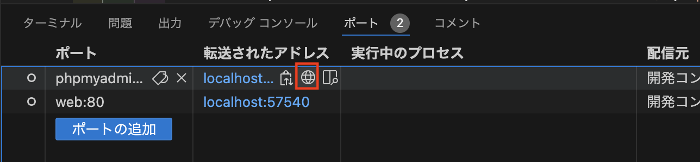
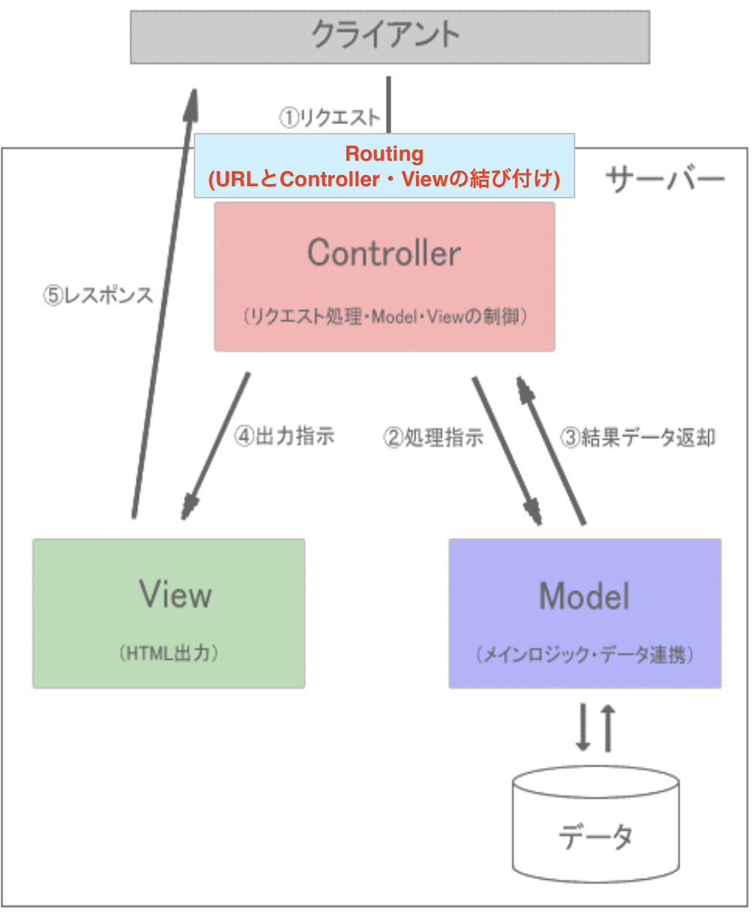
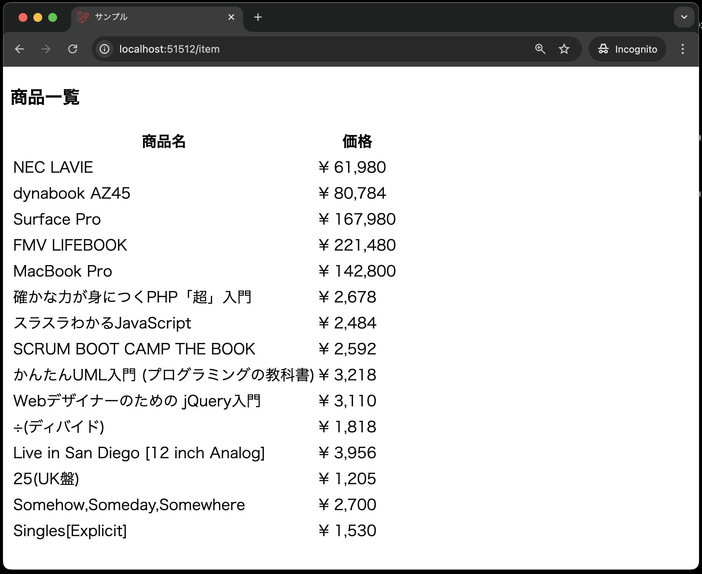

# モデル、コントローラ

- [モデル、コントローラ](#モデルコントローラ)
  - [事前準備](#事前準備)
  - [本章の狙い](#本章の狙い)
  - [Laravelでのデータベース環境構築](#laravelでのデータベース環境構築)
    - [.env ファイルの編集](#env-ファイルの編集)
    - [商品テーブル「items」](#商品テーブルitems)
    - [マイグレーション](#マイグレーション)
  - [シーダー](#シーダー)
  - [phpMyAdminでのデータ確認](#phpmyadminでのデータ確認)
  - [モデルについて](#モデルについて)
  - [コントローラについて](#コントローラについて)
  - [ルーティングとビューの作成](#ルーティングとビューの作成)
    - [ルーティングの作成](#ルーティングの作成)
    - [ビューの作成](#ビューの作成)
  - [動作確認](#動作確認)
  - [おまけ](#おまけ)
  - [まとめ](#まとめ)

## 事前準備

前回の[ビュー、ルーティング](../shop_index/README.md)でcloneしたコード(`21-first-laravel-GitHubアカウント名`)をそのまま利用してください。

## 本章の狙い

- Lravelでのデータベース環境構築方法を理解する
- Laravelのモデル、コントローラの基本的な使い方を理解する
- モデル、コントローラを使って、ジャンル別商品一覧画面を再構築する

## Laravelでのデータベース環境構築

本章の前半部ではデータベースとのやり取りを担当する**モデル**について学びますが、その前にデータベース環境を構築する必要があります。
Laravelでは、

- データベースの接続情報を記述するための**.envファイル**
- データベースのテーブル構造を定義するための**マイグレーション**
- データベースに初期データを挿入するための**シーダー**
  
を使ってデータベースの準備を行います。

### .env ファイルの編集

---

Laravelでは、データベースの接続情報を.envファイルに記述します。
前期のPHPでは、PDOクラスを使ってデータベースに接続する際、接続情報を直接記述していましたね。

Laravelでは.envファイルに記述することで、より安全にデータベースに接続することができます。
ここを正しく設定しない限り、この後出てくるテーブルを作成するためのマイグレーション、シーダーの実行ができません。

では、今回のDocker環境に合わせて.envファイルを編集しましょう。

```bash
APP_NAME=Laravel
APP_ENV=local
APP_KEY=base64:UwGfTSBkd2fawCCiK1eBmOLhQKNF5Ll7Bk1QcKtwhSI=
APP_DEBUG=true
APP_TIMEZONE=UTC
APP_URL=http://localhost

# --- 途中省略 ---

LOG_DEPRECATIONS_CHANNEL=null
LOG_LEVEL=debug

# --- 以下のように編集 ---
DB_CONNECTION=mysql
DB_HOST=db
DB_PORT=3306
DB_DATABASE=SAMPLE
DB_USERNAME=sampleuser
DB_PASSWORD=samplepass
# --- ここまで ---

# --- 以下省略 ---
```

**【解説】**

`DB_CONNECTION=mysql`:<br>
データベースの接続方法を指定します。
ここでは、MySQLを使用するため、`mysql`と記述します。

`DB_HOST=db`:<br>
データベースのホスト名を指定します。
ここでは、Dockerコンテナのサービス名を指定します。

`DB_PORT=3306`:<br>
データベースのポート番号を指定します。
MySQLのデフォルトポート番号は`3306`です。

`DB_DATABASE=SAMPLE`、`DB_USERNAME=sampleuser`、`DB_PASSWORD=samplepass`:<br>
データベース名、データベースに接続するためのユーザー名、パスワードを指定します。
これらの情報は、Docker環境の`docker-compose.yml`ファイルで設定したenv.txtファイルの内容に合わせて設定します。

データベースの接続情報を.envファイルに記述したら、次にマイグレーションを実行し、テーブル定義を行います。
ただし、マイグレーションを実行する前に、定義する商品テーブル「items」の構造を確認しておきましょう。

### 商品テーブル「items」

---

前期同様、ミニショップの商品を管理する商品テーブル「items」は以下のような構造になっています。

| カラム名 | データ型 | 制約 | 備考 |
| - | - | - | - |
|ident|int型|主キー、not null制約|商品番号|
|name|varchar型|最大文字数50、not null制約|商品名|
|maker|varchar型|最大文字数50、not null制約|メーカー・著者・アーティスト|
|price|int型||価格|
|image|varchar型|最大文字数20|画像名|
|genre|varchar型|最大文字数10|ジャンル|

### マイグレーション

---

マイグレーションとは、Laravelにおいてデータベースのテーブル構造を定義するための仕組みです。
マイグレーションを使うことで、データベースのテーブル構造をPHPのコードで定義し、データベースに反映させることができます。

では、マイグレーションを使って、データベースに商品テーブル「items」を作成しましょう。
マイグレーションを使うには、まずマイグレーションファイルを作成し、そのファイルを編集してテーブルの構造を定義します。

以下の手順でまずはマイグレーションファイルを作成しましょう。

1. VSCode上で、`Ctrl+Shift+P`(Macの場合は`Cmd+Shift+P`)を押し、コンテナを起動する(既に起動しているなら不要)
2. VSCode上で、`Ctrl+J`(Macの場合は`Cmd+J`)を押し、ターミナルを表示する
3. 以下のコマンドを実行して、itemsテーブル用のマイグレーションファイルを作成する

```bash
php artisan make:migration create_items_table
```

4. `database/migrations/20xx_xx_xx_xxxxxx_create_items_table.php` が作成されていることを確認する
5. `up`メソッドを以下のように修正する

    ```php
    <?php

    use Illuminate\Database\Migrations\Migration;
    use Illuminate\Database\Schema\Blueprint;
    use Illuminate\Support\Facades\Schema;

    return new class extends Migration
    {
        /**
         * Run the migrations.
         */
        public function up(): void
        {
            Schema::create('items', function (Blueprint $table) {
                // デフォルトの記述はコメントアウト
                // $table->id();
                // $table->timestamps();

                // --- 以下を追加 ---
                $table->integer('ident')->primary();
                $table->string('name', 50);
                $table->string('maker', 50);
                $table->integer('price');
                $table->string('image', 20);
                $table->string('genre', 10);
                // --- ここまで ---
            });
        }
        /**
         * Reverse the migrations.
         */
        public function down(): void
        {
            Schema::dropIfExists('items');
        }
    };
    ```

    **【解説】**

    `use...`: <br>
    useとは、他のクラスを読み込むためのキーワードです。
    pythonでいう`import`に近い役割を果たします。

    `public function up(): void {Schema::create('items', function (Blueprint $table) {`: <br>
    マイグレーションファイル作成時にデフォルトで記述されているコードです。
    ここでは、「`up`メソッド内にテーブル定義を記述するんだ」の理解で問題ございません。

    `$table->integer`: <br>
    整数型のカラムを定義します。
    第1引数にカラム名を指定します。

    `$table->string`: <br>
    文字列型のカラムを定義します。
    第1引数にカラム名、第2引数に文字列の長さを指定します。

    `$table->primary`: <br>
    主キーを定義します。`$table->integer('ident')->primary();`と記述することで、`ident`カラムを主キーに設定しています。

    `public function down(): void {Schema::dropIfExists('items');}`: <br>
    マイグレーションをロールバックする際に実行される処理を記述します。
    ロールバックとは、実行したマイグレーションを取り消すことを指します。
    `php artisan migrate:rollback`コマンドを実行することで、`down`メソッド内の処理が実行されます。
    ここでは、`items`テーブルを削除する処理を記述しています。

6. 以下のコマンドを実行して、マイグレーションを実行する

    ```bash
    php artisan migrate
    ```

これで、itemsテーブルが作成されました。
引き続き、itemsテーブルにデータを挿入するためのシーダーを作成します。

**【補足】**<br>
Laravelでテーブル定義をする際、以下のカラムがデフォルトで定義されています。
- `id`(主キー、自動採番付き(auto increment))
- `timestamps`(作成日時と更新日時を管理するためのカラム)

Laravelの前提としては、カラムとしてこれらを定義することを前提として構造化されているので、`id`、`timestamps`を削除する場合は、他のコード(モデルなど)も修正する必要がでてきます。

本授業では、
- 前期の「ミニショップ」の仕様を再現
- Laravelの前提ルールに則らない場合でもWebアプリを作成できる
ことを目的に、`id`、`timestamps`は使用しない前提で進めていきます。

## シーダー

シーダーとは、データベースに初期データを挿入するための仕組みです。
シーダーを使うことで、データベースのテストデータや初期データを簡単に挿入することができます。

では、シーダーを使って、itemsテーブルにデータを挿入しましょう。

1. VSCode上で、`Ctrl+Shift+P`(Macの場合は`Cmd+Shift+P`)を押し、コンテナを起動する(既に起動しているなら不要)
2. VSCode上で、`Ctrl+J`(Macの場合は`Cmd+J`)を押し、ターミナルを表示する
3. 以下のコマンドを実行して、ItemTableSeederを作成する

```bash
php artisan make:seeder ItemTableSeeder
```

4. `database/seeders/ItemTableSeeder.php` が作成されていることを確認する
5. 以下のようにシーダーを修正する

    ```php
    <?php

    namespace Database\Seeders;

    use Illuminate\Database\Console\Seeds\WithoutModelEvents;
    use Illuminate\Database\Seeder;
    use Illuminate\Support\Facades\DB; // 追加(忘れずに！)

    class ItemTableSeeder extends Seeder
    {
        /**
        * Run the database seeds.
        */
        public function run()
        {
            // --- 以下を追加 ---
            DB::table('items')->insert([
                ['ident' => 1, 'name' => 'NEC LAVIE', 'maker' => 'NEC', 'price' => 61980, 'image' => 'pc001.jpg', 'genre' => 'pc'],
                ['ident' => 2, 'name' => 'dynabook AZ45', 'maker' => '東芝', 'price' => 80784, 'image' => 'pc002.jpg', 'genre' => 'pc'],
                ['ident' => 3, 'name' => 'Surface Pro', 'maker' => 'マイクロソフト', 'price' => 167980, 'image' => 'pc003.jpg', 'genre' => 'pc'],
                ['ident' => 4, 'name' => 'FMV LIFEBOOK', 'maker' => '富士通', 'price' => 221480, 'image' => 'pc004.jpg', 'genre' => 'pc'],
                ['ident' => 5, 'name' => 'MacBook Pro', 'maker' => 'Apple', 'price' => 142800, 'image' => 'pc005.jpg', 'genre' => 'pc'],
                ['ident' => 6, 'name' => '確かな力が身につくPHP「超」入門', 'maker' => '松浦健一郎/司ゆき', 'price' => 2678, 'image' => 'book001.jpg', 'genre' => 'book'],
                ['ident' => 7, 'name' => 'スラスラわかるJavaScript', 'maker' => '生形　可奈子', 'price' => 2484, 'image' => 'book002.jpg', 'genre' => 'book'],
                ['ident' => 8, 'name' => 'SCRUM BOOT CAMP THE BOOK', 'maker' => '西村　直人ほか', 'price' => 2592, 'image' => 'book003.jpg', 'genre' => 'book'],
                ['ident' => 9, 'name' => 'かんたんUML入門 (プログラミングの教科書)', 'maker' => '大西　洋平ほか', 'price' => 3218, 'image' => 'book004.jpg', 'genre' => 'book'],
                ['ident' => 10, 'name' => 'Webデザイナーのための jQuery入門', 'maker' => '高津戸 壮', 'price' => 3110, 'image' => 'book005.jpg', 'genre' => 'book'],
                ['ident' => 11, 'name' => '÷(ディバイド)', 'maker' => 'エド・シーラン', 'price' => 1818, 'image' => 'music001.jpg', 'genre' => 'music'],
                ['ident' => 12, 'name' => 'Live in San Diego [12 inch Analog]', 'maker' => 'Eric Clapton', 'price' => 3956, 'image' => 'music002.jpg', 'genre' => 'music'],
                ['ident' => 13, 'name' => '25(UK盤)', 'maker' => 'Adele', 'price' => 1205, 'image' => 'music003.jpg', 'genre' => 'music'],
                ['ident' => 14, 'name' => 'Somehow,Someday,Somewhere', 'maker' => 'ai kuwabara trio project', 'price' => 2700, 'image' => 'music004.jpg', 'genre' => 'music'],
                ['ident' => 15, 'name' => 'Singles[Explicit]', 'maker' => 'マルーン5', 'price' => 1530, 'image' => 'music005.jpg', 'genre' => 'music'],
            ]);
            // --- ここまで ---
        }
    }
    ```

    **【解説】**
    
    `namespace...`: <br>
    namespaceとは、クラスをグループ化するためのキーワードです。
    ここでは、`Database\Seeders`という名前空間に`ItemTableSeeder`クラスを定義しています。
    名前空間を使うことで、同じクラス名でも異なる名前空間に属するクラスを区別することができます。

    `DB::table('items')->insert`: <br>
    連想配列を使って、itemsテーブルにデータを挿入します。

6. `database/seeders/DatabaseSeeder.php` を以下のように修正する

    ```php
    <?php

    namespace Database\Seeders;

    use Illuminate\Database\Seeder;

    class DatabaseSeeder extends Seeder
    {
        /**
        * Seed the application's database.
        */
        public function run()
        {
            // --- 以下を追加 ---
            $this->call(ItemTableSeeder::class);
            // --- ここまで ---
        }
    }
    ```

    **【解説】**

    `$this->call(ItemTableSeeder::class);`: <br>
    `ItemTableSeeder`クラスを呼び出して、データベースにデータを挿入します。
    以下の`php artisan db:seed`コマンドを実行することで、`DatabaseSeeder`クラスの`run`メソッドが実行され、`ItemTableSeeder`クラスが呼び出されます。

7. 以下のコマンドを実行して、シーダーを実行する

    ```bash
    php artisan db:seed
    ```

以上で、itemsテーブルにデータが挿入されました。

## phpMyAdminでのデータ確認

「.env ファイルの編集」、「マイグレーション」、「シーダー」の手順を踏んだ後、phpMyAdminでデータが正しく挿入されたか確認しましょう。

1. VSCode上で、`Ctrl+Shift+P`(Macの場合は`Cmd+Shift+P`)を押し、コンテナを起動する(既に起動している場合は不要)
2. VSCode上で、`Ctrl+J`(Macの場合は`Cmd+J`)を押し、ポートをクリックする
3. 画面下部のポートから「phpmyadmin:80」の地球儀マークをクリックする<br>
   
4. 以下の手順により、itemsテーブルにデータが挿入されているか確認する
   
   
   

    **【補足】**<br>
    ※画像を見ると、itemsテーブル以外にも、いくつかのテーブルが作成されていることがわかりますが、これらはLaravelのデフォルトで作成されるテーブルです。
    database/migrationsディレクトリには、これらのテーブルを作成するためのマイグレーションファイルがデフォルトで用意されており、`php artisan migrate`コマンドを実行することで、これらのテーブルが作成されました。

以上で、データベースの準備が整いました。
次はデータベースのやり取りを担当するモデルについて学びます。

## モデルについて

モデルはMVCモデルで言うところの「M(Model)」に相当します。
MVCモデルにおいて、モデルはデータベースとのやり取りを担当します。<br>


では、モデルを作成しましょう。
手動でモデルのPHPファイルも作成できますが、Laravelにはコマンドを使ってモデルを作成する機能があります。

1. VSCode上で、`Ctrl+Shift+P`(Macの場合は`Cmd+Shift+P`)を押し、コンテナを起動する(既に起動している場合は不要)
2. VSCode上で、`Ctrl+J`(Macの場合は`Cmd+J`)を押し、ターミナルを表示する
3. 以下のコマンドを実行して、Itemモデルを作成する

```bash
php artisan make:model Item
```

4. app/Models/Item.php が作成されていることを確認する
5. 以下のようにItem.phpを修正する

    ```php
    <?php
    namespace App\Models;

    use Illuminate\Database\Eloquent\Factories\HasFactory;
    use Illuminate\Database\Eloquent\Model;

    class Item extends Model
    {
        use HasFactory;

        // 以下を追加
        protected $primaryKey = 'ident';
    }
    ```

**【解説】**　<br>

`protected $primaryKey = 'ident';`: <br>
[マイグレーションの補足](#マイグレーション)で説明したように、itemsテーブルの主キーがデフォルトの`id`ではなく`ident`であるため、`$primaryKey`プロパティを使って、主キーが`ident`であることを指定しています。
この指定がなければ、モデルを使用してデータを取得する際、`id`を主キーとして扱おうとしてしまいエラーが発生します。

上記のように、`php artisan make:model Item`コマンドを実行し、Itemモデルを作成することで、itemsテーブルとのやり取りを行うための準備ができました。

**【補足】**　<br>
Laravelにおいて、「モデル名」と「テーブル名」には命名規則があります。
それは、原則、**「モデル名」は「テーブル名」の単数系でなければならない！**ということです。
(例: 「Item」モデル と「item**s**テーブル」)

ですので、Laravelではこの命名規則に則り構造化されているので、これを破るとエラーがでます。
とはいうものの、この命名規則に則っていないコードも出てきたりするので、そう言った場合の対処法もあるのでご安心を。
とりあえずはこの命名規則に則っていない場合は、なんらかの対処が必要だと頭の片隅にでも置いておいてください。

では、次にコントローラを使って、itemsテーブルからデータを取得し、ビューに渡す処理を行います。

## コントローラについて

コントローラはMVCモデルで言うところの「C(Controller)」に相当します。
MVCモデルにおいて、コントローラは、クライアントからのリクエストを受け取り、リクエストに応じて、モデルからデータを取得したり、ビューに出力を指示したりと、いわゆる司令塔の役割を果たします。<br>


では、コントローラを作成しましょう。
手動でコントローラのPHPファイルも作成できますが、Laravelにはコマンドを使ってコントローラを作成する機能があります。

1. VSCode上で、`Ctrl+Shift+P`(Macの場合は`Cmd+Shift+P`)を押し、コンテナを起動する(既に起動している場合は不要)
2. VSCode上で、`Ctrl+J`(Macの場合は`Cmd+J`)を押し、ターミナルを表示する
3. 以下のコマンドを実行して、ItemControllerを作成する

```bash
php artisan make:controller ItemController
```

4. app/Http/Controllers/ItemController.php が作成されていることを確認する

5. 作成されたItemController.phpをVSCodeで開き、以下のコードを追加する

    ```php
    <?php
    namespace App\Http\Controllers;

    use Illuminate\Http\Request;
    use App\Models\Item; // 追加

    class ItemController extends Controller
    {
        // --- 以下を追加 ---
        public function index()
        {
            $items = Item::all();
            return view('item.index', compact('items'));
        }
        // --- ここまで ---
    }
    ```

**【解説】**

`use App\Models\Item`: 先ほど[モデルについて]で作成した、`Item`モデルを使うために記述しています。
前期で習った`require_once`のようなもので、itemsテーブルとのやり取りを行うために、`Item`モデルを使いたいために記述しています。

`public function index`: <br>
Laravelでは、コントローラに記述する`index` メソッドは、「一覧表示画面を表示するためのメソッド名」として一般的に使われます。

`$items = Item::all();`: <br>
`Item::all()`は、`Item`モデルを使って、itemsテーブルの全データを取得するメソッドです。
`$items`には、itemsテーブルの全データが格納されます。

`return view('item.index', compact('items'));`: <br>

`view`メソッドは、ビューを表示するためのメソッドです。
第1引数には、表示するビューのファイル名を指定します。
第2引数には、ビューに渡すデータを連想配列で指定します。<br>
ここでは、`item.index`というビューに`$items`という変数を渡しています。
この`item.index`は、後ほど作成する`resources/views/item/index.blade.php`ファイルを指します。

**【補足】**<br>
このようにモデルを使ってデータベースからデータを取得する際、直接SQL文を書くことなく、モデルのメソッドを使ってデータベースとのやり取りを行うことができます。
これは、Laravelの**Eloquent ORM(エロクアント ORM)**という機能で、モデルを使ってデータベースとのやり取りを行う際に、SQL文を書かずにデータベースとのやり取りを行うことができます。

## ルーティングとビューの作成

それでは、先ほど作成したコントローラを使って、商品データを取得し、ビューに渡すためのルーティングとビューを作成しましょう。
ルーティングとビューが作成できれば、ブラウザで商品データが表示されるようになります。

### ルーティングの作成

---

まずはクライアントからリクエストがサーバーに送信された際に、必要に応じてマッピングを行う必要があります。(※マッピングとは、特定のURLにアクセスしたときにどのビューやコントローラを呼び出すかを定義することです。)

その役目を担うのがルーティングでしたね。
では、`routes/web.php`ファイルにルーティングを設定しましょう。

今回は、ItemControllerの`index`メソッドを呼び出すためのルーティングを設定します。

```php
use Illuminate\Support\Facades\Route;
use App\Http\Controllers\ItemController; // 追加

// 途中省略

// 以下を追加
Route::get('item', [ItemController::class, 'index']);
```

**【解説】**

`use App\Http\Controllers\ItemController;`: <br>
`ItemController`クラスを使用するために、`ItemController`クラスを読み込んでいます。

`Route::get('item', [ItemController::class, 'index']);`: <br>
`Route::get`メソッドは、GETリクエストを受け取った際に、指定したコントローラの指定したメソッドを呼び出すためのルーティングを設定します。
第1引数には、URLを指定します。ここでは、`item`というURLにリクエストが送信された際に、`ItemController`クラスの`index`メソッドを呼び出すように設定しています。

`[ItemController::class, 'index']`は、`ItemController`クラスの`index`メソッドを呼び出すことを示しています。

**【補足】**<br>
勘の良い方は気づいたかもしれませんが、Laravelではリクエストからコントローラまでの経路をルーティングで定義します。
ですので、以下の図で示すと、リクエストとコントローラの間にルーティングが挟まっているイメージです。



### ビューの作成

---

次に、商品データを表示するためのビューを作成します。

まず、`resources/views`ディレクトリに`item`ディレクトリを作成し、その中に`index.blade.php`ファイルを作成します。
※先ほどのItemControllerの`index`メソッドで`return view('item.index', compact('items'));`としているため、`item`ディレクトリに`index.blade.php`ファイルを作成する必要があります。
※`item`ディレクトリ並びに`index.blade.php`ファイルは、コマンドではなく手動で作成してください。


```php
<!DOCTYPE html>
<html lang="ja">
<head>
<meta charset="UTF-8">
<meta name="viewport" content="width=device-width, initial-scale=1.0">
<title>サンプル</title>
</head>
<body>
<h3>商品一覧</h3>
    <table>
        <tr>
            <th>商品名</th>
            <th>価格</th>
        </tr>
    @foreach( $items  as  $item )
        <tr>
            <td class="td_item_name"> {{  $item->name }} </td>
            <td class="td_right">&yen; {{  number_format( $item->price) }} </td>
        </tr>
    @endforeach
    </table>
</body>
</html>
```


**【解説】**

`$items`: <br>
`$items`は、ItemControllerのindexメソッドで取得した商品データが入っています。
ルーティングで、`return view('item.index', ['items' => $items]);`として、`$items`をビューに渡しているため、ビュー内で`$items`を使うことができます。

`@foreach( $items  as  $item )`: <br>
`@foreachディレクティブ`は、PHPのforeach文と同じ使い方ができるディレクティブであり、`@endforeach`ディレクティブで終了します。
`$items`には、商品データが入っています。
`$items`のデータを1つずつ取り出して、`$item`に代入しています。


`{{ $item->name }}`、`{{  number_format( $item->price) }}`: <br>
Laravelには、ビューで変数を表示したり、関数を呼び出したりする`{{  }}`という構文があります。

今回は、変数を表示する際に使用しています。
なお、この構文はセキュリティ対策のため、エスケープ処理が自動で行われます。
`$item->name`、`$item->price`は、商品データの各カラムの値を取得しています。

## 動作確認

これで、クライアントからリクエストを送信すると、商品一覧が表示されるようになりました。

では、実際に動作確認を行いましょう。

1. VSCode上で、`Ctrl+Shift+P`(Macの場合は`Cmd+Shift+P`)を押し、コンテナを起動する(既に起動しているなら不要)
2. VSCode上で、`Ctrl+J`(Macの場合は`Cmd+J`)を押し、画面下部のポートをクリックし、「web:80」の地球儀マークをクリックする<br>
   
3. ブラウザのアドレスバーの末尾に`/item`を追加し、Enterキーを押す
4. 商品一覧が表示されればOK<br>
    

## おまけ

実は、今回はマイグレーション、シーダー、モデル、コントローラをそれぞれコマンドで作成しました。
授業ではそれぞれにしっかりと意識を向けていただくことが目的ですが、実際の開発では面倒ですよね？

その場合、以下のコマンドを使うことで一気に作成可能です！

```bash
php artisan make:model Item -msc
```

`m`オプション: マイグレーションファイルを作成
`s`オプション: シーダーファイルを作成
`c`オプション: コントローラファイルを作成

また、マイグレーションとシーダーを同時に実行する場合は以下のコマンドを使うこで一気に実行可能です！
特に、こちらは今後の課題時の環境構築でも頻繁に使用するので、覚えておくと便利です。

```bash
php artisan migrate:fresh --seed
```

## まとめ

本章では、Laravelのモデルとコントローラについて学びました。
前章と合わせて、Laravelを通じて、MVCモデルの基本である、モデル、ビュー、コントローラについて経験しましたがいかがだったでしょうか。

大切なことは、Laravelの基本的なルールに従いコードを作成することにより、意識せずともMVCモデルを実装できる、つまり、オブジェクト思考に則った効率性・保守性の高いコードに標準化されるということです。

これがフレームワークが大規模開発に向いていると言われる理由の一つです。
