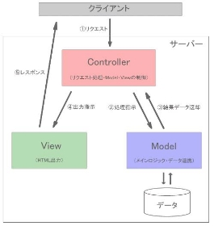

# モデルとコントローラについて

- [モデルとコントローラについて](#モデルとコントローラについて)
  - [モデルについて](#モデルについて)
  - [コントローラについて](#コントローラについて)
- [まとめ](#まとめ)

## モデルについて

モデルはMVCモデルで言うところの「M(Model)」に相当します。
MVCモデルにおいて、モデルはデータベースとのやり取りを担当します。<br>


では、モデルを作成しましょう。
手動でモデルのPHPファイルも作成できますが、Laravelにはコマンドを使ってモデルを作成する機能があります。

1. VSCode上で、`Ctrl+Shift+P`(Macの場合は`Cmd+Shift+P`)を押し、コンテナを起動する
2. VSCode上で、`Ctrl+J`(Macの場合は`Cmd+J`)を押し、ターミナルを表示する
3. 以下のコマンドを実行して、Itemモデルを作成する

```bash
php artisan make:model Item
```


## コントローラについて

コントローラはMVCモデルで言うことのできる「C(Controller)」に相当します。
MVCモデルにおいて、コントローラはいわゆる司令塔の役割を果たします。

具体的には、クライアントからのリクエストを受け取り、リクエストに応じて、モデルからデータを取得したり、ビューに出力を指示したりします。<br>


では、コントローラを作成しましょう。
手動でコントローラのPHPファイルも作成できますが、Laravelにはコマンドを使ってコントローラを作成する機能があります。

1. VSCode上で、`Ctrl+Shift+P`(Macの場合は`Cmd+Shift+P`)を押し、コンテナを起動する
2. VSCode上で、`Ctrl+J`(Macの場合は`Cmd+J`)を押し、ターミナルを表示する
3. 以下のコマンドを実行して、ItemControllerを作成する

```bash
php artisan make:controller ItemController
```

4. app/Http/Controllers/ItemController.php が作成されていることを確認する

5. 作成されたItemController.phpをVSCodeで開き、以下のコードを追加する

    ```php
    <?php
    namespace App\Http\Controllers;

    use App\Models\Item; // 追加
    use Illuminate\Http\Request;

    class ItemController extends Controller
    {
    /**
     * Display a listing of the resource.
     */
    public function index(Request $request)
    {
        // --- 以下を追加 ---
        $items = Item::where('genre', $request->genre)->get();
        return view('item.index', ['items' => $items]);
        // --- ここまで ---
    }
    ```

**【解説】**

コントローラでは、基礎言語のPHPとは大きく異なる書き方が多数出てくるので、細かく解説していきます。

`namespace App\Http\Controllers`: <br>このコントローラがLaravelのどのディレクトリに属しているかを示します。
これにより、他のクラスと名前の衝突を避けることができます。

`use App\Models\Item`: `Item`モデルを使用する宣言をします。

`class ItemController extends Controller`: <br>
`ItemController` クラスは、`Controller` クラスを継承しています。

`public function index(Request $request)`: <br>
Laravelでは、コントローラに記述する`index` メソッドは、「一覧表示画面を表示するためのメソッド」として一般的に使われます。

`$items = Item::where('genre', $request->genre)->get();`: <br>

マイグレーションについて
マイグレーションの役割
マイグレーションは、データベースのテーブル構造を定義し、バージョン管理を可能にします。開発途中での変更が容易になります。

2024_07_18_013557_create_items_table.php の解説
以下は create_items_table.php の一部コードです。

php
コードをコピーする
use Illuminate\Database\Migrations\Migration;
use Illuminate\Database\Schema\Blueprint;
use Illuminate\Support\Facades\Schema;

class CreateItemsTable extends Migration
{
    public function up()
    {
        Schema::create('items', function (Blueprint $table) {
            $table->id();
            $table->string('name');
            $table->text('description');
            $table->decimal('price', 8, 2);
            $table->timestamps();
        });
    }

    public function down()
    {
        Schema::dropIfExists('items');
    }
}
解説
upメソッド: items テーブルを作成し、id, name, description, price, timestamps カラムを定義します。
downメソッド: items テーブルを削除します。
シーダーについて
シーダーの役割
シーダーは、テストや開発環境で使用するためのデータを自動的にデータベースに挿入する仕組みです。

ItemTableSeeder.php の解説
以下は ItemTableSeeder.php のコードです。

php
コードをコピーする
use Illuminate\Database\Seeder;
use App\Models\Item;

class ItemTableSeeder extends Seeder
{
    public function run()
    {
        Item::create([
            'name' => 'Sample Item',
            'description' => 'This is a sample item.',
            'price' => 100.00
        ]);
    }
}
解説
runメソッド: Item::create を使って、items テーブルにサンプルデータを挿入します。
シーダーの実行
シーダーを実行するには、以下のコマンドを使用します。

bash
コードをコピーする
php artisan db:seed --class=ItemTableSeeder
phpMyAdminでのデータ確認
データの確認方法
phpMyAdminは、ウェブベースのデータベース管理ツールです。ここでは、items テーブルのデータを確認する手順を紹介します。

phpMyAdminにアクセスします。
左側のデータベースリストから、使用中のデータベースを選択します。
items テーブルをクリックして、データを確認します。
データベース環境に応じた.envの編集
.env ファイルの役割
.env ファイルは、アプリケーションの環境設定を行うファイルです。データベース接続情報もここに記述します。

設定例
以下は .env ファイルの一部です。

makefile
コードをコピーする
DB_CONNECTION=mysql
DB_HOST=127.0.0.1
DB_PORT=3306
DB_DATABASE=your_database_name
DB_USERNAME=your_username
DB_PASSWORD=your_password
解説
DB_CONNECTION: 使用するデータベースの種類を指定します。
DB_HOST: データベースサーバーのホスト名を指定します。
DB_PORT: データベースのポート番号を指定します。
DB_DATABASE: 使用するデータベース名を指定します。
DB_USERNAME: データベースのユーザー名を指定します。
DB_PASSWORD: データベースのパスワードを指定します。
ジャンル別商品一覧画面の作成
index.blade.php の解説
resources/views/item/index.blade.php は商品一覧画面を表示するためのビューです。

blade
コードをコピーする
@extends('layouts.app')

@section('content')
    <h1>Item List</h1>
    <ul>
        @foreach ($items as $item)
            <li>{{ $item->name }} - {{ $item->price }}円</li>
        @endforeach
    </ul>
@endsection
解説
@extends: 親レイアウト layouts.app を継承します。
@section: コンテンツを content セクションに挿入します。
@foreach: $items 配列をループして各アイテムの名前と価格を表示します。
学習時間の目安
MVCモデルのコントローラについて: 約30分
マイグレーションについて: 約20分
シーダーについて: 約15分
phpMyAdminでのデータ確認: 約10分
データベース環境に応じた.envの編集: 約10分
ジャンル別商品一覧画面の作成: 約25分
全体で約1時間50分を想定しています。

この教材を活用して、Laravelの基礎をしっかり学びましょう。質問があれば、授業中に積極的に質問してください。

# まとめ

本章では、Laravelのモデルとコントローラについて学びました。
前章と合わせて、Laravelを通じて、MVCモデルの基本である、モデル、ビュー、コントローラについて経験しましたがいかがだったでしょうか。

ここで大切なことは、Laravelの基本的なルールに従いコードを作成することにより、意識せずともMVCモデルを実装できる、つまり、オブジェクト思考に則った効率性・保守性の高いコードに標準化されるということです。

これがフレームワークが大規模開発に向いていると言われる理由の一つです。
