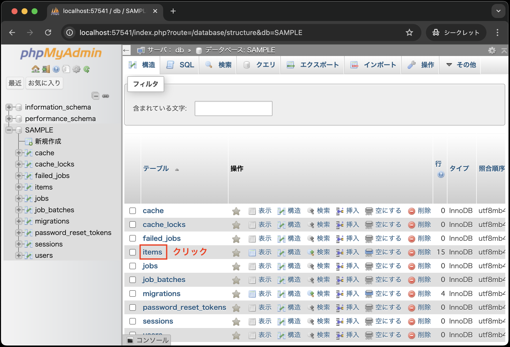
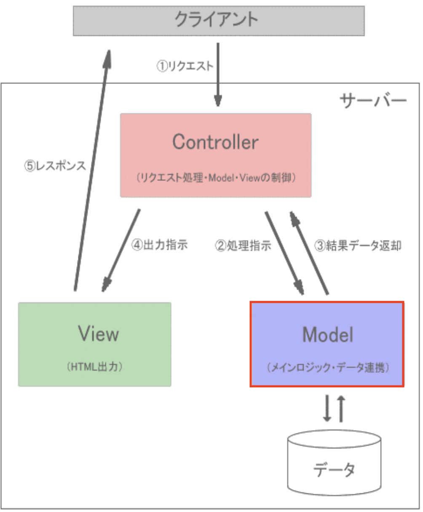

# モデルとコントローラについて

- [モデルとコントローラについて](#モデルとコントローラについて)
  - [事前準備](#事前準備)
  - [マイグレーション](#マイグレーション)
  - [シーダー](#シーダー)
  - [phpMyAdminでのデータ確認](#phpmyadminでのデータ確認)
  - [モデルについて](#モデルについて)
  - [コントローラについて](#コントローラについて)
  - [ジャンル選択画面とルーティング修正](#ジャンル選択画面とルーティング修正)
    - [ジャンル選択画面のaction属性を修正](#ジャンル選択画面のaction属性を修正)
  - [ジャンル別商品一覧画面の作成](#ジャンル別商品一覧画面の作成)
  - [まとめ](#まとめ)

## 事前準備

1. [こちらのページ]()から、ソースコードを`C:¥sys_dev_exe`へcloneする
2. VSCode上で、`Ctrl+Shift+P`(Macの場合は`Cmd+Shift+P`)を押し、コンテナを起動する
3. VSCode上で、`Ctrl+J`(Macの場合は`Cmd+J`)を押し、ターミナルを表示する
3. `composer create-project laravel/laravel .` を実行し、Laravel環境を構築する
4. 前章で作成した以下のコードを、上記「1.」でcloneしたソースコードを同じ場所に上書きする
   
   ```text
    app
    │
    途中省略
    │
    ├── resources
    │   └── views
    │       └── index.blade.php
    ├── routes
    │   └── web.php
    ```

## はじめに

## データベース環境構築

本章の前半部ではデータベースとのやり取りを担当するモデルについて学びます。
そのため、まずはデータベース環境を構築し、やり取りするデータベース用意します。

## .env ファイルの編集

Laravelでは、データベースの接続情報を.envファイルに記述します。
ここを正しく設定しない限り、この後出てくるテーブルを作成するためのマイグレーション、シーダーの実行ができません。

では、今回のDocker環境に合わせて.envファイルを編集しましょう。

```bash
APP_NAME=Laravel
APP_ENV=local
APP_KEY=base64:UwGfTSBkd2fawCCiK1eBmOLhQKNF5Ll7Bk1QcKtwhSI=
APP_DEBUG=true
APP_TIMEZONE=UTC
APP_URL=http://localhost

# --- 途中省略 ---

LOG_DEPRECATIONS_CHANNEL=null
LOG_LEVEL=debug

# --- 以下のように編集 ---
DB_CONNECTION=mysql
DB_HOST=db
DB_PORT=3306
DB_DATABASE=SAMPLE
DB_USERNAME=sampleuser
DB_PASSWORD=samplepass
# --- ここまで ---

# --- 以下省略 ---
```

**【解説】**

`DB_CONNECTION=mysql`: データベースの接続方法を指定します。ここでは、MySQLを使用するため、`mysql`と記述します。<br>
`DB_HOST=db`: データベースのホスト名を指定します。ここでは、Dockerコンテナのサービス名を指定します。<br>
`DB_PORT=3306`: データベースのポート番号を指定します。MySQLのデフォルトポート番号は`3306`です。<br>
`DB_DATABASE=SAMPLE`、`DB_USERNAME=sampleuser`、`DB_PASSWORD=samplepass`: データベース名、データベースに接続するためのユーザー名、パスワードを指定します。
これらの情報は、Docker環境の`docker-compose.yml`ファイルで設定したenv.txtファイルの内容に合わせて設定します。

データベースの接続情報を.envファイルに記述したら、次にマイグレーションを実行します。

## マイグレーション

マイグレーションとは、Laravelにおいてデータベースのテーブル構造を定義するための仕組みです。

マイグレーションを使うことで、データベースのテーブル構造をPHPのコードで定義し、データベースに反映させることができます。

では、マイグレーションを使って、データベースにitemsテーブルを作成しましょう。

1. VSCode上で、`Ctrl+Shift+P`(Macの場合は`Cmd+Shift+P`)を押し、コンテナを起動する(既に起動しているなら不要)
2. VSCode上で、`Ctrl+J`(Macの場合は`Cmd+J`)を押し、ターミナルを表示する
3. 以下のコマンドを実行して、itemsテーブルを作成する

```bash
php artisan make:migration create_items_table
```

4. `database/migrations/20xx_xx_xx_xxxxxx_create_items_table.php` が作成されていることを確認する
5. `up`メソッドを以下のように修正する

    ```php
    public function up(): void
        {
            Schema::create('items', function (Blueprint $table) {
                // デフォルトの記述はコメントアウト
                // $table->id();
                // $table->timestamps();

                // --- 以下を追加 ---
                $table->integer('ident')->primary();
                $table->string('name', 50);
                $table->string('maker', 50);
                $table->integer('price');
                $table->string('image', 20);
                $table->string('genre', 10);
                // --- ここまで ---
            });
        }
    ```

    **【解説】**

    `$table->integer`: <br>
    整数型のカラムを定義します。
    第1引数にカラム名を指定します。

    `$table->string`: <br>
    文字列型のカラムを定義します。
    第1引数にカラム名、第2引数に文字列の長さを指定します。

    `$table->primary`: <br>
    主キーを定義します。`$table->integer('ident')->primary();`と記述することで、`ident`カラムを主キーに設定しています。

    ※ここで、Laravelでのテーブル定義について補足しておきます。
    Laravelでは、テーブルの主キーは`id`という自動採番付きのカラムがデフォルトで用意されており、`timestamps`という作成日時と更新日時を管理するためのカラムもデフォルトで用意されています。
    以降出てくるモデルなどデータベースとやり取りをするコードでは、これらを前提としているため、`id`、`timestamps`を削除する場合は、モデルなどのコードを修正する必要があります。

6. 以下のコマンドを実行して、マイグレーションを実行する

    ```bash
    php artisan migrate
    ```

これで、itemsテーブルが作成されました。
引き続き、itemsテーブルにデータを挿入するためのシーダーを作成します。

## シーダー

シーダーとは、データベースに初期データを挿入するための仕組みです。
シーダーを使うことで、データベースのテストデータや初期データを簡単に挿入することができます。

では、シーダーを使って、itemsテーブルにデータを挿入しましょう。

1. VSCode上で、`Ctrl+Shift+P`(Macの場合は`Cmd+Shift+P`)を押し、コンテナを起動する(既に起動しているなら不要)
2. VSCode上で、`Ctrl+J`(Macの場合は`Cmd+J`)を押し、ターミナルを表示する
3. 以下のコマンドを実行して、ItemTableSeederを作成する

```bash
php artisan make:seeder ItemTableSeeder
```

4. `database/seeders/ItemTableSeeder.php` が作成されていることを確認する
5. 以下のようにシーダーを修正する

    ```php
    <?php

    namespace Database\Seeders;

    use Illuminate\Database\Console\Seeds\WithoutModelEvents;
    use Illuminate\Database\Seeder;
    use Illuminate\Support\Facades\DB; // 追加(忘れずに！)

    class ItemsTableSeeder extends Seeder
    {
        /**
        * Run the database seeds.
        */
        public function run()
        {
            // --- 以下を追加 ---
            DB::table('items')->insert([
                ['ident' => 1, 'name' => 'NEC LAVIE', 'maker' => 'NEC', 'price' => 61980, 'image' => 'pc001.jpg', 'genre' => 'pc'],
                ['ident' => 2, 'name' => 'dynabook AZ45', 'maker' => '東芝', 'price' => 80784, 'image' => 'pc002.jpg', 'genre' => 'pc'],
                ['ident' => 3, 'name' => 'Surface Pro', 'maker' => 'マイクロソフト', 'price' => 167980, 'image' => 'pc003.jpg', 'genre' => 'pc'],
                ['ident' => 4, 'name' => 'FMV LIFEBOOK', 'maker' => '富士通', 'price' => 221480, 'image' => 'pc004.jpg', 'genre' => 'pc'],
                ['ident' => 5, 'name' => 'MacBook Pro', 'maker' => 'Apple', 'price' => 142800, 'image' => 'pc005.jpg', 'genre' => 'pc'],
                ['ident' => 6, 'name' => '確かな力が身につくPHP「超」入門', 'maker' => '松浦健一郎/司ゆき', 'price' => 2678, 'image' => 'book001.jpg', 'genre' => 'book'],
                ['ident' => 7, 'name' => 'スラスラわかるJavaScript', 'maker' => '生形　可奈子', 'price' => 2484, 'image' => 'book002.jpg', 'genre' => 'book'],
                ['ident' => 8, 'name' => 'SCRUM BOOT CAMP THE BOOK', 'maker' => '西村　直人ほか', 'price' => 2592, 'image' => 'book003.jpg', 'genre' => 'book'],
                ['ident' => 9, 'name' => 'かんたんUML入門 (プログラミングの教科書)', 'maker' => '大西　洋平ほか', 'price' => 3218, 'image' => 'book004.jpg', 'genre' => 'book'],
                ['ident' => 10, 'name' => 'Webデザイナーのための jQuery入門', 'maker' => '高津戸 壮', 'price' => 3110, 'image' => 'book005.jpg', 'genre' => 'book'],
                ['ident' => 11, 'name' => '÷(ディバイド)', 'maker' => 'エド・シーラン', 'price' => 1818, 'image' => 'music001.jpg', 'genre' => 'music'],
                ['ident' => 12, 'name' => 'Live in San Diego [12 inch Analog]', 'maker' => 'Eric Clapton', 'price' => 3956, 'image' => 'music002.jpg', 'genre' => 'music'],
                ['ident' => 13, 'name' => '25(UK盤)', 'maker' => 'Adele', 'price' => 1205, 'image' => 'music003.jpg', 'genre' => 'music'],
                ['ident' => 14, 'name' => 'Somehow,Someday,Somewhere', 'maker' => 'ai kuwabara trio project', 'price' => 2700, 'image' => 'music004.jpg', 'genre' => 'music'],
                ['ident' => 15, 'name' => 'Singles[Explicit]', 'maker' => 'マルーン5', 'price' => 1530, 'image' => 'music005.jpg', 'genre' => 'music'],
            ]);
            // --- ここまで ---
        }
    }
    ```

    **【解説】**

    `DB::table('items')->insert`: <br>
    連想配列を使って、itemsテーブルにデータを挿入します。

6. 以下のコマンドを実行して、シーダーを実行する

    ```bash
    php artisan db:seed --class=ItemTableSeeder
    ```

以上で、itemsテーブルにデータが挿入されました。

## phpMyAdminでのデータ確認

「.env ファイルの編集」、「マイグレーション」、「シーダー」の手順を踏んだ後、phpMyAdminでデータベースにデータが挿入されているか確認しましょう。

1. VSCode上で、`Ctrl+Shift+P`(Macの場合は`Cmd+Shift+P`)を押し、コンテナを起動する(既に起動している場合は不要)
2. VSCode上で、`Ctrl+J`(Macの場合は`Cmd+J`)を押し、ポートをクリックする
3. 地球儀マークをクリックする<br>
   
4. 以下の手順により、itemsテーブルにデータが挿入されているか確認する
   
   
   

   ※画像を見ると、itemsテーブル以外にも、いくつかのテーブルが作成されていることがわかりますが、これらはLaravelのデフォルトで作成されるテーブルです。
   database/migrationsディレクトリには、これらのテーブルを作成するためのマイグレーションファイルが用意されており、`php artisan migrate`コマンドを実行することで、これらのテーブルが作成されました。

以上で、データベースの準備が整いました。

次は、モデルとコントローラ

## モデルについて

モデルはMVCモデルで言うところの「M(Model)」に相当します。
MVCモデルにおいて、モデルはデータベースとのやり取りを担当します。<br>


では、モデルを作成しましょう。
手動でモデルのPHPファイルも作成できますが、Laravelにはコマンドを使ってモデルを作成する機能があります。

1. VSCode上で、`Ctrl+Shift+P`(Macの場合は`Cmd+Shift+P`)を押し、コンテナを起動する(既に起動している場合は不要)
2. VSCode上で、`Ctrl+J`(Macの場合は`Cmd+J`)を押し、ターミナルを表示する
3. 以下のコマンドを実行して、Itemモデルを作成する

```bash
php artisan make:model Item
```

4. app/Models/Item.php が作成されていることを確認する

5. 以下のようにItem.phpを修正する

    ```php
    <?php
    namespace App\Models;

    use Illuminate\Database\Eloquent\Factories\HasFactory;
    use Illuminate\Database\Eloquent\Model;

    class Item extends Model
    {
        use HasFactory;

        // 以下を追加
        protected $primaryKey = 'ident';
    }
    ```

上記のように、`php artisan make:model Item`コマンドを実行し、Itemモデルを作成することで、itemsテーブルとのやり取りを行うための準備ができました。

`protected $primaryKey = 'ident';`では、[マイグレーション](#マイグレーション)の補足で説明したように、itemsテーブルの主キーがデフォルトの`id`ではなく`ident`であるため、`$primaryKey`プロパティを使って、主キーが`ident`であることを指定しています。
この指定をしなければ、モデルを使用してデータを取得する際、`id`を主キーとして扱おうとしてしまい、エラーが発生します。

では、次にコントローラを使って、itemsテーブルからデータを取得し、ビューに渡す処理を行います。

## コントローラについて

コントローラはMVCモデルで言うところの「C(Controller)」に相当します。
MVCモデルにおいて、コントローラは、クライアントからのリクエストを受け取り、リクエストに応じて、モデルからデータを取得したり、ビューに出力を指示したりと、いわゆる司令塔の役割を果たします。<br>


では、コントローラを作成しましょう。
手動でコントローラのPHPファイルも作成できますが、Laravelにはコマンドを使ってコントローラを作成する機能があります。

1. VSCode上で、`Ctrl+Shift+P`(Macの場合は`Cmd+Shift+P`)を押し、コンテナを起動する
2. VSCode上で、`Ctrl+J`(Macの場合は`Cmd+J`)を押し、ターミナルを表示する
3. 以下のコマンドを実行して、ItemControllerを作成する

```bash
php artisan make:controller ItemController
```

4. app/Http/Controllers/ItemController.php が作成されていることを確認する

5. 作成されたItemController.phpをVSCodeで開き、以下のコードを追加する

    ```php
    <?php
    namespace App\Http\Controllers;

    use App\Models\Item; // 追加
    use Illuminate\Http\Request;

    class ItemController extends Controller
    {
        /**
         * Display a listing of the resource.
         */
        public function index(Request $request)
        {
            // --- 以下を追加 ---
            $items = Item::where('genre', $request->genre)->get();
            return view('item.index', ['items' => $items]);
            // --- ここまで ---
        }
    }
    ```

**【解説】**

コントローラでは、基礎言語のPHPとは大きく異なる書き方が多数出てくるので、細かく解説していきます。

`namespace App\Http\Controllers`: <br>このコントローラがLaravelのどのディレクトリに属しているかを示します。
これにより、他のクラスと名前の衝突を避けることができます。

`use App\Models\Item`: `Item`モデルを使用する宣言をします。
前期で習った`require_once`のようなもので、`Item`モデルを使うためにはこの記述が必要です。

`public function index`: <br>
Laravelでは、コントローラに記述する`index` メソッドは、「一覧表示画面を表示するためのメソッド」として一般的に使われます。

`Request $request`: <br>
`Request`クラスは、あらかじめ定義されているHTTPリクエストを表すクラスです。
上部で`use Illuminate\Http\Request;`として読み込んでいるため、`Request`クラスを使用することができます。

また、`Request $request`と記述することにより、newを使わずにクラスから`$request`オブジェクトを使うことができます。
PHPでは、メソッド内に`$request = new Request();`と記述していたのが、Laravelでは、メソッドの**引数に**`Request $request`と記述するだけで、`$request`オブジェクトを使うことができます。

`$request`オブジェクトにより、リクエスト時にGET・POSTメソッドを使って送られたデータを取得することができ、非常に便利です。

このメソッドの引数にクラスとそのオブジェクトを記述する方法は、**依存性の注入**と呼ばれ、効率的に開発する上でメリットがあるのですが、詳細は別の章で説明します。

`$items = Item::where('genre', $request->genre)->get();`: <br>

`Item::where('genre', $request->genre)`: <br>
`Item`モデルの`genre`カラムが、リクエスト時に送られた`genre`の値と一致するレコードを取得します。`Item::where`という記述は、Laravelのファ

`->get()`: <br>
`get`メソッドは、`where`メソッドで取得したレコードを取得します。

なお、このようにモデルを使ってデータベースからデータを取得する際、直接SQL文を書くことなく、データを取得することができます。
これは、Laravelの**Eloquent ORM**という機能により、データベースとのやり取りを簡単に行うことができるためです。

## ジャンル選択画面とルーティング修正

ジャンル別商品一覧画面を作成する前に、前章で作成したものにいくつか修正を加える必要があります。

### ジャンル選択画面のaction属性を修正
   


## ジャンル別商品一覧画面の作成

## まとめ

本章では、Laravelのモデルとコントローラについて学びました。
前章と合わせて、Laravelを通じて、MVCモデルの基本である、モデル、ビュー、コントローラについて経験しましたがいかがだったでしょうか。

ここで大切なことは、Laravelの基本的なルールに従いコードを作成することにより、意識せずともMVCモデルを実装できる、つまり、オブジェクト思考に則った効率性・保守性の高いコードに標準化されるということです。

これがフレームワークが大規模開発に向いていると言われる理由の一つです。
