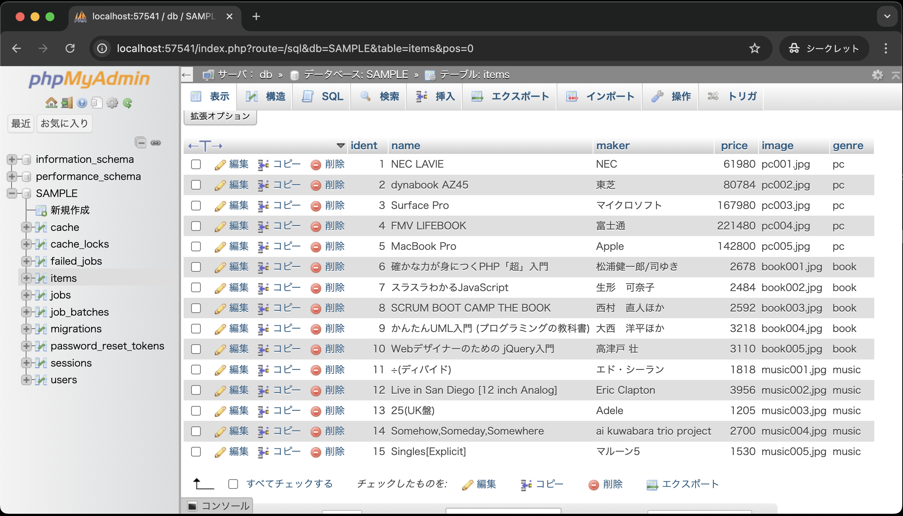
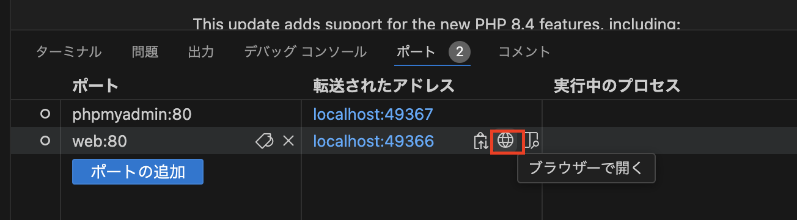

# モデル、コントローラ

- [モデル、コントローラ](#モデルコントローラ)
  - [事前準備](#事前準備)
  - [はじめに](#はじめに)
  - [本章の狙い](#本章の狙い)
  - [Laravelでのデータベース環境構築](#laravelでのデータベース環境構築)
    - [.env ファイルの編集](#env-ファイルの編集)
    - [マイグレーション](#マイグレーション)
    - [商品テーブル「items」](#商品テーブルitems)
  - [シーダー](#シーダー)
  - [phpMyAdminでのデータ確認](#phpmyadminでのデータ確認)
  - [モデルについて](#モデルについて)
  - [コントローラについて](#コントローラについて)
  - [ルーティングとジャンル選択画面の修正](#ルーティングとジャンル選択画面の修正)
    - [ルーティングの修正](#ルーティングの修正)
    - [ジャンル選択画面の修正](#ジャンル選択画面の修正)
  - [ジャンル別商品一覧画面の作成](#ジャンル別商品一覧画面の作成)
  - [動作確認](#動作確認)
  - [まとめ](#まとめ)

## 事前準備

1. [こちらのページ]()から、ソースコードを`C:¥sys_dev_exe`へcloneする
2. VSCode上で、`Ctrl+Shift+P`(Macの場合は`Cmd+Shift+P`)を押し、コンテナを起動する
3. VSCode上で、`Ctrl+J`(Macの場合は`Cmd+J`)を押し、ターミナルを表示する
4. `composer create-project laravel/laravel .` を実行し、Laravel環境を構築する

## はじめに

本章では、Laravelの基本的な機能であるモデル、コントローラについて学びます。

## 本章の狙い

- Lravelでのデータベース環境構築方法を理解する
- Laravelのモデル、コントローラの基本的な使い方を理解する
- モデル、コントローラを使って、ジャンル別商品一覧画面を再構築する

## Laravelでのデータベース環境構築

本章の前半部ではデータベースとのやり取りを担当する**モデル**について学びますが、その前にデータベース環境を構築する必要があります。
Laravelでは、

- データベースの接続情報を記述するための**.envファイル**
- データベースのテーブル構造を定義するための**マイグレーション**
- データベースに初期データを挿入するための**シーダー**
  
を使ってデータベースの準備を行います。

### .env ファイルの編集

---

Laravelでは、データベースの接続情報を.envファイルに記述します。
前期のPHPでは、PDOクラスを使ってデータベースに接続する際、接続情報を直接記述していましたが、Laravelでは.envファイルに記述することで、より安全にデータベースに接続することができます。
ここを正しく設定しない限り、この後出てくるテーブルを作成するためのマイグレーション、シーダーの実行ができません。

では、今回のDocker環境に合わせて.envファイルを編集しましょう。

```bash
APP_NAME=Laravel
APP_ENV=local
APP_KEY=base64:UwGfTSBkd2fawCCiK1eBmOLhQKNF5Ll7Bk1QcKtwhSI=
APP_DEBUG=true
APP_TIMEZONE=UTC
APP_URL=http://localhost

# --- 途中省略 ---

LOG_DEPRECATIONS_CHANNEL=null
LOG_LEVEL=debug

# --- 以下のように編集 ---
DB_CONNECTION=mysql
DB_HOST=db
DB_PORT=3306
DB_DATABASE=SAMPLE
DB_USERNAME=sampleuser
DB_PASSWORD=samplepass
# --- ここまで ---

# --- 以下省略 ---
```

**【解説】**

`DB_CONNECTION=mysql`:<br>
データベースの接続方法を指定します。
ここでは、MySQLを使用するため、`mysql`と記述します。

`DB_HOST=db`:<br>
データベースのホスト名を指定します。
ここでは、Dockerコンテナのサービス名を指定します。

`DB_PORT=3306`:<br>
データベースのポート番号を指定します。
MySQLのデフォルトポート番号は`3306`です。

`DB_DATABASE=SAMPLE`、`DB_USERNAME=sampleuser`、`DB_PASSWORD=samplepass`:<br>
データベース名、データベースに接続するためのユーザー名、パスワードを指定します。
これらの情報は、Docker環境の`docker-compose.yml`ファイルで設定したenv.txtファイルの内容に合わせて設定します。

データベースの接続情報を.envファイルに記述したら、次にマイグレーションを実行します。

### マイグレーション

---

マイグレーションとは、Laravelにおいてデータベースのテーブル構造を定義するための仕組みです。
マイグレーションを使うことで、データベースのテーブル構造をPHPのコードで定義し、データベースに反映させることができます。

では、マイグレーションを使って、データベースに商品テーブル「items」を作成しましょう。
マイグレーションを使うには、まずマイグレーションファイルを作成し、そのファイルを編集してテーブルの構造を定義します。

以下の手順でまずはマイグレーションファイルを作成しましょう。

1. VSCode上で、`Ctrl+Shift+P`(Macの場合は`Cmd+Shift+P`)を押し、コンテナを起動する(既に起動しているなら不要)
2. VSCode上で、`Ctrl+J`(Macの場合は`Cmd+J`)を押し、ターミナルを表示する
3. 以下のコマンドを実行して、itemsテーブル用のマイグレーションファイルを作成する

```bash
php artisan make:migration create_items_table
```

4. `database/migrations/20xx_xx_xx_xxxxxx_create_items_table.php` が作成されていることを確認する
5. `up`メソッドを以下のように修正する

    ```php
    public function up(): void
        {
            Schema::create('items', function (Blueprint $table) {
                // デフォルトの記述はコメントアウト
                // $table->id();
                // $table->timestamps();

                // --- 以下を追加 ---
                $table->integer('ident')->primary();
                $table->string('name', 50);
                $table->string('maker', 50);
                $table->integer('price');
                $table->string('image', 20);
                $table->string('genre', 10);
                // --- ここまで ---
            });
        }
    ```

    **【解説】**
    `public function up(): void {Schema::create('items', function (Blueprint $table) {`: <br>
    マイグレーションファイル作成時にデフォルトで記述されているコードです。
    ここでは、「`up`メソッド内にテーブル定義を記述するんだ」の理解で問題ございません。

    `$table->integer`: <br>
    整数型のカラムを定義します。
    第1引数にカラム名を指定します。

    `$table->string`: <br>
    文字列型のカラムを定義します。
    第1引数にカラム名、第2引数に文字列の長さを指定します。

    `$table->primary`: <br>
    主キーを定義します。`$table->integer('ident')->primary();`と記述することで、`ident`カラムを主キーに設定しています。

6. 以下のコマンドを実行して、マイグレーションを実行する

    ```bash
    php artisan migrate
    ```

これで、itemsテーブルが作成されました。
引き続き、itemsテーブルにデータを挿入するためのシーダーを作成します。

**【Laravelのテーブル定義について補足】**<br>
Laravelでテーブル定義をする際以下のカラムがデフォルトで定義されています。
- `id`(主キー、自動採番付き(auto increment))
- `timestamps`(作成日時と更新日時を管理するためのカラム)

Laravelの前提としては、カラムとしてこれらを定義すること前提として構造化されているので、`id`、`timestamps`を削除する場合は、他のコード(モデルなど)も修正する必要がでてきます。

本授業では、
- 極力前期の「ミニショップ」の仕様を再現
- Laravelの前提ルールに則らない場合でもWebアプリを作成できる
ことを目的に、`id`、`timestamps`は使用しない前提で進めていきます。

### 商品テーブル「items」

---

前期同様、ミニショップの商品を管理する商品テーブル「items」は以下のような構造になっています。

| カラム名 | データ型 | 制約 | 備考 |
| - | - | - | - |
|ident|int型|主キー、not null制約|商品番号|
|name|varchar型|最大文字数50、not null制約|商品名|
|maker|varchar型|最大文字数50、not null制約|メーカー・著者・アーティスト|
|price|int型||価格|
|image|varchar型|最大文字数20|画像名|
|genre|varchar型|最大文字数10|ジャンル|

## シーダー

シーダーとは、データベースに初期データを挿入するための仕組みです。
シーダーを使うことで、データベースのテストデータや初期データを簡単に挿入することができます。

では、シーダーを使って、itemsテーブルにデータを挿入しましょう。

1. VSCode上で、`Ctrl+Shift+P`(Macの場合は`Cmd+Shift+P`)を押し、コンテナを起動する(既に起動しているなら不要)
2. VSCode上で、`Ctrl+J`(Macの場合は`Cmd+J`)を押し、ターミナルを表示する
3. 以下のコマンドを実行して、ItemTableSeederを作成する

```bash
php artisan make:seeder ItemTableSeeder
```

4. `database/seeders/ItemTableSeeder.php` が作成されていることを確認する
5. 以下のようにシーダーを修正する

    ```php
    <?php

    namespace Database\Seeders;

    use Illuminate\Database\Console\Seeds\WithoutModelEvents;
    use Illuminate\Database\Seeder;
    use Illuminate\Support\Facades\DB; // 追加(忘れずに！)

    class ItemsTableSeeder extends Seeder
    {
        /**
        * Run the database seeds.
        */
        public function run()
        {
            // --- 以下を追加 ---
            DB::table('items')->insert([
                ['ident' => 1, 'name' => 'NEC LAVIE', 'maker' => 'NEC', 'price' => 61980, 'image' => 'pc001.jpg', 'genre' => 'pc'],
                ['ident' => 2, 'name' => 'dynabook AZ45', 'maker' => '東芝', 'price' => 80784, 'image' => 'pc002.jpg', 'genre' => 'pc'],
                ['ident' => 3, 'name' => 'Surface Pro', 'maker' => 'マイクロソフト', 'price' => 167980, 'image' => 'pc003.jpg', 'genre' => 'pc'],
                ['ident' => 4, 'name' => 'FMV LIFEBOOK', 'maker' => '富士通', 'price' => 221480, 'image' => 'pc004.jpg', 'genre' => 'pc'],
                ['ident' => 5, 'name' => 'MacBook Pro', 'maker' => 'Apple', 'price' => 142800, 'image' => 'pc005.jpg', 'genre' => 'pc'],
                ['ident' => 6, 'name' => '確かな力が身につくPHP「超」入門', 'maker' => '松浦健一郎/司ゆき', 'price' => 2678, 'image' => 'book001.jpg', 'genre' => 'book'],
                ['ident' => 7, 'name' => 'スラスラわかるJavaScript', 'maker' => '生形　可奈子', 'price' => 2484, 'image' => 'book002.jpg', 'genre' => 'book'],
                ['ident' => 8, 'name' => 'SCRUM BOOT CAMP THE BOOK', 'maker' => '西村　直人ほか', 'price' => 2592, 'image' => 'book003.jpg', 'genre' => 'book'],
                ['ident' => 9, 'name' => 'かんたんUML入門 (プログラミングの教科書)', 'maker' => '大西　洋平ほか', 'price' => 3218, 'image' => 'book004.jpg', 'genre' => 'book'],
                ['ident' => 10, 'name' => 'Webデザイナーのための jQuery入門', 'maker' => '高津戸 壮', 'price' => 3110, 'image' => 'book005.jpg', 'genre' => 'book'],
                ['ident' => 11, 'name' => '÷(ディバイド)', 'maker' => 'エド・シーラン', 'price' => 1818, 'image' => 'music001.jpg', 'genre' => 'music'],
                ['ident' => 12, 'name' => 'Live in San Diego [12 inch Analog]', 'maker' => 'Eric Clapton', 'price' => 3956, 'image' => 'music002.jpg', 'genre' => 'music'],
                ['ident' => 13, 'name' => '25(UK盤)', 'maker' => 'Adele', 'price' => 1205, 'image' => 'music003.jpg', 'genre' => 'music'],
                ['ident' => 14, 'name' => 'Somehow,Someday,Somewhere', 'maker' => 'ai kuwabara trio project', 'price' => 2700, 'image' => 'music004.jpg', 'genre' => 'music'],
                ['ident' => 15, 'name' => 'Singles[Explicit]', 'maker' => 'マルーン5', 'price' => 1530, 'image' => 'music005.jpg', 'genre' => 'music'],
            ]);
            // --- ここまで ---
        }
    }
    ```

    **【解説】**

    `DB::table('items')->insert`: <br>
    連想配列を使って、itemsテーブルにデータを挿入します。

6. 以下のコマンドを実行して、シーダーを実行する

    ```bash
    php artisan db:seed --class=ItemTableSeeder
    ```

以上で、itemsテーブルにデータが挿入されました。

## phpMyAdminでのデータ確認

「.env ファイルの編集」、「マイグレーション」、「シーダー」の手順を踏んだ後、phpMyAdminでデータベースにデータが挿入されているか確認しましょう。

1. VSCode上で、`Ctrl+Shift+P`(Macの場合は`Cmd+Shift+P`)を押し、コンテナを起動する(既に起動している場合は不要)
2. VSCode上で、`Ctrl+J`(Macの場合は`Cmd+J`)を押し、ポートをクリックする
3. 地球儀マークをクリックする<br>
   
4. 以下の手順により、itemsテーブルにデータが挿入されているか確認する
   
   
   

   ※画像を見ると、itemsテーブル以外にも、いくつかのテーブルが作成されていることがわかりますが、これらはLaravelのデフォルトで作成されるテーブルです。
   database/migrationsディレクトリには、これらのテーブルを作成するためのマイグレーションファイルが用意されており、`php artisan migrate`コマンドを実行することで、これらのテーブルが作成されました。

以上で、データベースの準備が整いました。
次はデータベースのやり取りを担当するモデルについて学びます。

## モデルについて

モデルはMVCモデルで言うところの「M(Model)」に相当します。
MVCモデルにおいて、モデルはデータベースとのやり取りを担当します。<br>


では、モデルを作成しましょう。
手動でモデルのPHPファイルも作成できますが、Laravelにはコマンドを使ってモデルを作成する機能があります。

1. VSCode上で、`Ctrl+Shift+P`(Macの場合は`Cmd+Shift+P`)を押し、コンテナを起動する(既に起動している場合は不要)
2. VSCode上で、`Ctrl+J`(Macの場合は`Cmd+J`)を押し、ターミナルを表示する
3. 以下のコマンドを実行して、Itemモデルを作成する

```bash
php artisan make:model Item
```

4. app/Models/Item.php が作成されていることを確認する

5. 以下のようにItem.phpを修正する

    ```php
    <?php
    namespace App\Models;

    use Illuminate\Database\Eloquent\Factories\HasFactory;
    use Illuminate\Database\Eloquent\Model;

    class Item extends Model
    {
        use HasFactory;

        // 以下を追加
        protected $primaryKey = 'ident';
    }
    ```

上記のように、`php artisan make:model Item`コマンドを実行し、Itemモデルを作成することで、itemsテーブルとのやり取りを行うための準備ができました。

`protected $primaryKey = 'ident';`では、[マイグレーション](#マイグレーション)の補足で説明したように、itemsテーブルの主キーがデフォルトの`id`ではなく`ident`であるため、`$primaryKey`プロパティを使って、主キーが`ident`であることを指定しています。
この指定をしなければ、モデルを使用してデータを取得する際、`id`を主キーとして扱おうとしてしまい、エラーが発生します。

では、次にコントローラを使って、itemsテーブルからデータを取得し、ビューに渡す処理を行います。

## コントローラについて

コントローラはMVCモデルで言うところの「C(Controller)」に相当します。
MVCモデルにおいて、コントローラは、クライアントからのリクエストを受け取り、リクエストに応じて、モデルからデータを取得したり、ビューに出力を指示したりと、いわゆる司令塔の役割を果たします。<br>


では、コントローラを作成しましょう。
手動でコントローラのPHPファイルも作成できますが、Laravelにはコマンドを使ってコントローラを作成する機能があります。

1. VSCode上で、`Ctrl+Shift+P`(Macの場合は`Cmd+Shift+P`)を押し、コンテナを起動する
2. VSCode上で、`Ctrl+J`(Macの場合は`Cmd+J`)を押し、ターミナルを表示する
3. 以下のコマンドを実行して、ItemControllerを作成する

```bash
php artisan make:controller ItemController
```

4. app/Http/Controllers/ItemController.php が作成されていることを確認する

5. 作成されたItemController.phpをVSCodeで開き、以下のコードを追加する

    ```php
    <?php
    namespace App\Http\Controllers;

    use Illuminate\Http\Request;
    use App\Models\Item; // 追加

    class ItemController extends Controller
    {
        // --- 以下を追加 ---
        public function index(Request $request)
        {
            $items = Item::where('genre', $request->genre)->get();
            return view('item.index', ['items' => $items]);
        }
        // --- ここまで ---
    }
    ```

**【解説】**

コントローラでは、基礎言語のPHPとは大きく異なる書き方が多数出てくるので、細かく解説していきます。

`namespace App\Http\Controllers`: <br>
このコントローラがLaravelのどのディレクトリに属しているかを示します。
これにより、他のクラスと名前の衝突を避けることができます。

`use App\Models\Item`: `Item`モデルを使用する宣言をします。
前期で習った`require_once`のようなもので、`Item`モデルを使うためにはこの記述が必要です。

`public function index`: <br>
Laravelでは、コントローラに記述する`index` メソッドは、「一覧表示画面を表示するためのメソッド」として一般的に使われます。

`Request $request`: <br>
`Request`クラスは、あらかじめ定義されているHTTPリクエストを表すクラスです。
上部で`use Illuminate\Http\Request;`として読み込んでいるため、`Request`クラスを使用することができます。

また、`Request $request`と記述することにより、newを使わずにクラスから`$request`オブジェクトを使うことができます。
PHPでは、メソッド内に`$request = new Request();`と記述していたのが、Laravelでは、メソッドの**引数に**`Request $request`と記述するだけで、`$request`オブジェクトを使うことができます。

`$request`オブジェクトにより、リクエスト時にGET・POSTメソッドを使って送られたデータを取得することができ、非常に便利です。

このメソッドの引数にクラスとそのオブジェクトを記述する方法は、**依存性の注入**と呼ばれ、効率的に開発する上でメリットがあるのですが、詳細は別の章で説明します。

`$items = Item::where('genre', $request->genre)->get();`: <br>

`Item::where('genre', $request->genre)`: <br>
`Item`モデルの`genre`カラムが、リクエスト時に送られた`genre`の値と一致するレコードを取得します。

`->get()`: <br>
`get`メソッドは、`where`メソッドで取得したレコードを取得します。

`return view('item.index', ['items' => $items]);`: <br>
`view`関数は、ビューを表示するための関数です。
第1引数には、表示するビューのファイル名を指定します。
第2引数には、ビューに渡すデータを連想配列で指定します。
ここでは、`item.index`というビューに`$items`という変数を渡しています。

なお、このようにモデルを使ってデータベースからデータを取得する際、直接SQL文を書くことなく、データを取得することができます。
これは、Laravelの**Eloquent ORM**という機能により、データベースとのやり取りを簡単に行うことができるためです。

## ルーティングとジャンル選択画面の修正

ジャンル別商品一覧画面を作成する前に、前章で作成したものにいくつか修正を加える必要があります。

### ルーティングの修正

現状、ジャンル選択画面からリクエストを送信しても、先ほど作成したコントローラ(ItemController.php)にリクエストが送信されないため、ジャンル選択画面で選択したジャンルをコントローラに送信するためのルーティングを追加する必要があります。

勘の良い方は気づいたかもしれませんが、Laravelではリクエストからコントローラまでの経路をルーティングで定義します。
ですので、以下の図で示すと、リクエストとコントローラの間にルーティングが挟まっているイメージです。


ルーティングを追加するためには、`routes/web.php`ファイルを以下のように修正してください。

```php
use Illuminate\Support\Facades\Route;
use App\Http\Controllers\ItemController; // 追加

// デフォルトのルート設定はコメントアウトしてください
// Route::get('/', function () {
//     return view('welcome');
// });

Route::get('/', function () {
    return view('index');
});

// --- 以下を追加 ---
Route::post('item', [ItemController::class, 'index'])->name('item.index');
```

**【解説】**

`use App\Http\Controllers\ItemController;`: <br>
`ItemController`クラスを使用するために、`ItemController`クラスを読み込んでいます。

`Route::post('item', [ItemController::class, 'index'])->name('item.index');`: <br>
`Route::post`メソッドは、POSTメソッドでリクエストが送信された際に、指定したコントローラの指定したメソッドを呼び出すルーティングを定義します。
`'item'`は、ルーティングのURLを指定します。ここでは、`'item'`と指定しているため、`http://localhost/item`にPOSTメソッドでリクエストが送信された際に、`ItemController`の`index`メソッドが呼び出されます。

`[ItemController::class, 'index']`は、`ItemController`クラスの`index`メソッドを呼び出すことを示しています。

`->name('item.index')`は、このルーティングに名前を付けています。
この名前を使って、ビューからリンクを作成することができます。

### ジャンル選択画面の修正

次に、ジャンル選択画面(resources/views/index.blade.php)を修正します。
ジャンル選択画面のフォームの`action`属性が空欄になっているため、先ほど追加したルーティングにリクエストを送信するように修正します。

```php
<!DOCTYPE html>
<html lang="ja">
<head>
<meta charset="UTF-8">
<meta name="viewport" content="width=device-width, initial-scale=1.0">
<title>ショッピングサイト</title>
</head>
<body>
<h3>ジャンル選択</h3>
<!-- action属性の値にルーティングのURLを指定 -->
<form method="POST" action="{{ route('item.index') }}">
    @csrf
    <label><input type="radio" name="genre" value="pc">パソコン</label>&nbsp;&nbsp;
    <label><input type="radio" name="genre" value="book" checked>ブック</label>&nbsp;&nbsp;
    <label><input type="radio" name="genre" value="music">ミュージック</label>&nbsp;&nbsp;
    <input type="submit" value="選択">
</form>
</body>
</html>
```

**【解説】**

`<form method="POST" action="{{ route('item.index') }}">`: <br>
`action`属性に`{{ route('item.index') }}`を指定することで、`item.index`という名前のルーティングにリクエストを送信するように設定しています。

## ジャンル別商品一覧画面の作成

ジャンル選択画面からジャンルを選択し、リクエストを送信すると、ItemControllerのindexメソッドが呼び出され、選択したジャンルに応じた商品一覧画面を表示するようになります。

では、ジャンル別商品一覧画面を作成しましょう。

まず、作成する場所ですが、Laravelでは、ビューは`resources/views`ディレクトリに配置していましたね。
ジャンル別商品一覧画面は、アプリケーション「ミニショップ」の**商品機能**に関するビューになるため、`resources/views/item`ディレクトリに配置します。

では、`resources/views/item`ディレクトリに`index.blade.php`ファイルを作成し、以下のコードを記述してください。
※Laravelでは、モデル、コントローラはコマンドでファイルを自動作成できますが、ビューは自動作成できませんので、手動で作成してください。

```php
<!DOCTYPE html>
<html lang="ja">
<head>
<meta charset="UTF-8">
<meta name="viewport" content="width=device-width, initial-scale=1.0">
<link rel="stylesheet" href="{{ asset('css/minishop.css')}}">
<title>ショッピングサイト</title>
</head>
<body>
<h3>ジャンル別商品一覧</h3>
    <table>
        <tr>
            <th>&nbsp;</th>
            <th>商品名</th>
            <th>メーカー・著者<br>アーティスト</th>
            <th>価格</th>
            <th>詳細</th>
        </tr>
    @foreach( $items  as  $item )
        <tr>
        <td class="td_mini_img">image )}}"></td>
        <td class="td_item_name"> {{  $item->name }} </td>
        <td class="td_item_maker"> {{  $item->maker }}  </td>
        <td class="td_right">&yen; {{  number_format( $item->price) }} </td>
        <!-- リンク先についてはここでは一旦空欄とします -->
        <td><a href="">詳細</a></td>
        </tr>
    @endforeach
    </table>
    <br>
    <a href="{{ route('index') }}">ジャンル選択に戻る</a>
</body>
</html>
```

**【解説】**

`<link rel="stylesheet" href="{{ asset('css/minishop.css')}}">`: <br>
`asset`ヘルパ関数は、`public`ディレクトリのパスを返す関数です。

`image )}}">`: <br>
`$item->image`には、商品画像のファイル名が入っています。
`asset`ヘルパ関数を使って、`public/images`ディレクトリ内の画像ファイルを表示しています。

`$items`: <br>
`$items`は、ItemControllerのindexメソッドで取得した商品データが入っています。
ルーティングで、`return view('item.index', ['items' => $items]);`として、`$items`をビューに渡しているため、ビュー内で`$items`を使うことができます。

`@foreach( $items  as  $item )`: <br>
`@foreachディレクティブ`は、PHPのforeach文と同じ使い方ができるディレクティブであり、`@endforeach`ディレクティブで終了します。
`$items`には、商品データが入っています。
`$items`のデータを1つずつ取り出して、`$item`に代入しています。

`{{ $item->name }}`、`{{  $item->maker }}`、`{{  number_format( $item->price) }}`: <br>
Laravelには、ビューで変数を表示したり、関数を呼び出したりする`{{  }}`という構文があります。
今回は、変数を表示する際に使用しています。
なお、この構文はセキュリティ対策のため、エスケープ処理が自動で行われます。
`$item->name`、`$item->maker`、`$item->price`は、商品データの各カラムの値を取得しています。

`<a href="{{ route('index') }}">ジャンル選択に戻る</a>`: <br>
ジャンル選択画面に戻るリンクを作成しています。

## 動作確認

これで、ジャンル選択画面からジャンルを選択し、リクエストを送信すると、選択したジャンルに応じた商品一覧画面が表示されるようになりました。

では、実際に動作確認を行いましょう。

1. VSCode上で、`Ctrl+Shift+P`(Macの場合は`Cmd+Shift+P`)を押し、コンテナを起動する(既に起動しているなら不要)
2. VSCode上で、`Ctrl+J`(Macの場合は`Cmd+J`)を押し、画面下部のポートをクリックし、地球儀マークをクリックする<br>
   
3. ブック、パソコン、ミュージックそれぞれの一覧が表示されればOK
   
   
    
    
    
    

## まとめ

本章では、Laravelのモデルとコントローラについて学びました。
前章と合わせて、Laravelを通じて、MVCモデルの基本である、モデル、ビュー、コントローラについて経験しましたがいかがだったでしょうか。

大切なことは、Laravelの基本的なルールに従いコードを作成することにより、意識せずともMVCモデルを実装できる、つまり、オブジェクト思考に則った効率性・保守性の高いコードに標準化されるということです。

これがフレームワークが大規模開発に向いていると言われる理由の一つです。
