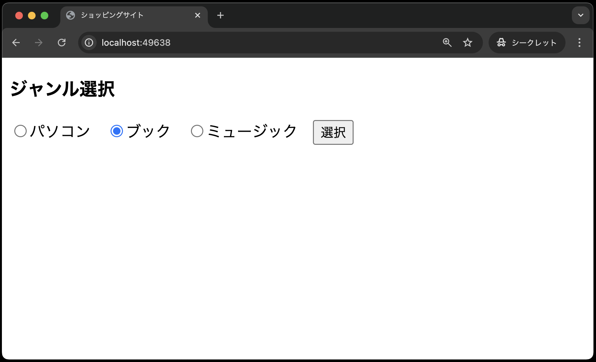
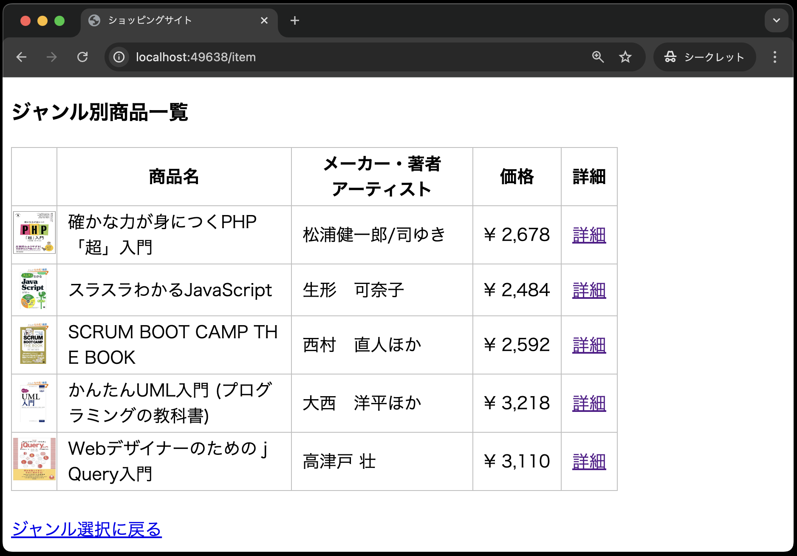
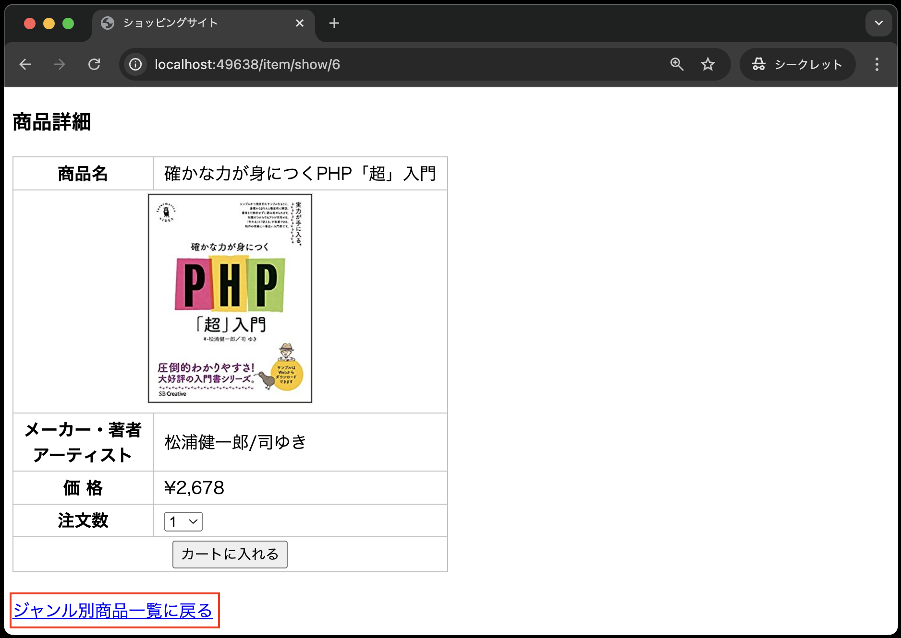

# Laravelの便利な書き方を学ぼう(ルートモデルバインディング、ファサード、メソッドチェーン、依存性の注入)

- [Laravelの便利な書き方を学ぼう(ルートモデルバインディング、ファサード、メソッドチェーン、依存性の注入)](#laravelの便利な書き方を学ぼうルートモデルバインディングファサードメソッドチェーン依存性の注入)
  - [事前準備](#事前準備)
  - [本章の狙い](#本章の狙い)
  - [ルートモデルバインディング](#ルートモデルバインディング)
    - [ルーティングの修正](#ルーティングの修正)
    - [ジャンル別商品一覧の修正](#ジャンル別商品一覧の修正)
    - [コントローラの修正](#コントローラの修正)
  - [商品詳細画面の作成](#商品詳細画面の作成)
  - [商品詳細画面のバグ修正](#商品詳細画面のバグ修正)
  - [まとめ](#まとめ)

## 事前準備

前回の[モデル、コントローラ](../shop_item_index/README.md)でcloneしたコードをそのまま利用してください。

## 本章の狙い

- ルートモデルバインディングを使って、コントローラで商品ID(主キー)に対応する商品情報を取得する方法を学ぶ
- Laravelの便利な書き方を学ぶ(今までのコードで既出のものもある)
- 商品詳細画面を再構築する

## ルートモデルバインディング

前回の[モデル、コントローラ]の章では、サンプルとして、itemsテーブルからすべての商品情報を取得し、一覧を表示しました。
今回は、ある特定の商品情報を取得して表示する方法を学びます。

Laravelの中でもやり方は色々ありますが、今回は**ルートモデルバインディング**を使って、商品IDに対応する商品情報を取得します。

### ルーティングの修正

---

今回のサンプル用のルーティングを`routes/web.php`に追加しますが、今までとは少し異なる書き方があります。

```php
use Illuminate\Support\Facades\Route;
use App\Http\Controllers\ItemController;

// 途中省略


Route::get('item', [ItemController::class, 'index']);
// --- 以下を追加 ---  
Route::get('item/show/{item}', [ItemController::class, 'show']);
```

**【解説】**

`Route::get('item/show/{item}', [ItemController::class, 'show'])->name('item.show');`: <br>
`item/show/{item}`は、商品詳細画面に遷移するためのURLです。
URLの末尾に`/{item}`が付いているのは、商品IDを指定するためです。

PHPでいうところの、GETリクエスト時のクエリパラメータに相当します。
`{item}`は、商品IDを表しています。

ここで大事なのではなぜ商品IDを指定したいのに、`{item}`という名前なのかです。
これは、ルートモデルバインディングを使うためのルールです。
ルートモデルバインディングを使う場合、ルーティングの定義とコントローラのメソッドの引数名が一致している必要があります。
詳細はコントローラの修正で説明します。

`[ItemController::class, 'show']`は、`ItemController`クラスの`show`メソッドを呼び出すことを意味します。

### ジャンル別商品一覧の修正

---

次に、前回の[モデル、コントローラ]の章で作成した商品の一覧画面に詳細のリンクを追加します。

### コントローラの修正

次に、商品詳細画面のビューを表示するために、コントローラに`show`メソッドを作成します。
Laravelにおける`show`というメソッド名は、一般的に、「IDなどで指定されたリソースを表示するためのメソッド名」として使われます。
今回だと、商品IDに対応する商品情報を表示するためのメソッドとして使います。

`app/Http/Controllers/ItemController.php` を以下のように修正してください。

```php
<?php

namespace App\Http\Controllers;

use App\Models\Item;
use Illuminate\Http\Request;

class ItemController extends Controller
{
    public function index()
    {
        $items = Item::all();
        return view('item.index', compact('items'));
    }

    // --- ここから追加 ---
    public function show(Item $item)
    {
        return view('item.show', ['item' => $item]);
    }
    // --- ここまで追加 ---
}
```

**【解説】**

`public function show(Item $item)`: <br>
`show`メソッドは、商品詳細画面を表示するためのメソッドです。
注目すべきは、いきなりreturn文があることです。

これは、商品IDに対応する商品情報を取得してビューに渡していることを意味します。
これを可能にしているのが、引数の`Item $item`です。

この`$item`には、商品IDに対応する商品情報が**自動的に格納されています。**
この機能が**ルートモデルバインディング(Route Model Binding)**と呼ばれるものです。

復習ですが、このルートモデルバインディングを使用するためには、ルーティングの定義とコントローラのメソッドの引数名が一致している必要があります。
以下のような記述を思い出してみてください。

**`routes/web.php`**

```php
// {item}の部分がコントローラのメソッドの引数名と一致している
Route::get('item/show/{item}', [ItemController::class, 'show'])->name('item.show');
```

**`resources/views/index.blade.php`**

```php
// ['item' => $item->ident]の`item`の部分がコントローラのメソッドの引数名と一致している
<a href="{{ route('item.show',  ['item' => $item->ident]) }}">詳細</a>
```

Laravelでは、コントローラに記述する`show` メソッドは、一般的に、指定されたリソースを表示するためのメソッドとして使われます。
例えば、今回のように商品IDに対応する商品情報を表示する場合に使われます。

## 商品詳細画面の作成

次に、商品詳細画面を作成します。
`resources/views/item`ディレクトリに`show.blade.php`ファイルを作成し、以下のように記述してください。

```php
<!DOCTYPE html>
<html lang="ja">
<head>
<meta charset="UTF-8">
<meta name="viewport" content="width=device-width, initial-scale=1.0">
<link rel="stylesheet" href="{{ asset('css/minishop.css')}}">
<title>ショッピングサイト</title>
</head>
<body>
<h3>商品詳細</h3>
<!-- action属性は空にしています -->
<form method="POST" action="">
    @csrf
    <input type="hidden" name="ident" value="{{ $item->ident }}">
    <table>
        <tr><th>商品名</th>
        <td>{{ $item->name }}</td></tr>
        <tr><td colspan="2"><div class="td_center">
        image )}}"></div></td></tr>
        <tr><th>メーカー・著者<br>アーティスト</th>
        <td>{{ $item->maker }}</td></tr>
        <tr><th>価 格</th>
        <td>&yen;{{  number_format( $item->price) }}</td></tr>
        <tr><th>注文数</th>
        <td><select name="quantity">
            @for ( $i=1;  $i<=10;  $i++ )
                <option value="{{ $i }}"> {{ $i }} </option>
            @endfor
        </select></td></tr>
        <tr><th colspan="2"><input type="submit" value="カートに入れる"></th></tr>
    </table>
</form>
<br>
<a href="{{ route('item.index',['genre' => $item->genre])}}">ジャンル別商品一覧に戻る</a>
</body>
</html>
```

**【解説】**

`<input type="hidden" name="ident" value="{{ $item->ident }}">`: <br>
`<input type="hidden" name="ident" value="{{ $item->ident }}">`は、商品IDをPOSTするための隠しフィールドです。

`<a href="{{ route('item.index',['genre' => $item->genre])}}">ジャンル別商品一覧に戻る</a>`: <br>
`route('item.index',['genre' => $item->genre])`は、ジャンル別商品一覧画面に遷移するためのリンクを生成しています。

以上で、商品詳細画面の作成は完了です。
実際に、動作確認をしてみましょう。
以下のように、ジャンル選択画面から商品詳細画面まで遷移できればOKです。





## 商品詳細画面のバグ修正

現状のままだと、商品詳細画面からジャンル別商品一覧に戻るリンクをクリックすると、以下のようなエラーが発生します。




このエラーは、商品詳細画面からジャンル別商品一覧に戻るリンクをクリックした際のルーティングが設定されていないために発生します。
そのため、商品詳細画面からジャンル別商品一覧に戻るリンクをクリックした際に、ジャンル別商品一覧画面に遷移するためのルーティングを追加する必要があります。

`routes/web.php`ファイルを以下のように修正してください。

```php
use Illuminate\Support\Facades\Route;
use App\Http\Controllers\ItemController;

// Route::get('/', function () {
//     return view('welcome');
// });

Route::get('/', function () {
    return view('index');
});
// 以前までのはコメントアウト
//Route::post('item', [ItemController::class, 'index'])->name('item.index');
// --- 以下を追加 ---
Route::match(['get', 'post'], 'item/{genre?}', [ItemController::class, 'index'])->name('item.index');

Route::get('item/show/{item}', [ItemController::class, 'show'])->name('item.show');
```

**【解説】**

`Route::match(['get', 'post'], 'item/{genre?}', [ItemController::class, 'index'])->name('item.index');`: <br>
`Route::match`は、GETリクエストとPOSTリクエストの両方を受け付けるルートを定義しています。
第1引数の`['get', 'post']`は、GETリクエストとPOSTリクエストを受け付けることを意味します。
第2引数の`'item/{genre?}'`は、商品詳細画面からジャンル別商品一覧に戻るリンクをクリックした際に、ジャンル別商品一覧画面に遷移するためのURLです。
`{genre?}`の`?`は、POSTリクエスト時にURL末尾にパラメータでジャンルが指定されていない場合でも、問題なく遷移できるようにするためのものです。

以上で、商品詳細画面のバグ修正は完了です。
実際に、動作確認をしてみましょう。


## まとめ

本章では、商品詳細画面を作成しました。

商品詳細画面を作成する際に、データを取得するコードを記述することなく、自動でデータを取得するルートモデルバインディングを学びました。
また、GETリクエストとPOSTリクエストの両方を受け付けるルーティングを学びました。
