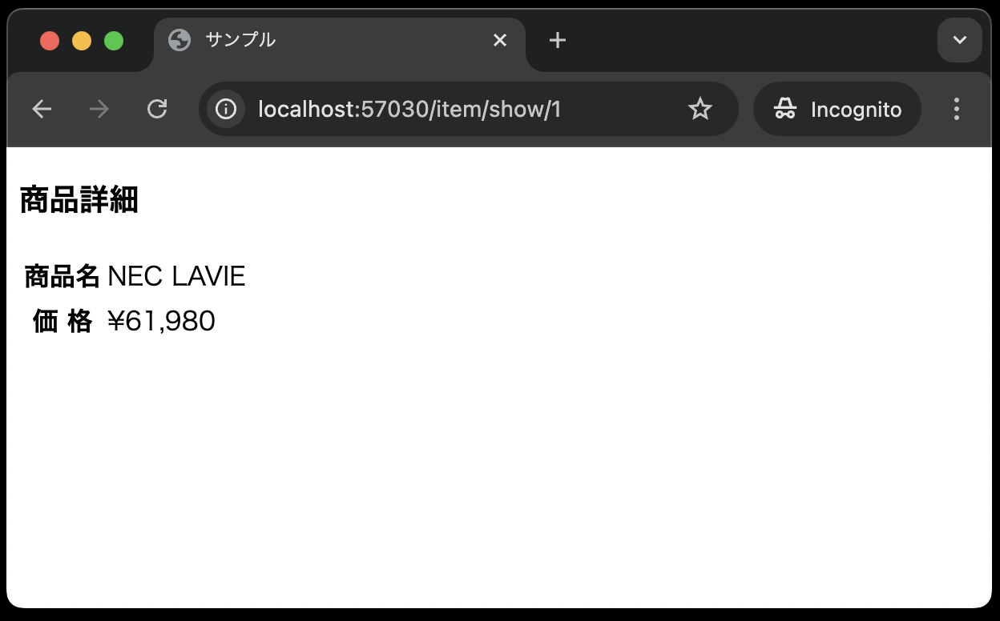

# Laravelの便利な実装(ルートモデルバインディング)

- [Laravelの便利な実装(ルートモデルバインディング)](#laravelの便利な実装ルートモデルバインディング)
  - [事前準備](#事前準備)
  - [本章の狙い](#本章の狙い)
  - [ルートモデルバインディング](#ルートモデルバインディング)
    - [ルーティングの修正](#ルーティングの修正)
    - [ジャンル別商品一覧の修正](#ジャンル別商品一覧の修正)
    - [コントローラの修正](#コントローラの修正)
  - [ビューの作成](#ビューの作成)
  - [まとめ](#まとめ)

## 事前準備

前回の[モデル、コントローラ](../shop_item_index/README.md)までで使用したコード(`21-first-laravel-GitHubアカウント名`)をそのまま利用してください。

## 本章の狙い

- ルートモデルバインディングを使って、コントローラで商品ID(主キー)に対応する商品情報を取得する方法を学ぶ
- Laravelの便利な書き方を学ぶ(今までのコードで既出のものもある)
- 商品詳細画面を再構築する

## ルートモデルバインディング

前回の[モデル、コントローラ]の章では、サンプルとして、itemsテーブルからすべての商品情報を取得し、一覧を表示しました。
今回は、ある特定の商品情報を取得して表示する方法を学びます。

Laravelの中でもやり方は色々ありますが、今回は**ルートモデルバインディング**を使って、商品IDに対応する商品情報を取得します。

### ルーティングの修正

---

今回のサンプル用のルーティングを`routes/web.php`に追加しますが、今までとは少し異なる書き方があります。

```php
use Illuminate\Support\Facades\Route;
use App\Http\Controllers\ItemController;

// 途中省略


Route::get('item', [ItemController::class, 'index']);
// --- 以下を追加 ---  
Route::get('item/show/{item}', [ItemController::class, 'show'])->name('item.show');
```

**【解説】**

`Route::get('item/show/{item}', [ItemController::class, 'show'])->name('item.show');`: <br>
`item/show/{item}`は、商品詳細画面に遷移するためのURLです。
URLの末尾に`/{item}`が付いているのは、商品IDを指定するためです。

PHPでいうところの、GETリクエスト時のクエリパラメータに相当します。
`{item}`は、商品IDを表しています。

ここで大事なのではなぜ商品IDを指定したいのに、`{item}`という名前なのかです。
これは、**ルートモデルバインディングを使うためのルール**です。
ルートモデルバインディングを使う場合、ルーティングの定義とコントローラのメソッドの引数名が一致している必要があります。
詳細はコントローラの修正で説明します。

`[ItemController::class, 'show']`は、`ItemController`クラスの`show`メソッドを呼び出すことを意味します。

### ジャンル別商品一覧の修正

---

次に、前回の[モデル、コントローラ]の章で作成した商品の一覧画面に詳細のリンクを追加し、一覧から詳細データが見えるようにしましょう。

`resources/views/item/index.blade.php`を以下のように修正してください。


```php
<!DOCTYPE html>
<html lang="ja">
<head>
<meta charset="UTF-8">
<meta name="viewport" content="width=device-width, initial-scale=1.0">
<title>サンプル</title>
</head>
<body>
<h3>商品一覧</h3>
    <table>
        <tr>
            <th>商品名</th>
            <th>価格</th>
        </tr>
    @foreach( $items  as  $item )
        <tr>
            <td class="td_item_name"> {{  $item->name }} </td>
            <td class="td_right">&yen; {{  number_format( $item->price) }} </td>
            <td><a href="{{ route('item.show',  ['item' => $item->ident]) }}">詳細</a></td>
        </tr>
    @endforeach
    </table>
</body>
</html>
```


**【解説】**

`<a href="{{ route('item.show',  ['item' => $item->ident]) }}">詳細</a>`: <br>
商品詳細画面に遷移するためのリンクです。
`route('item.show',  ['item' => $item->ident])`は、商品詳細画面に遷移するためのURLを生成しています。
`['item' => $item->ident]`は、itemという名前で指定した商品IDが、ルーティングで設定された`Route::get('item/show/{item}', [ItemController::class, 'show']);`の`{item}`に渡されます。

### コントローラの修正

---

次に、商品詳細画面のビューを表示するために、コントローラに`show`メソッドを作成します。
Laravelにおける`show`というメソッド名は、一般的に、「IDなどで指定されたリソースを表示するためのメソッド名」として使われます。
今回だと、商品IDに対応する商品情報を表示するためのメソッドとして使います。

`app/Http/Controllers/ItemController.php` を以下のように修正してください。

```php
<?php

namespace App\Http\Controllers;

use App\Models\Item;
use Illuminate\Http\Request;

class ItemController extends Controller
{
    public function index()
    {
        $items = Item::all();
        return view('item.index', compact('items'));
    }

    // --- ここから追加 ---
    public function show(Item $item)
    {
        return view('item.show', ['item' => $item]);
    }
    // --- ここまで追加 ---
}
```

**【解説】**

`public function show(Item $item)`: <br>
`show`メソッドは、商品詳細画面を表示するためのメソッドです。
注目すべきは、いきなりreturn文があることです。

これは、商品IDに対応する商品情報を取得してビューに渡していることを意味します。
これを可能にしているのが、引数の`Item $item`です。

この`$item`には、商品IDに対応する商品情報が**自動的に格納されています。**
この機能が**ルートモデルバインディング(Route Model Binding)**と呼ばれるものです。

復習ですが、このルートモデルバインディングを使用するためには、ルーティングの定義とコントローラのメソッドの引数名が一致している必要があります。
以下のような記述を思い出してみてください。

**`routes/web.php`**

```php
// {item}の部分がコントローラのメソッドの引数名と一致している
Route::get('item/show/{item}', [ItemController::class, 'show'])->name('item.show');
```

**`resources/views/index.blade.php`**

```php
// ルーティングの定義を一致させるために、['item' => $item->ident]で`item`という名前で指定した商品IDを渡している
<a href="{{ route('item.show',  ['item' => $item->ident]) }}">詳細</a>
```

ルートモデルバインディングを使うことで、コントローラで商品IDに対応する商品情報を取得するコードを記述する必要がなくなるので、コードがスッキリします。

## ビューの作成

最後に、商品の詳細画面を作成します。
`resources/views/item`ディレクトリに`show.blade.php`ファイルを作成し、以下のように記述してください。


```php
<!DOCTYPE html>
<html lang="ja">
<head>
<meta charset="UTF-8">
<meta name="viewport" content="width=device-width, initial-scale=1.0">
<title>サンプル</title>
</head>
<body>
<h3>商品詳細</h3>
<table>
    <tr><th>商品名</th>
    <td>{{ $item->name }}</td></tr>
    <tr><th>価 格</th>
    <td>&yen;{{  number_format( $item->price) }}</td></tr>
</table>
</body>
</html>
``` 


以上で、商品詳細画面の作成は完了です。
実際に、動作確認をしてみましょう。
以下のように、商品一覧から商品詳細画面まで遷移できればOKです。




## まとめ

本章では、商品詳細画面を作成する際に、データを取得するコードを記述することなく、自動でデータを取得するルートモデルバインディングを学びました。
Laravelには、他にも便利な機能がたくさんありますので、興味があれば公式ドキュメントなどを参考にしてみてください。
