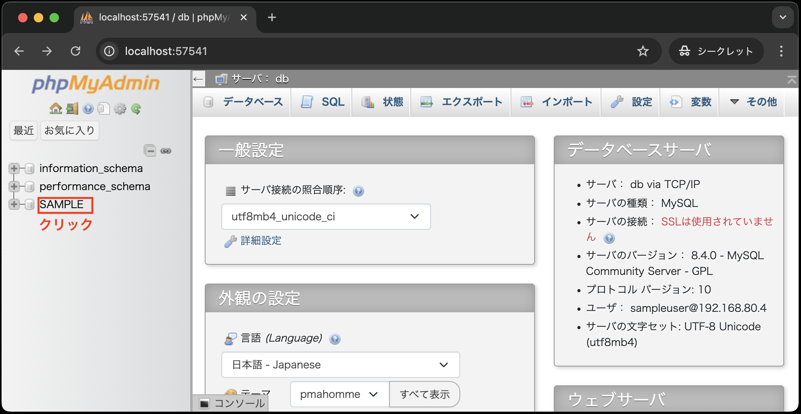
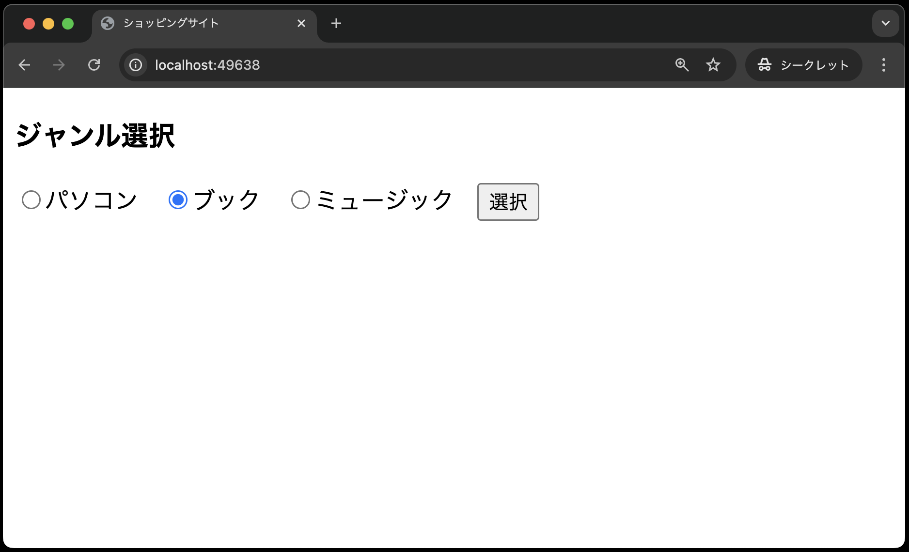
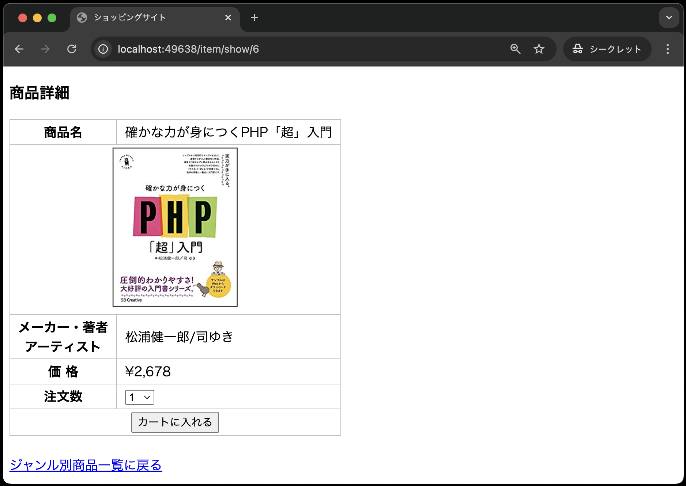
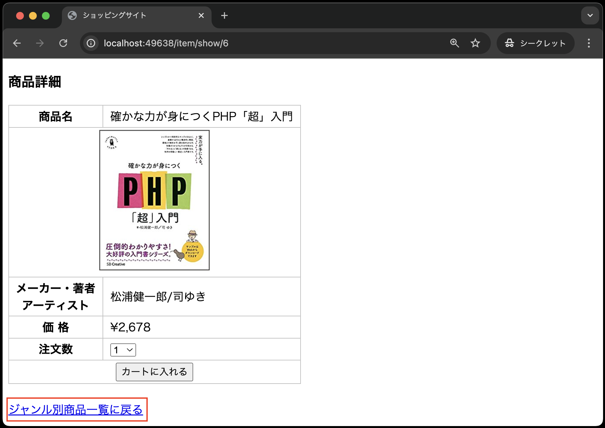

# 商品詳細画面

- [商品詳細画面](#商品詳細画面)
  - [事前準備](#事前準備)
  - [本章の狙い](#本章の狙い)
  - [①Laravel環境の構築](#laravel環境の構築)
  - [商品詳細画面のバグ修正](#商品詳細画面のバグ修正)
  - [まとめ](#まとめ)

## 事前準備

[こちらのページ]()から、ソースコードを`C:¥sys_dev_exe`へcloneしてください。

## 本章の狙い

- [Laravelの便利な実装(ルートモデルバインディング)](../shop_item_show/README.md)の章で学んだ知識を定着させる
- 商品詳細画面を再構築する

## ①Laravel環境の構築

1. VSCode上で、`Ctrl+Shift+P`(Macの場合は`Cmd+Shift+P`)を押し、コンテナを起動する
2. VSCode上で、`Ctrl+J`(Macの場合は`Cmd+J`)を押し、ターミナルを表示する
3. ターミナルに`composer create-project laravel/laravel .` と入力し、`Enter`で実行する<br>
   
4. [【課題】ジャンル別商品一覧画面の作成](../shop_item_index_kadai/README.md)までで作成した以下のコードを、上記「1.」でcloneしたソースコードと同じ場所に上書きする
   
   ```text
    app
    ├──  
    │
    途中省略
    │
    resources
    ├── views
    │   ├── items
    │   │   └── index.blade.php    
    │   └── index.blade.php
    routes
    └── web.php
    ```

5. [モデル、コントローラ](../shop_item_index/README.md)の章と同様に、`items`テーブルを作成し、データを挿入する(※手順はあえて書いてないので、頑張ってトライしてみましょう！)
6. phpmyadminで`items`テーブルが確認できればOK<br>
   <br>
   <br>
   

## ②ルーティングとジャンル別商品一覧画面の修正

商品詳細画面を作成する前に、前章で作成したものにいくつか修正を加える必要があります。

### ②−1 ルーティングの修正

---

現状、ジャンル別商品一覧画面の「詳細」リンクをクリックしても商品詳細画面に遷移しません。
そのため、商品詳細画面に遷移するためのルーティングを追加する必要があります。

ルーティングを追加するためには、`routes/web.php`ファイルを以下の観点から修正してください。

- GETリクエスト時にItemControllerの`show`メソッドを呼び出すルートを追加する
- マッピングするURLを`item/show/{xxxx}`に設定する(`xxxx`にはルートモデルバインディングのための名前を指定する※わからなければ[Laravelの便利な実装(ルートモデルバインディング)](../shop_item_show/README.md)の章を参考にすること)
- ルーティングの名前を`item.show`に設定する

### ②−2 ジャンル別商品一覧画面の修正

---

次に、ジャンル別商品一覧画面(`resources/views/index.blade.php`)を修正します。
上記の[ルーティングの修正](#ルーティングの修正)を参考に、商品詳細画面に遷移するための詳細リンクを以下の観点から修正してください。

- 詳細リンクの宛先に対象のルーティングを指定する(ルーティングの名前で指定すること)
- 商品IDを渡す※商品IDを渡すときの名前に注意！わからなければ[Laravelの便利な実装(ルートモデルバインディング)](../shop_item_show/README.md)の章を参考にすること

## コントローラの修正

次に、商品詳細画面のビューを表示するために、ItemController(`app/Http/Controllers/ItemController.php`)を修正します。
以下の観点から修正してください。

- `show`メソッドの追加(`show`メソッドの仕様は以下のとおり)
  - ルートモデルバインディングにより、商品IDと一致する商品情報を取得
  - 商品情報をビューに渡す

## ビューの作成

次に、ビューとして商品詳細画面を作成します。
`resources/views/item`ディレクトリに`show.blade.php`ファイルを作成し、以下のように記述してください。

```php
<!DOCTYPE html>
<html lang="ja">
<head>
<meta charset="UTF-8">
<meta name="viewport" content="width=device-width, initial-scale=1.0">
<link rel="stylesheet" href="{{ asset('css/minishop.css')}}">
<title>ショッピングサイト</title>
</head>
<body>
<h3>商品詳細</h3>
<!-- action属性は空にしています -->
<form method="POST" action="">
    @csrf
    <input type="hidden" name="ident" value="{{ $item->ident }}">
    <table>
        <tr><th>商品名</th>
        <td>{{ $item->name }}</td></tr>
        <tr><td colspan="2"><div class="td_center">
        image )}}"></div></td></tr>
        <tr><th>メーカー・著者<br>アーティスト</th>
        <td>{{ $item->maker }}</td></tr>
        <tr><th>価 格</th>
        <td>&yen;{{  number_format( $item->price) }}</td></tr>
        <tr><th>注文数</th>
        <td><select name="quantity">
            @for ( $i=1;  $i<=10;  $i++ )
                <option value="{{ $i }}"> {{ $i }} </option>
            @endfor
        </select></td></tr>
        <tr><th colspan="2"><input type="submit" value="カートに入れる"></th></tr>
    </table>
</form>
<br>
<a href="{{ route('item.index',['genre' => $item->genre])}}">ジャンル別商品一覧に戻る</a>
</body>
</html>
```

**【解説】**

`<input type="hidden" name="ident" value="{{ $item->ident }}">`: <br>
`<input type="hidden" name="ident" value="{{ $item->ident }}">`は、商品IDをPOSTするための隠しフィールドです。

`<a href="{{ route('item.index',['genre' => $item->genre])}}">ジャンル別商品一覧に戻る</a>`: <br>
`route('item.index',['genre' => $item->genre])`は、ジャンル別商品一覧画面に遷移するためのリンクを生成しています。

以上で、商品詳細画面の作成は完了です。
実際に、動作確認をしてみましょう。
以下のように、ジャンル選択画面から商品詳細画面まで遷移できればOKです。





## 商品詳細画面のバグ修正

現状のままだと、商品詳細画面からジャンル別商品一覧に戻るリンクをクリックすると、以下のようなエラーが発生します。




このエラーは、商品詳細画面からジャンル別商品一覧に戻るリンクをクリックした際のルーティングが設定されていないために発生します。
そのため、商品詳細画面からジャンル別商品一覧に戻るリンクをクリックした際に、ジャンル別商品一覧画面に遷移するためのルーティングを追加する必要があります。

`routes/web.php`ファイルを以下のように修正してください。

```php
use Illuminate\Support\Facades\Route;
use App\Http\Controllers\ItemController;

// Route::get('/', function () {
//     return view('welcome');
// });

Route::get('/', function () {
    return view('index');
});
// 以前までのはコメントアウト
//Route::post('item', [ItemController::class, 'index'])->name('item.index');
// --- 以下を追加 ---
Route::match(['get', 'post'], 'item/{genre?}', [ItemController::class, 'index'])->name('item.index');

Route::get('item/show/{item}', [ItemController::class, 'show'])->name('item.show');
```

**【解説】**

`Route::match(['get', 'post'], 'item/{genre?}', [ItemController::class, 'index'])->name('item.index');`: <br>
`Route::match`は、GETリクエストとPOSTリクエストの両方を受け付けるルートを定義しています。
第1引数の`['get', 'post']`は、GETリクエストとPOSTリクエストを受け付けることを意味します。
第2引数の`'item/{genre?}'`は、商品詳細画面からジャンル別商品一覧に戻るリンクをクリックした際に、ジャンル別商品一覧画面に遷移するためのURLです。
`{genre?}`の`?`は、POSTリクエスト時にURL末尾にパラメータでジャンルが指定されていない場合でも、問題なく遷移できるようにするためのものです。

以上で、商品詳細画面のバグ修正は完了です。
実際に、動作確認をしてみましょう。


## まとめ

本章では、商品詳細画面を作成しました。

商品詳細画面を作成する際に、データを取得するコードを記述することなく、自動でデータを取得するルートモデルバインディングを学びました。
また、GETリクエストとPOSTリクエストの両方を受け付けるルーティングを学びました。
